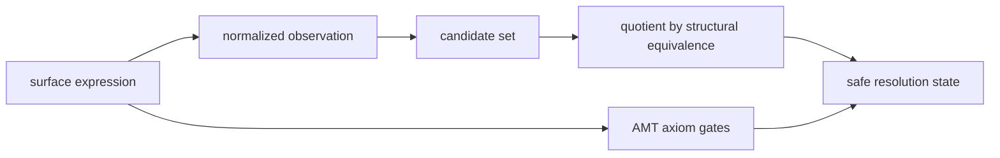
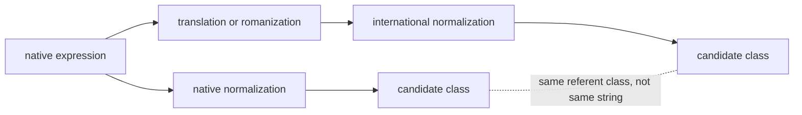
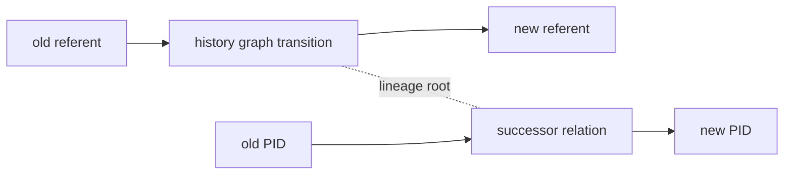
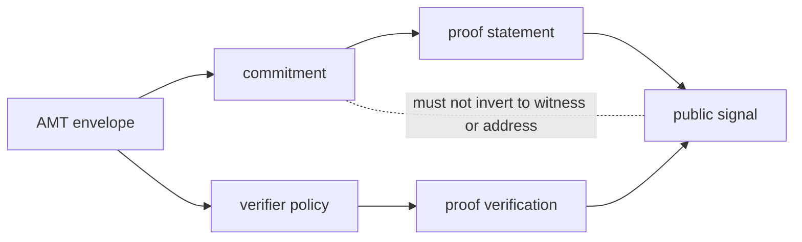
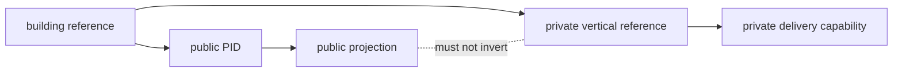

# AMT v2 Commutative Diagrams

Status: companion appendix for the 12-chapter AMT v2 paper

This appendix adds a diagram layer to Address Morphism Theory.  A diagram is not
included merely as an illustration.  It is a claim about whether two processing
paths are allowed to produce the same reference, the same class, the same public
signal, or the same safety decision.

The core rule is:

```text
AMT commutativity is not string equality.
It is agreement of referent class, resolution state, safety boundary,
or public signal under declared assumptions.
```

This is why AMT needs four kinds of diagrams.

| kind | meaning | safe use |
| --- | --- | --- |
| `strict` | both paths must produce the same formal object | deterministic parsing, benchmark oracle checks |
| `weak` | both paths may differ syntactically but land in the same referent class or candidate superset | multilingual aliases, structural clusters |
| `conditional` | both paths commute only when source, time, purpose, quality, and privacy gates pass | postal-equivalent regions, PID issuance, deliverability |
| `intentionally-non-commutative` | one direction must not invert or disclose private material | vertical privacy, ZK proofs, anonymous delivery, audit projection |

The fourth class is essential.  If every diagram commuted, public identifiers,
proofs, audit records, or merchant approvals could be wrongly interpreted as a
way to reconstruct private address material.  AMT therefore treats
non-commutativity as a safety feature.

## Formal Reading

Let \(X\), \(Y\), \(Z\), and \(W\) be AMT objects, with paths

\[
X \xrightarrow{f} Y \xrightarrow{g} W
\]

and

\[
X \xrightarrow{h} Z \xrightarrow{k} W.
\]

A strict commutative square asserts

\[
g(f(x)) = k(h(x)).
\]

A weak AMT square asserts instead that both paths are equivalent under a
declared quotient or safety predicate:

\[
g(f(x)) \sim_p k(h(x)).
\]

A conditional AMT square asserts:

\[
\mathsf{Gate}(x,p,t,E)=1
\Rightarrow
g(f(x)) \sim_p k(h(x)).
\]

An intentionally non-commutative square asserts:

\[
\nexists i : W \to X_{\mathrm{private}}
\]

or, operationally:

```text
public output must not invert to private address, witness, recipient,
unit, key, or proof-secret material.
```

## Representative Diagrams

### Core AMT Chain

Diagram id: `core-morphism-chain`  
Title: Core AMT morphism chain



This diagram is conditional.  The staged path and the gate path agree only when
candidate sufficiency, evidence admissibility, finite candidate generation, and
ordering decidability pass.  Otherwise the correct output is unresolved or
manual review.

### Multilingual Referent Square

Diagram id: `multilingual-referent-square`  
Title: Multilingual referent square



This diagram is weak.  Japanese, English, Latin transliteration, old names, and
local aliases should not be forced into identical strings.  The target is the
same referent class after evidence gates, not the same spelling.

### History Successor Square

Diagram id: `history-successor-square`  
Title: History successor and PID conservation square



This diagram is conditional.  A successor relation is valid only if split,
merge, relocation, deprecation, and social-continuity events are explicitly
typed.  It does not claim that the old delivery endpoint and the new delivery
endpoint are identical.

### ZK Boundary Square

Diagram id: `zk-boundary-noncommutative`  
Title: ZK proof boundary non-commutative diagram



This diagram is intentionally-non-commutative.  The two paths may agree on the
public signal, but neither path may be used to reconstruct the hidden address,
witness, private key, recipient, or proof secret.  A valid proof also does not
repair bad AMT resolution.

### Vertical Privacy Square

Diagram id: `vertical-privacy-noncommutative`  
Title: Vertical privacy non-commutative diagram



This is the most important privacy diagram for buildings.  Public building
identity and private unit reachability are related, but public PID publication
must not reveal room, unit, household, recipient, or private vertical
attributes.

## Diagram Catalog

| id | title | kind | equalizer | chapters |
| --- | --- | --- | --- | --- |
| `core-morphism-chain` | Core AMT morphism chain | conditional | same-resolution-state | 1, 3, 4, 5, 6, 7, 12 |
| `parse-normalize-square` | Parsing and normalization square | strict | same-normal-form | 2, 4, 5 |
| `multilingual-referent-square` | Multilingual referent square | weak | same-referent-class | 2, 5, 6, 12 |
| `postal-agid-region-square` | Postal-equivalent and AGID region square | conditional | same-safety-decision | 5, 7, 9, 12 |
| `candidate-expansion-inclusion` | Candidate expansion inclusion diagram | weak | same-candidate-superset | 5, 12 |
| `source-aggregation-square` | Source aggregation square | conditional | same-safety-decision | 5, 9, 12 |
| `equivalence-cluster-square` | Structural distance and graph-cluster square | weak | same-referent-class | 6, 9 |
| `history-successor-square` | History successor and PID conservation square | conditional | same-safety-decision | 8, 12 |
| `administrative-change-square` | Administrative-change projection square | conditional | same-referent-class | 5, 8, 12 |
| `disaster-temporary-reference-square` | Disaster and temporary reference square | conditional | same-safety-decision | 1, 8, 10, 11 |
| `natural-geography-boundary-square` | Natural geography boundary square | conditional | same-safety-decision | 3, 10, 12 |
| `vertical-privacy-noncommutative` | Vertical privacy non-commutative diagram | intentionally-non-commutative | must-not-invert | 3, 10, 11 |
| `pid-issuance-boundary-square` | PID issuance boundary square | conditional | same-safety-decision | 7, 8, 11 |
| `zk-boundary-noncommutative` | ZK proof boundary non-commutative diagram | intentionally-non-commutative | same-public-signal | 11, 12 |
| `deliverability-square` | Deliverability square | conditional | same-safety-decision | 7, 9, 10, 11 |
| `address-login-schema-square` | Address Login schema square | conditional | same-safety-decision | 1, 2, 5, 12 |
| `anonymous-delivery-noncommutative` | Anonymous delivery disclosure non-commutative diagram | intentionally-non-commutative | same-safety-decision | 10, 11 |
| `quality-decision-square` | Quality and decision square | conditional | same-safety-decision | 5, 7, 9, 12 |
| `benchmark-oracle-square` | Benchmark oracle square | strict | same-safety-decision | 12 |
| `country-pack-index-square` | Country pack and index square | conditional | same-safety-decision | 5, 10, 12 |
| `ocean-hierarchy-square` | Ocean and maritime hierarchy square | conditional | same-safety-decision | 3, 10, 12 |
| `audit-projection-noncommutative` | Audit projection non-commutative diagram | intentionally-non-commutative | must-not-invert | 8, 11, 12 |

## How These Diagrams Enter The Paper

The main paper should reference this appendix in three places:

- Chapter 4 should introduce the four commutativity classes as part of the AMT
  axiom and safe-abstention vocabulary.
- Chapter 7 should cite the PID issuance, deliverability, and quality-decision
  diagrams before claiming a resolution can become a public identifier.
- Chapter 11 should cite every intentionally-non-commutative diagram before
  discussing privacy proofs, carrier-only decryption, audit logs, or public
  projections.

## Non-Claims

This appendix does not claim that all AMT diagrams are already proven in a proof
assistant.  It records the diagram obligations that the paper and executable
tests must preserve.

It also does not claim that commutativity implies truth.  A square can commute
over the wrong evidence.  Therefore every useful AMT diagram must be paired with
source policy, quality gates, counterexamples, and a non-claim boundary.

