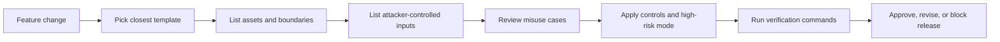

# Address Privacy Threat Model Templates

Address Privacy Threat Model Templates are the reusable review layer for AGID,
AOID, AGID-S, Address Element, Portal, POS, Field Handoff, Evidence Vault,
registry/webhook, ZK predicate, locker/PUDO, and Developer Console surfaces.

They are designed for open-source review. The templates contain no personal data,
no raw address data, no production QR/NFC payload, and no private proof material.

## Purpose

AGID/AOID features can fail quietly if privacy is reviewed too late. A normal
feature checklist may confirm that a scan, proof, receipt, or registry call works,
while missing whether it creates linkability, stores an address body, exposes a
proof secret, or makes a high-risk user visible.

These templates force each privacy-critical surface to name:

- protected assets
- trust boundaries
- attacker-controlled inputs
- misuse cases
- required invariants
- safe public outputs
- forbidden outputs
- high-risk mode requirements
- verification commands

## Core Rule

Public and shared surfaces must be:

- local-first where possible
- Ethereum-optional
- no-raw-address-by-default
- safe for high-risk contexts

Safe public outputs are commitments, short aliases, issuer references, freshness
and revocation roots, nullifier hashes, redacted evidence references, coarse
region codes, and public proof signals.

Forbidden outputs include address bodies, raw AOID bodies, AGID-S plaintext or
production ciphertext, proof witnesses, proof codes, private keys, device
secrets, recipient identity fields, precise private coordinates, and full
QR/NFC payloads.

## Template Surfaces

| Template | Main Surface |
| --- | --- |
| Address Element / Registration | Embedded address entry, postal assist, AGID assist, correction feedback |
| Address Portal Consent | Scope, revoke, delete, export, and Address Item control |
| POS Terminal Handoff | Scan -> Decision -> Handoff -> Report |
| Field Handoff / Offline Sync | Offline receipts, reachability, nullifier sync, CRDT conflict review |
| Evidence Vault / Local OCR | Photo/PDF OCR, redaction, encrypted evidence, proof of possession |
| Hosted Registry API / Webhooks | Issuer, revocation, freshness, nullifier, used-state, webhooks |
| ZK Address Predicate | Residence, delivery eligibility, AOID ownership, and PID audit predicates |
| AGID-S QR/NFC Sharing | Encrypted AGID sharing over QR, NFC, link, or paper |
| Open Locker/PUDO Simulator | QR/NFC intake, local protocol simulation, redacted receipts |
| Developer Console / Public Fixtures | API keys, webhooks, SDK snippets, OpenAPI, test vectors |

## Review Flow



## Generated Pack

Regenerate the public template pack:

```bash
npm run export:privacy-threat-templates
```

Verify the templates:

```bash
npm run verify:privacy-threat-templates
```

The generated files live under:

```text
data/address_privacy_threat_model_templates/
```

## When to Use

Use these templates before adding or changing:

- address entry or correction feedback
- language tabs or postal assist behavior
- AGID-S QR/NFC parsing or decryption
- AOID credential, ownership, or delegation flows
- POS scan, decision, handoff, or report flows
- field handoff offline queues
- evidence OCR, redaction, or export flows
- registry, webhook, issuer, revocation, freshness, or nullifier APIs
- ZK proof public signal schemas
- public SDK examples, test vectors, or demo fixtures

## Limits

The templates do not prove that an implementation is secure. They also do not
prove that a real address is true, owned, deliverable, or legally valid. They are
release-review scaffolding: a structured way to keep privacy expectations visible,
testable, and hard to accidentally bypass.
