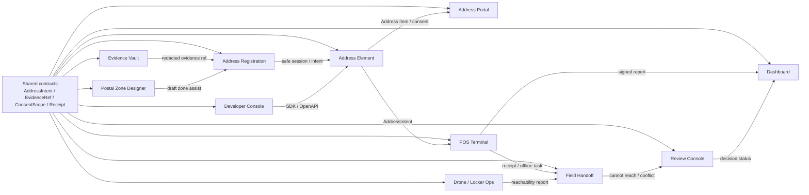

# Address Surface Compatibility

この文書は、Address Registration / Address Element を中心に、Portal、POS、Field Handoff、Dashboard、Developer Console、Evidence Vault、Postal Zone Designer、Drone / Locker Ops が共有すべきコードと互換性境界を整理する。

目的は、画面ごとに似た機能を作り直すことを防ぎ、住所のプライバシー境界、品質判定、同意、監査、オフライン同期を同じ契約で扱うことである。

## 最優先の共通化

Address Registration と Address Element は、AGID/AOID 全体の入力基盤である。ここが弱いと、Portal、POS、Field、Review、Developer API すべてが弱くなる。

共通化するもの:

- `AddressIntent`: 住所登録、配送、返品、支援、本人確認、通関の目的、証拠、状態、次アクションを統一する。
- `Safe Address Session`: 生住所を外へ出さず、入力状態、言語タブ、品質判定、証拠 fingerprint だけを外部へ出す。
- `Registration Assistance`: 郵便番号補完、AGID補完、逆ジオ補助を「編集可能な候補」として扱う。
- `Correction Feedback`: ユーザー修正や住所翻訳フィードバックを閉じたローカル学習参照として保存する。
- `Address Verification Evidence`: 郵便番号、AGID逆ジオ、住所制度、配送可否、ユーザー修正を同じ証拠モデルに寄せる。

Registration が持つべきもの:

- 生のフォーム draft
- OCR候補の編集前状態
- ユーザー修正の一時状態

Element が持つべきもの:

- host 側の生入力状態
- host 側 private field
- public event に出す安全な session / intent preview

外に出してよいもの:

- `AddressIntent`
- evidence fingerprint
- commitment
- alias
- quality decision
- next action
- redacted receipt

外に出してはいけないもの:

- plaintext address
- raw AGID
- AGID-S ciphertext
- raw AOID
- recipient name
- phone
- unit / room
- proof code
- recipient secret

## アプリ間の互換性

## 画面ごとの役割

### Address Registration / Address Element

住所登録、郵便番号補完、AGID補完、住所修正、翻訳フィードバック、住所品質判定を担当する。
この2つは別UIでも、同じ `AddressIntent` と `Safe Address Session` を使う。

次のリファクタリング:

- `AddressRegistration.tsx` を stepper と hook に分割する。
- Address Element の public event contract を作る。
- 両者を同じ assistance / verification / feedback model に接続する。

### Address Portal

ユーザーが同意、scope、取消、削除、export を管理する画面。
個人住所を見せる画面ではなく、「どの相手に、何の目的で、何を許可しているか」を見る画面にする。

### POS Terminal

主導線は `Scan -> Decision -> Handoff -> Report` の4画面に固定する。
端末診断、プリンタ、キャッシュドロワー、計測器、offline queue、監査は副導線にする。

### Field Handoff App

配送員、支援者、現場スタッフ向け。
POS と同じ receipt / QR / recipient proof を使うが、現場ではオフライン、到達可否、後同期衝突を中心にする。

### Dashboard / Review Console

Dashboard は運用状態を表示する。Review Console は判断する。
この2つは同じ event stream を使うが、Dashboard は集計、Review はケース管理に分ける。

### Developer Console

Address Element、POS、Portal、Registry API を外部開発者が導入するための入口。
OpenAPI、Webhook、SDK、test vector、launch checklist、redaction simulator をまとめる。

### Evidence Vault

PDF/写真/OCR、redaction、暗号化証跡を扱う。
個人情報リスクが高いため、Registration / Element / Portal / POS の境界が固まった後に進める。

### Postal Zone Designer

郵便番号が弱い国向けに、AGID郵便区画を設計する。
公的郵便番号を勝手に置き換えず、draft / approval / privacy / governance を必須にする。

### Drone / Locker Ops

ドローンOS本体ではなく、到達可否API、ロッカー連携、MQTT/HTTP/Modbusローカルシミュレータに絞る。
POS / Field / Review へ reachability report を渡す役割にする。

## 実装で守る原則

1. まず `AddressIntent` を通す。
2. UI固有の状態と共有状態を混ぜない。
3. 生住所は surface 内だけに閉じる。
4. public API / webhook / dashboard / receipt は redacted payload だけにする。
5. offline は許可するが、衝突は review case にする。
6. ZK / Ethereum / hosted registry は optional にする。
7. high-risk mode は無料かつ local-first で動くようにする。

## 対応コード

- `src/lib/addressSurfaceCompatibility.ts`
- `src/lib/addressSurfaceCompatibility.test.ts`
- `src/lib/addressIntent.ts`
- `src/lib/addressElement.ts`
- `src/lib/addressRegistrationAutomation.ts`
- `src/lib/addressPortal.ts`
- `src/lib/posOperationalControls.ts`
- `src/lib/addressOfflineSyncCrdt.ts`
- `src/lib/addressRadar.ts`
- `src/lib/addressEvidenceVault.ts`
