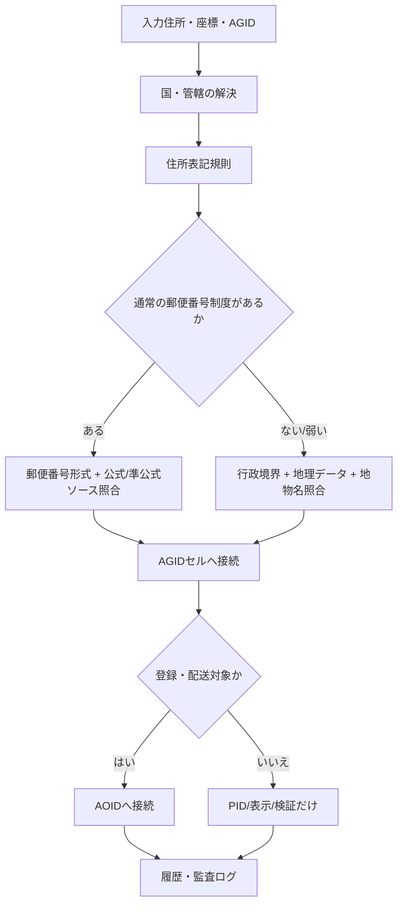

# 住所制度との接続方法

## 基本方針

AGID/AOID は既存の住所制度を置き換えるものではなく、住所制度に接続するための写像・検証レイヤーとして扱う。

住所制度との接続は、次の順番で分離する。

1. 法的管轄
2. 住所表記規則
3. 郵便・配送制度
4. 行政境界・地理データ
5. AGID 空間セル
6. AOID 配送・登録対象
7. 履歴・監査

この順番にすると、国ごとの住所制度、郵便番号の有無、行政境界の変更、建物名や地番、配送可能性を混同しにくい。

## 接続フロー

## 接続モード

| モード | 意味 | 使う場面 |
| --- | --- | --- |
| `postal-authoritative` | 郵便番号・住所制度に公式または強い準公式ソースで接続できる | 日本、英国、フランスなど公式/強い郵便データがある国 |
| `postal-format-bridge` | 郵便番号形式は分かるが強い照合ソースが不足 | 形式検証までは可能だが配送可能性は保留 |
| `geo-official-reference` | 通常郵便番号がない、または地理データ中心に接続する | 香港、南極、島、自然地物、建物名中心の住所 |
| `agid-manual-bridge` | AGID/座標はあるが制度ソースが弱い | 低品質地域、境界付近、災害時仮想住所 |
| `manual-review` | 国・制度・空間アンカーが不足 | unresolved または再入力対象 |
| `unsupported` | 国・管轄が不明 | 接続禁止 |

## 数理的な書き方

住所制度を国・管轄ごとの制度空間

\[
\mathcal{S}_j =
(\mathcal{F}_j,\mathcal{P}_j,\mathcal{B}_j,\mathcal{G}_j,\mathcal{L}_j)
\]

とおく。

- \(\mathcal{F}_j\): 住所表記規則
- \(\mathcal{P}_j\): 郵便・配送制度
- \(\mathcal{B}_j\): 行政境界
- \(\mathcal{G}_j\): 地理・地物データ
- \(\mathcal{L}_j\): 住所履歴・制度変更

入力住所 \(a\) は、まず管轄写像

\[
\kappa(a) = j
\]

で制度空間を選ぶ。次に、住所表記写像、郵便照合写像、地理包含写像を別々に適用する。

\[
\pi_F(a) \in \mathcal{F}_j
\]

\[
\pi_P(a) \in \mathcal{P}_j \cup \{\bot\}
\]

\[
\pi_G(a, x) \in \mathcal{B}_j \times \mathcal{G}_j
\]

ここで \(x\) は座標または AGID セルである。郵便制度がない場合、\(\pi_P(a)=\bot\) とし、地理包含写像 \(\pi_G\) を主経路にする。

最終的なAGID接続は

\[
\alpha(a) = \operatorname{AGID}(x)
\]

であり、登録・配送対象が必要なときだけ

\[
\omega(a) = \operatorname{AOID}(\alpha(a), o)
\]

を発行する。ここで \(o\) は建物、区画、宅配ロッカー、基地、店舗などの配送・登録対象である。

## 実装上の接続原則

- 住所文字列は法的・社会的表記として保存する。
- AGID は空間アンカーとして保存する。
- AOID は配送・登録対象として保存する。
- 郵便番号は国ごとの制度に従って検証する。
- 郵便番号がない地域では、行政境界・地物名・座標・AGIDで接続する。
- 公式ソース、準公式ソース、オープンソース、手動確認を同じ重みで扱わない。
- unresolved を失敗ではなく、制度接続が不足している状態として扱う。

## アプリへの反映

実装では `addressSystemConnection` が接続プランを返す。

住所検証エンジンは次を返せる。

- 接続モード
- 接続スコア
- PIDを発行できるか
- AOIDへ接続できるか
- 手動確認が必要か
- どの制度層で不足しているか
- 次に取るべき行動

これにより、住所タブではユーザーに内部スコアを見せずに、次の制御ができる。

- 低品質タブを非表示にする
- 注意表示にする
- 再検証対象にする
- 郵便制度ではなく地理制度で検証する
- AOID登録を保留する

## 重要な分離

住所制度との接続では、以下を混ぜない。

| 項目 | 役割 |
| --- | --- |
| 住所表記 | 人間・行政・配送業者が読む文字列 |
| 郵便番号 | 郵便・配送制度の索引 |
| AGID | 地球上の空間セル |
| AOID | 配送・登録対象 |
| PID | 住所写像論上の永続識別子 |
| 履歴 | 旧住所、新住所、行政変更、分裂、統合 |

この分離ができていると、郵便番号がない地域、海上、南極、島、山、湖、国境付近、災害時住所でも制度接続を保てる。
