# AGID/AOID ER Diagram Catalog

This document is the implementation-facing ER diagram catalog for AGID, AOID,
AGID-S, POS operation, address verification, ZK-ready credentials, and registry
integration.

The diagrams intentionally separate:

- Conceptual ER: domain concepts and their responsibilities.
- Logical ER: application records and data ownership boundaries.
- Physical ER: concrete storage shapes used by adapters.
- Privacy ER: data that must remain off-chain, encrypted, or non-persistent.
- Operational ER: scan, proof, registry, payment, and audit flows.

## Source Mapping

| Area | Main implementation sources |
|---|---|
| Browser database | `src/lib/appDatabase.ts` |
| Registered address QR | `src/lib/registeredAddressQr.ts` |
| AOID model | `src/lib/aoid/types.ts` |
| Address morphism pipeline | `src/lib/addressMorphism.ts` |
| PID issuance audit | `src/lib/pidIssuanceAudit.ts` |
| AGID-S secure sharing | `src/lib/agidSecureShare.ts` |
| POS AGID-S registry | `src/lib/agidSecurePos.ts`, `src/server/agidSecurePosRegistryStore.ts` |
| Credential issuer trust | `src/lib/credentialIssuerTrustRegistry.ts` |
| Revocation and freshness anchoring | `src/lib/revocationFreshnessRootAnchoring.ts` |
| ZK proof bundle registry | `src/lib/zkProofBundleRegistry.ts` |
| Ethereum registry mode | `src/lib/ethereumRegistryOnlyMode.ts`, `src/server/ethereumRegistryClient.ts` |
| Address verification engine | `src/lib/addressVerificationEngine.ts` |
| Cloud and DB integration | `docs/cloud-db-integration-design.md` |

## Diagram 1. Domain Conceptual ER

This is the whole AGID/AOID domain at the concept level. It is useful for papers,
README, architecture review, and onboarding.

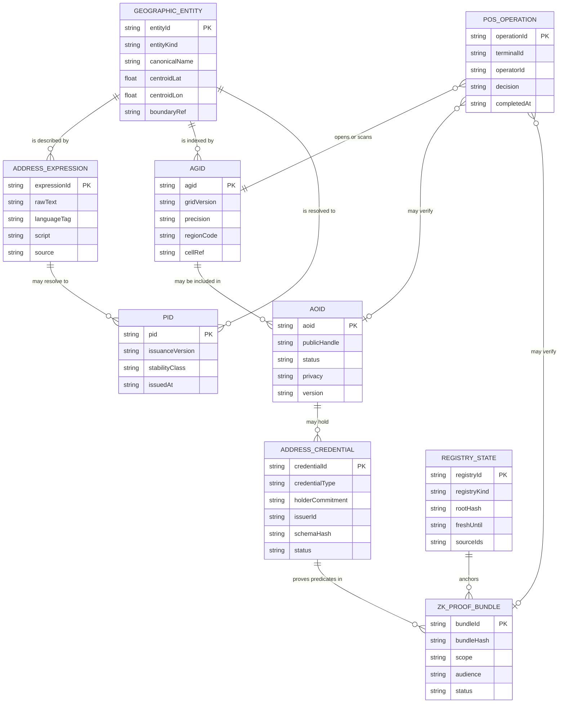
```mermaid
erDiagram
  GEOGRAPHIC_ENTITY {
    string entityId PK
    string entityKind
    string canonicalName
    float centroidLat
    float centroidLon
    string boundaryRef
  }

  ADDRESS_EXPRESSION {
    string expressionId PK
    string rawText
    string languageTag
    string script
    string source
  }

  AGID {
    string agid PK
    string gridVersion
    string precision
    string regionCode
    string cellRef
  }

  AOID {
    string aoid PK
    string publicHandle
    string status
    string privacy
    string version
  }

  PID {
    string pid PK
    string issuanceVersion
    string stabilityClass
    string issuedAt
  }

  ADDRESS_CREDENTIAL {
    string credentialId PK
    string credentialType
    string holderCommitment
    string issuerId
    string schemaHash
    string status
  }

  ZK_PROOF_BUNDLE {
    string bundleId PK
    string bundleHash
    string scope
    string audience
    string status
  }

  REGISTRY_STATE {
    string registryId PK
    string registryKind
    string rootHash
    string freshUntil
    string sourceIds
  }

  POS_OPERATION {
    string operationId PK
    string terminalId
    string operatorId
    string decision
    string completedAt
  }

  GEOGRAPHIC_ENTITY ||--o{ ADDRESS_EXPRESSION : "is described by"
  GEOGRAPHIC_ENTITY ||--o{ AGID : "is indexed by"
  GEOGRAPHIC_ENTITY ||--o{ PID : "is resolved to"
  ADDRESS_EXPRESSION ||--o{ PID : "may resolve to"
  AGID ||--o{ AOID : "may be included in"
  AOID ||--o{ ADDRESS_CREDENTIAL : "may hold"
  ADDRESS_CREDENTIAL ||--o{ ZK_PROOF_BUNDLE : "proves predicates in"
  REGISTRY_STATE ||--o{ ZK_PROOF_BUNDLE : "anchors"
  POS_OPERATION }o--|| AGID : "opens or scans"
  POS_OPERATION }o--o| AOID : "may verify"
  POS_OPERATION }o--o| ZK_PROOF_BUNDLE : "may verify"
```

## Diagram 2. Browser IndexedDB Logical ER

This describes the client-side database in `AGID_AppDB`. It is the fastest local
mode and must not become a plain-text central address database.

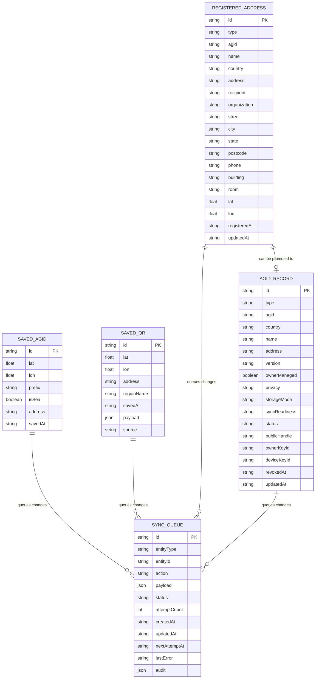
```mermaid
erDiagram
  SAVED_AGID {
    string id PK
    float lat
    float lon
    string prefix
    boolean isSea
    string address
    string savedAt
  }

  SAVED_QR {
    string id PK
    float lat
    float lon
    string address
    string regionName
    string savedAt
    json payload
    string source
  }

  REGISTERED_ADDRESS {
    string id PK
    string type
    string agid
    string name
    string country
    string address
    string recipient
    string organization
    string street
    string city
    string state
    string postcode
    string phone
    string building
    string room
    float lat
    float lon
    string registeredAt
    string updatedAt
  }

  AOID_RECORD {
    string id PK
    string type
    string agid
    string country
    string name
    string address
    string version
    boolean ownerManaged
    string privacy
    string storageMode
    string syncReadiness
    string status
    string publicHandle
    string ownerKeyId
    string deviceKeyId
    string revokedAt
    string updatedAt
  }

  SYNC_QUEUE {
    string id PK
    string entityType
    string entityId
    string action
    json payload
    string status
    int attemptCount
    string createdAt
    string updatedAt
    string nextAttemptAt
    string lastError
    json audit
  }

  SAVED_AGID ||--o{ SYNC_QUEUE : "queues changes"
  SAVED_QR ||--o{ SYNC_QUEUE : "queues changes"
  REGISTERED_ADDRESS ||--o{ SYNC_QUEUE : "queues changes"
  AOID_RECORD ||--o{ SYNC_QUEUE : "queues changes"
  REGISTERED_ADDRESS ||--o| AOID_RECORD : "can be promoted to"
```

## Diagram 3. Address Morphism Pipeline ER

This diagram models candidate generation, clustering, unresolved handling,
history update, and PID issuance.

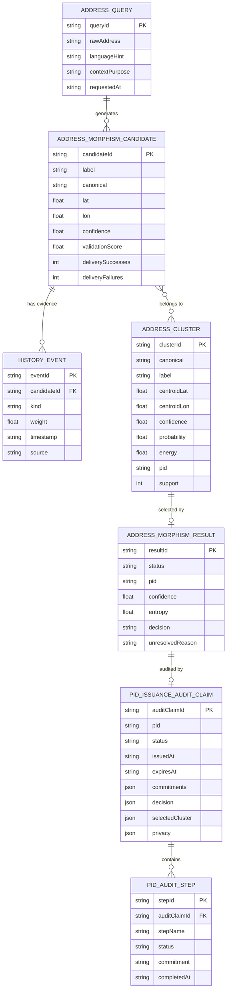
```mermaid
erDiagram
  ADDRESS_QUERY {
    string queryId PK
    string rawAddress
    string languageHint
    string contextPurpose
    string requestedAt
  }

  ADDRESS_MORPHISM_CANDIDATE {
    string candidateId PK
    string label
    string canonical
    float lat
    float lon
    float confidence
    float validationScore
    int deliverySuccesses
    int deliveryFailures
  }

  HISTORY_EVENT {
    string eventId PK
    string candidateId FK
    string kind
    float weight
    string timestamp
    string source
  }

  ADDRESS_CLUSTER {
    string clusterId PK
    string canonical
    string label
    float centroidLat
    float centroidLon
    float confidence
    float probability
    float energy
    string pid
    int support
  }

  ADDRESS_MORPHISM_RESULT {
    string resultId PK
    string status
    string pid
    float confidence
    float entropy
    string decision
    string unresolvedReason
  }

  PID_ISSUANCE_AUDIT_CLAIM {
    string auditClaimId PK
    string pid
    string status
    string issuedAt
    string expiresAt
    json commitments
    json decision
    json selectedCluster
    json privacy
  }

  PID_AUDIT_STEP {
    string stepId PK
    string auditClaimId FK
    string stepName
    string status
    string commitment
    string completedAt
  }

  ADDRESS_QUERY ||--o{ ADDRESS_MORPHISM_CANDIDATE : "generates"
  ADDRESS_MORPHISM_CANDIDATE ||--o{ HISTORY_EVENT : "has evidence"
  ADDRESS_MORPHISM_CANDIDATE }o--o{ ADDRESS_CLUSTER : "belongs to"
  ADDRESS_CLUSTER ||--o| ADDRESS_MORPHISM_RESULT : "selected by"
  ADDRESS_MORPHISM_RESULT ||--o| PID_ISSUANCE_AUDIT_CLAIM : "audited by"
  PID_ISSUANCE_AUDIT_CLAIM ||--o{ PID_AUDIT_STEP : "contains"
```

## Diagram 4. AOID Privacy And Sync ER

AOID is private by default. The public descriptor and encrypted sync envelope are
separate from the sensitive AOID payload.

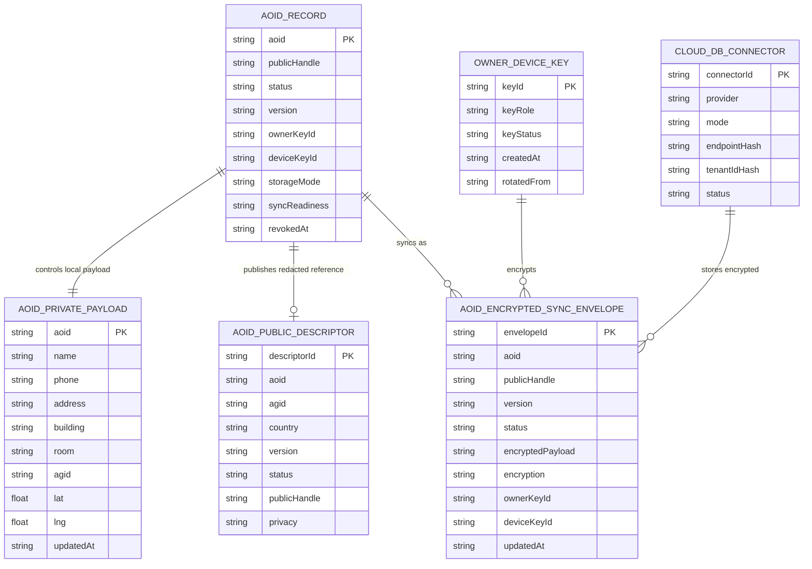
```mermaid
erDiagram
  AOID_PRIVATE_PAYLOAD {
    string aoid PK
    string name
    string phone
    string address
    string building
    string room
    string agid
    float lat
    float lng
    string updatedAt
  }

  AOID_RECORD {
    string aoid PK
    string publicHandle
    string status
    string version
    string ownerKeyId
    string deviceKeyId
    string storageMode
    string syncReadiness
    string revokedAt
  }

  AOID_PUBLIC_DESCRIPTOR {
    string descriptorId PK
    string aoid
    string agid
    string country
    string version
    string status
    string publicHandle
    string privacy
  }

  AOID_ENCRYPTED_SYNC_ENVELOPE {
    string envelopeId PK
    string aoid
    string publicHandle
    string version
    string status
    string encryptedPayload
    string encryption
    string ownerKeyId
    string deviceKeyId
    string updatedAt
  }

  OWNER_DEVICE_KEY {
    string keyId PK
    string keyRole
    string keyStatus
    string createdAt
    string rotatedFrom
  }

  CLOUD_DB_CONNECTOR {
    string connectorId PK
    string provider
    string mode
    string endpointHash
    string tenantIdHash
    string status
  }

  AOID_RECORD ||--|| AOID_PRIVATE_PAYLOAD : "controls local payload"
  AOID_RECORD ||--o| AOID_PUBLIC_DESCRIPTOR : "publishes redacted reference"
  AOID_RECORD ||--o{ AOID_ENCRYPTED_SYNC_ENVELOPE : "syncs as"
  OWNER_DEVICE_KEY ||--o{ AOID_ENCRYPTED_SYNC_ENVELOPE : "encrypts"
  CLOUD_DB_CONNECTOR ||--o{ AOID_ENCRYPTED_SYNC_ENVELOPE : "stores encrypted"
```

## Diagram 5. AGID-S And POS Operation ER

AGID-S is an encrypted sharing envelope for AGID. POS uses it for QR, NFC, and
handoff decisions.

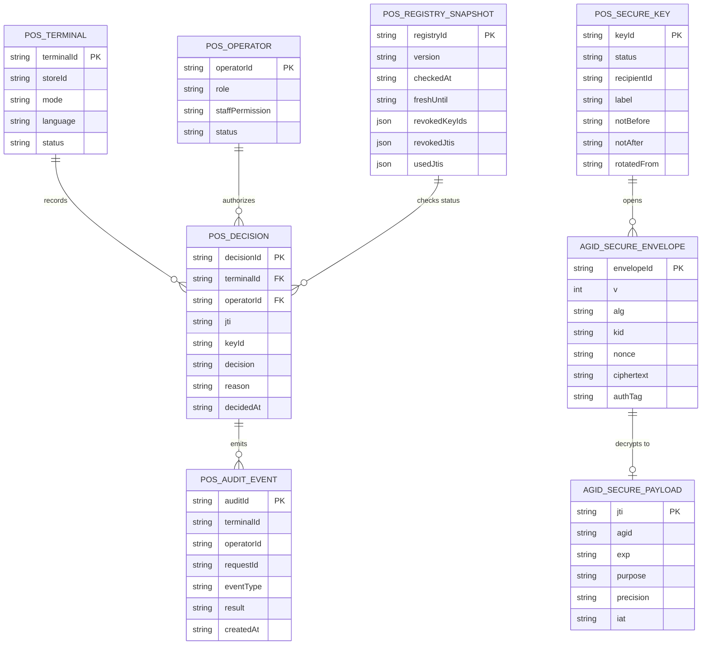
```mermaid
erDiagram
  AGID_SECURE_ENVELOPE {
    string envelopeId PK
    int v
    string alg
    string kid
    string nonce
    string ciphertext
    string authTag
  }

  AGID_SECURE_PAYLOAD {
    string jti PK
    string agid
    string exp
    string purpose
    string precision
    string iat
  }

  POS_TERMINAL {
    string terminalId PK
    string storeId
    string mode
    string language
    string status
  }

  POS_OPERATOR {
    string operatorId PK
    string role
    string staffPermission
    string status
  }

  POS_SECURE_KEY {
    string keyId PK
    string status
    string recipientId
    string label
    string notBefore
    string notAfter
    string rotatedFrom
  }

  POS_REGISTRY_SNAPSHOT {
    string registryId PK
    string version
    string checkedAt
    string freshUntil
    json revokedKeyIds
    json revokedJtis
    json usedJtis
  }

  POS_DECISION {
    string decisionId PK
    string terminalId FK
    string operatorId FK
    string jti
    string keyId
    string decision
    string reason
    string decidedAt
  }

  POS_AUDIT_EVENT {
    string auditId PK
    string terminalId
    string operatorId
    string requestId
    string eventType
    string result
    string createdAt
  }

  AGID_SECURE_ENVELOPE ||--o| AGID_SECURE_PAYLOAD : "decrypts to"
  POS_SECURE_KEY ||--o{ AGID_SECURE_ENVELOPE : "opens"
  POS_TERMINAL ||--o{ POS_DECISION : "records"
  POS_OPERATOR ||--o{ POS_DECISION : "authorizes"
  POS_REGISTRY_SNAPSHOT ||--o{ POS_DECISION : "checks status"
  POS_DECISION ||--o{ POS_AUDIT_EVENT : "emits"
```

## Diagram 6. POS Registry Physical ER

This is the storage shape used when the POS registry is backed by SQLite,
Postgres, or Redis-like adapters. JTI and key identifiers are operational
identifiers, not address payloads.

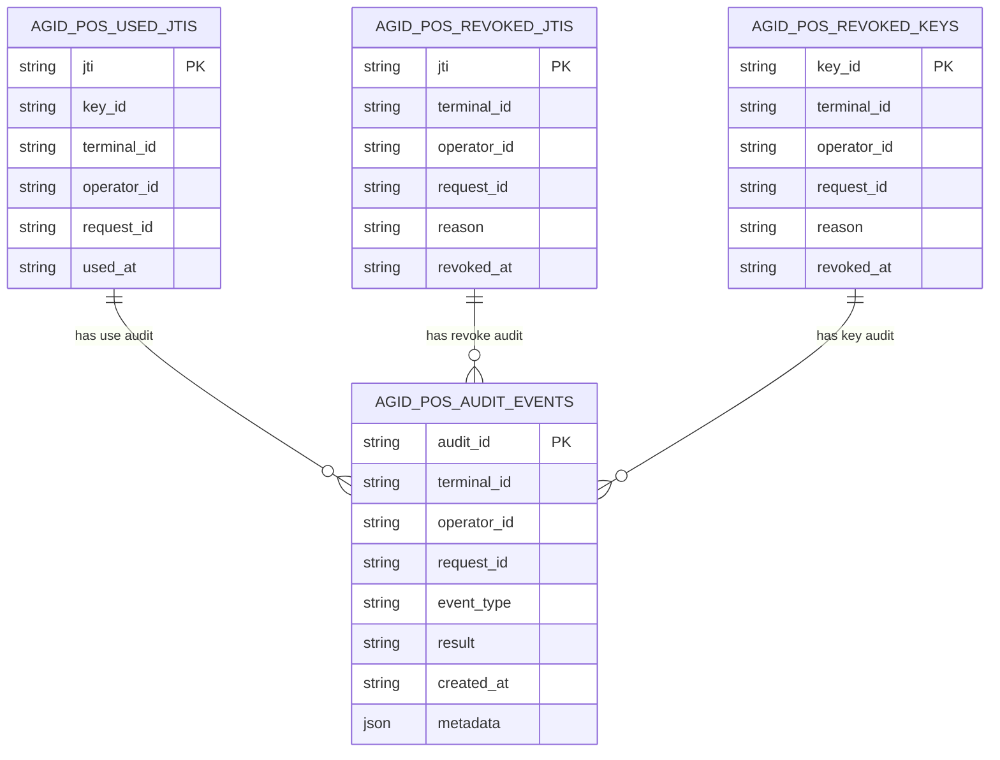
```mermaid
erDiagram
  AGID_POS_USED_JTIS {
    string jti PK
    string key_id
    string terminal_id
    string operator_id
    string request_id
    string used_at
  }

  AGID_POS_REVOKED_JTIS {
    string jti PK
    string terminal_id
    string operator_id
    string request_id
    string reason
    string revoked_at
  }

  AGID_POS_REVOKED_KEYS {
    string key_id PK
    string terminal_id
    string operator_id
    string request_id
    string reason
    string revoked_at
  }

  AGID_POS_AUDIT_EVENTS {
    string audit_id PK
    string terminal_id
    string operator_id
    string request_id
    string event_type
    string result
    string created_at
    json metadata
  }

  AGID_POS_USED_JTIS ||--o{ AGID_POS_AUDIT_EVENTS : "has use audit"
  AGID_POS_REVOKED_JTIS ||--o{ AGID_POS_AUDIT_EVENTS : "has revoke audit"
  AGID_POS_REVOKED_KEYS ||--o{ AGID_POS_AUDIT_EVENTS : "has key audit"
```

## Diagram 7. Credential, Revocation, Freshness, And ZK ER

This diagram covers ZK-ready credential verification. It keeps semantics and
cryptography separated: AMT decides what a predicate means; ZK proves only that
the hidden witness satisfies the public predicate.

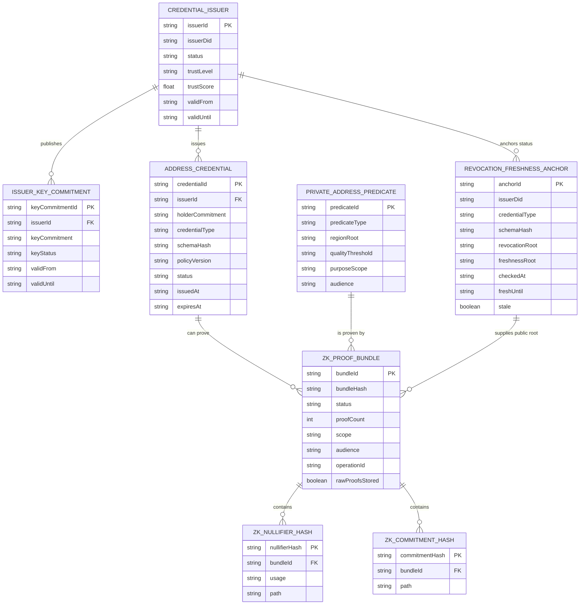
```mermaid
erDiagram
  CREDENTIAL_ISSUER {
    string issuerId PK
    string issuerDid
    string status
    string trustLevel
    float trustScore
    string validFrom
    string validUntil
  }

  ISSUER_KEY_COMMITMENT {
    string keyCommitmentId PK
    string issuerId FK
    string keyCommitment
    string keyStatus
    string validFrom
    string validUntil
  }

  ADDRESS_CREDENTIAL {
    string credentialId PK
    string issuerId FK
    string holderCommitment
    string credentialType
    string schemaHash
    string policyVersion
    string status
    string issuedAt
    string expiresAt
  }

  REVOCATION_FRESHNESS_ANCHOR {
    string anchorId PK
    string issuerDid
    string credentialType
    string schemaHash
    string revocationRoot
    string freshnessRoot
    string checkedAt
    string freshUntil
    boolean stale
  }

  PRIVATE_ADDRESS_PREDICATE {
    string predicateId PK
    string predicateType
    string regionRoot
    string qualityThreshold
    string purposeScope
    string audience
  }

  ZK_PROOF_BUNDLE {
    string bundleId PK
    string bundleHash
    string status
    int proofCount
    string scope
    string audience
    string operationId
    boolean rawProofsStored
  }

  ZK_NULLIFIER_HASH {
    string nullifierHash PK
    string bundleId FK
    string usage
    string path
  }

  ZK_COMMITMENT_HASH {
    string commitmentHash PK
    string bundleId FK
    string path
  }

  CREDENTIAL_ISSUER ||--o{ ISSUER_KEY_COMMITMENT : "publishes"
  CREDENTIAL_ISSUER ||--o{ ADDRESS_CREDENTIAL : "issues"
  CREDENTIAL_ISSUER ||--o{ REVOCATION_FRESHNESS_ANCHOR : "anchors status"
  ADDRESS_CREDENTIAL ||--o{ ZK_PROOF_BUNDLE : "can prove"
  PRIVATE_ADDRESS_PREDICATE ||--o{ ZK_PROOF_BUNDLE : "is proven by"
  ZK_PROOF_BUNDLE ||--o{ ZK_NULLIFIER_HASH : "contains"
  ZK_PROOF_BUNDLE ||--o{ ZK_COMMITMENT_HASH : "contains"
  REVOCATION_FRESHNESS_ANCHOR ||--o{ ZK_PROOF_BUNDLE : "supplies public root"
```

## Diagram 8. Ethereum Registry Logical ER

Ethereum is a verification layer, not an address database. AGID, AOID body,
plain address, phone, building, room, latitude, longitude, and AGID-S ciphertext
must stay out of public transaction arguments.

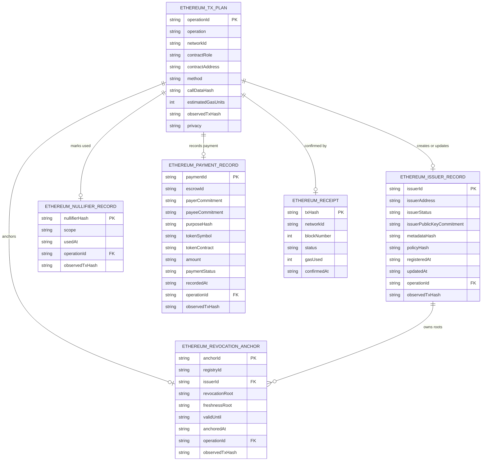
```mermaid
erDiagram
  ETHEREUM_TX_PLAN {
    string operationId PK
    string operation
    string networkId
    string contractRole
    string contractAddress
    string method
    string callDataHash
    int estimatedGasUnits
    string observedTxHash
    string privacy
  }

  ETHEREUM_ISSUER_RECORD {
    string issuerId PK
    string issuerAddress
    string issuerStatus
    string issuerPublicKeyCommitment
    string metadataHash
    string policyHash
    string registeredAt
    string updatedAt
    string operationId FK
    string observedTxHash
  }

  ETHEREUM_REVOCATION_ANCHOR {
    string anchorId PK
    string registryId
    string issuerId FK
    string revocationRoot
    string freshnessRoot
    string validUntil
    string anchoredAt
    string operationId FK
    string observedTxHash
  }

  ETHEREUM_NULLIFIER_RECORD {
    string nullifierHash PK
    string scope
    string usedAt
    string operationId FK
    string observedTxHash
  }

  ETHEREUM_PAYMENT_RECORD {
    string paymentId PK
    string escrowId
    string payerCommitment
    string payeeCommitment
    string purposeHash
    string tokenSymbol
    string tokenContract
    string amount
    string paymentStatus
    string recordedAt
    string operationId FK
    string observedTxHash
  }

  ETHEREUM_RECEIPT {
    string txHash PK
    string networkId
    int blockNumber
    string status
    int gasUsed
    string confirmedAt
  }

  ETHEREUM_TX_PLAN ||--o| ETHEREUM_ISSUER_RECORD : "creates or updates"
  ETHEREUM_TX_PLAN ||--o| ETHEREUM_REVOCATION_ANCHOR : "anchors"
  ETHEREUM_TX_PLAN ||--o| ETHEREUM_NULLIFIER_RECORD : "marks used"
  ETHEREUM_TX_PLAN ||--o| ETHEREUM_PAYMENT_RECORD : "records payment"
  ETHEREUM_TX_PLAN ||--o| ETHEREUM_RECEIPT : "confirmed by"
  ETHEREUM_ISSUER_RECORD ||--o{ ETHEREUM_REVOCATION_ANCHOR : "owns roots"
```

## Diagram 9. Multi-Mode Deployment ER

The same domain supports local, server, ZK-only, Ethereum-only, and full ZK plus
Ethereum modes.

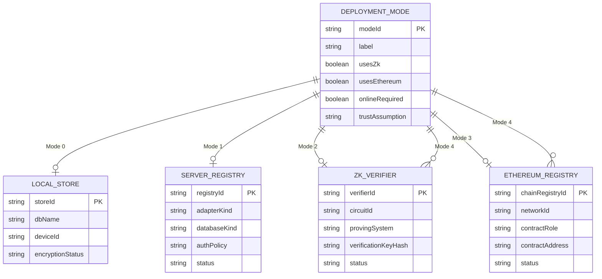
```mermaid
erDiagram
  DEPLOYMENT_MODE {
    string modeId PK
    string label
    boolean usesZk
    boolean usesEthereum
    boolean onlineRequired
    string trustAssumption
  }

  LOCAL_STORE {
    string storeId PK
    string dbName
    string deviceId
    string encryptionStatus
  }

  SERVER_REGISTRY {
    string registryId PK
    string adapterKind
    string databaseKind
    string authPolicy
    string status
  }

  ZK_VERIFIER {
    string verifierId PK
    string circuitId
    string provingSystem
    string verificationKeyHash
    string status
  }

  ETHEREUM_REGISTRY {
    string chainRegistryId PK
    string networkId
    string contractRole
    string contractAddress
    string status
  }

  DEPLOYMENT_MODE ||--o| LOCAL_STORE : "Mode 0"
  DEPLOYMENT_MODE ||--o| SERVER_REGISTRY : "Mode 1"
  DEPLOYMENT_MODE ||--o| ZK_VERIFIER : "Mode 2"
  DEPLOYMENT_MODE ||--o| ETHEREUM_REGISTRY : "Mode 3"
  DEPLOYMENT_MODE ||--o{ ZK_VERIFIER : "Mode 4"
  DEPLOYMENT_MODE ||--o{ ETHEREUM_REGISTRY : "Mode 4"
```

## Diagram 10. Address Verification And Postal Evidence ER

This covers country policy, postal evidence, standard library hooks, and quality
scoring. It is designed for the address tab and validation engine.

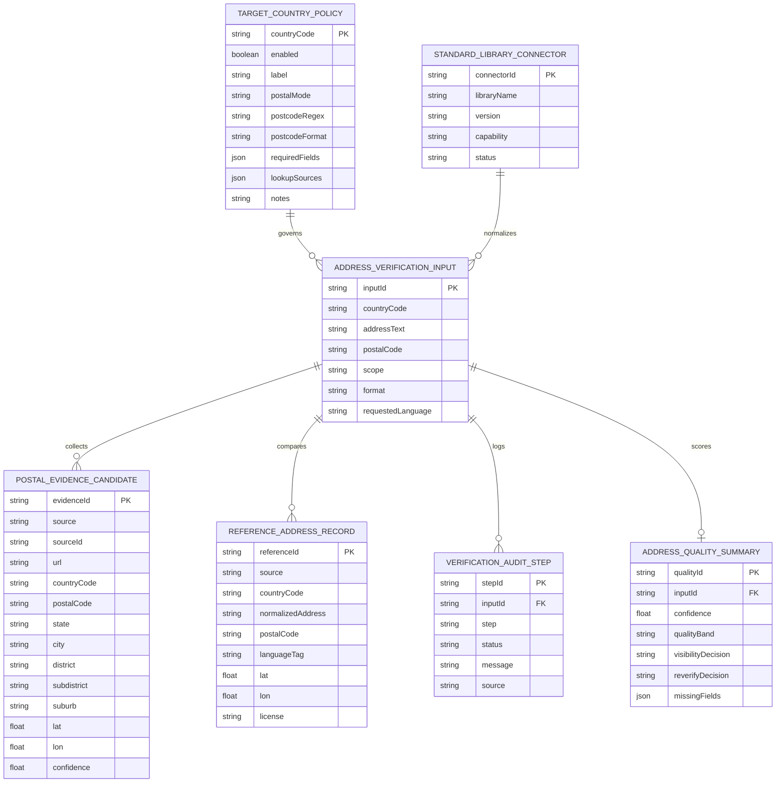
```mermaid
erDiagram
  TARGET_COUNTRY_POLICY {
    string countryCode PK
    boolean enabled
    string label
    string postalMode
    string postcodeRegex
    string postcodeFormat
    json requiredFields
    json lookupSources
    string notes
  }

  ADDRESS_VERIFICATION_INPUT {
    string inputId PK
    string countryCode
    string addressText
    string postalCode
    string scope
    string format
    string requestedLanguage
  }

  POSTAL_EVIDENCE_CANDIDATE {
    string evidenceId PK
    string source
    string sourceId
    string url
    string countryCode
    string postalCode
    string state
    string city
    string district
    string subdistrict
    string suburb
    float lat
    float lon
    float confidence
  }

  REFERENCE_ADDRESS_RECORD {
    string referenceId PK
    string source
    string countryCode
    string normalizedAddress
    string postalCode
    string languageTag
    float lat
    float lon
    string license
  }

  STANDARD_LIBRARY_CONNECTOR {
    string connectorId PK
    string libraryName
    string version
    string capability
    string status
  }

  VERIFICATION_AUDIT_STEP {
    string stepId PK
    string inputId FK
    string step
    string status
    string message
    string source
  }

  ADDRESS_QUALITY_SUMMARY {
    string qualityId PK
    string inputId FK
    float confidence
    string qualityBand
    string visibilityDecision
    string reverifyDecision
    json missingFields
  }

  TARGET_COUNTRY_POLICY ||--o{ ADDRESS_VERIFICATION_INPUT : "governs"
  ADDRESS_VERIFICATION_INPUT ||--o{ POSTAL_EVIDENCE_CANDIDATE : "collects"
  ADDRESS_VERIFICATION_INPUT ||--o{ REFERENCE_ADDRESS_RECORD : "compares"
  STANDARD_LIBRARY_CONNECTOR ||--o{ ADDRESS_VERIFICATION_INPUT : "normalizes"
  ADDRESS_VERIFICATION_INPUT ||--o{ VERIFICATION_AUDIT_STEP : "logs"
  ADDRESS_VERIFICATION_INPUT ||--o| ADDRESS_QUALITY_SUMMARY : "scores"
```

## Diagram 11. Reverse Geocoding And Natural Feature ER

This supports roads, bridges, mountains, rivers, waterfalls, lakes, islands,
wetlands, deserts, grasslands, forests, glaciers, caves, valleys, heritage
sites, offshore areas, polar areas, and other named geographic features.

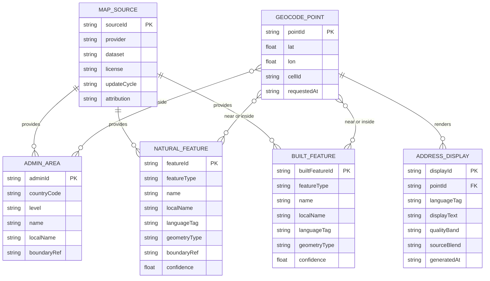
```mermaid
erDiagram
  MAP_SOURCE {
    string sourceId PK
    string provider
    string dataset
    string license
    string updateCycle
    string attribution
  }

  GEOCODE_POINT {
    string pointId PK
    float lat
    float lon
    string cellId
    string requestedAt
  }

  ADMIN_AREA {
    string adminId PK
    string countryCode
    string level
    string name
    string localName
    string boundaryRef
  }

  NATURAL_FEATURE {
    string featureId PK
    string featureType
    string name
    string localName
    string languageTag
    string geometryType
    string boundaryRef
    float confidence
  }

  BUILT_FEATURE {
    string builtFeatureId PK
    string featureType
    string name
    string localName
    string languageTag
    string geometryType
    float confidence
  }

  ADDRESS_DISPLAY {
    string displayId PK
    string pointId FK
    string languageTag
    string displayText
    string qualityBand
    string sourceBlend
    string generatedAt
  }

  MAP_SOURCE ||--o{ ADMIN_AREA : "provides"
  MAP_SOURCE ||--o{ NATURAL_FEATURE : "provides"
  MAP_SOURCE ||--o{ BUILT_FEATURE : "provides"
  GEOCODE_POINT }o--o{ ADMIN_AREA : "inside"
  GEOCODE_POINT }o--o{ NATURAL_FEATURE : "near or inside"
  GEOCODE_POINT }o--o{ BUILT_FEATURE : "near or inside"
  GEOCODE_POINT ||--o{ ADDRESS_DISPLAY : "renders"
```

## Diagram 12. Internationalization And Address Tab ER

The language tab is separate from address validity. A language change should
change rendering, labels, ordering, transliteration, and evidence choice when
available, while the underlying verified entity remains stable.

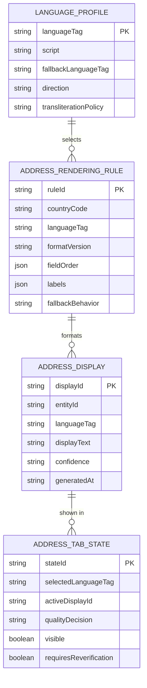
```mermaid
erDiagram
  LANGUAGE_PROFILE {
    string languageTag PK
    string script
    string fallbackLanguageTag
    string direction
    string transliterationPolicy
  }

  ADDRESS_RENDERING_RULE {
    string ruleId PK
    string countryCode
    string languageTag
    string formatVersion
    json fieldOrder
    json labels
    string fallbackBehavior
  }

  ADDRESS_DISPLAY {
    string displayId PK
    string entityId
    string languageTag
    string displayText
    string confidence
    string generatedAt
  }

  ADDRESS_TAB_STATE {
    string stateId PK
    string selectedLanguageTag
    string activeDisplayId
    string qualityDecision
    boolean visible
    boolean requiresReverification
  }

  LANGUAGE_PROFILE ||--o{ ADDRESS_RENDERING_RULE : "selects"
  ADDRESS_RENDERING_RULE ||--o{ ADDRESS_DISPLAY : "formats"
  ADDRESS_DISPLAY ||--o{ ADDRESS_TAB_STATE : "shown in"
```

## Diagram 13. Cross-Border POS And Shopping Agent Data ER

This diagram supports tariffs, HS codes, currency, carrier capability, customs
evidence, and shopping-agent decisions. It should remain a helper data layer,
not a private address store.

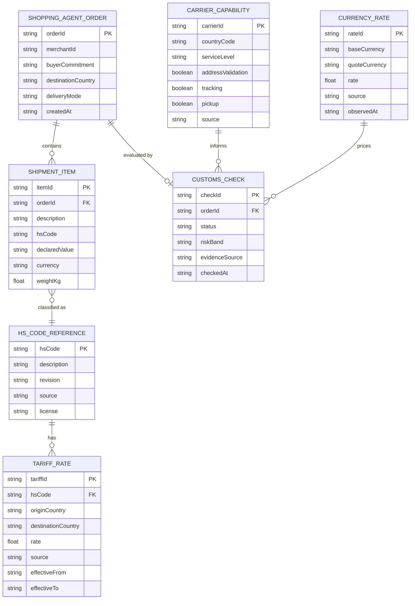
```mermaid
erDiagram
  SHOPPING_AGENT_ORDER {
    string orderId PK
    string merchantId
    string buyerCommitment
    string destinationCountry
    string deliveryMode
    string createdAt
  }

  SHIPMENT_ITEM {
    string itemId PK
    string orderId FK
    string description
    string hsCode
    string declaredValue
    string currency
    float weightKg
  }

  HS_CODE_REFERENCE {
    string hsCode PK
    string description
    string revision
    string source
    string license
  }

  TARIFF_RATE {
    string tariffId PK
    string hsCode FK
    string originCountry
    string destinationCountry
    float rate
    string source
    string effectiveFrom
    string effectiveTo
  }

  CURRENCY_RATE {
    string rateId PK
    string baseCurrency
    string quoteCurrency
    float rate
    string source
    string observedAt
  }

  CARRIER_CAPABILITY {
    string carrierId PK
    string countryCode
    string serviceLevel
    boolean addressValidation
    boolean tracking
    boolean pickup
    string source
  }

  CUSTOMS_CHECK {
    string checkId PK
    string orderId FK
    string status
    string riskBand
    string evidenceSource
    string checkedAt
  }

  SHOPPING_AGENT_ORDER ||--o{ SHIPMENT_ITEM : "contains"
  SHIPMENT_ITEM }o--|| HS_CODE_REFERENCE : "classified as"
  HS_CODE_REFERENCE ||--o{ TARIFF_RATE : "has"
  CURRENCY_RATE ||--o{ CUSTOMS_CHECK : "prices"
  CARRIER_CAPABILITY ||--o{ CUSTOMS_CHECK : "informs"
  SHOPPING_AGENT_ORDER ||--o| CUSTOMS_CHECK : "evaluated by"
```

## Diagram 14. Audit, Consent, And Purpose Scope ER

This diagram captures user consent, purpose separation, and audit trails. It is
important for the "do not build a surveillance database" design requirement.

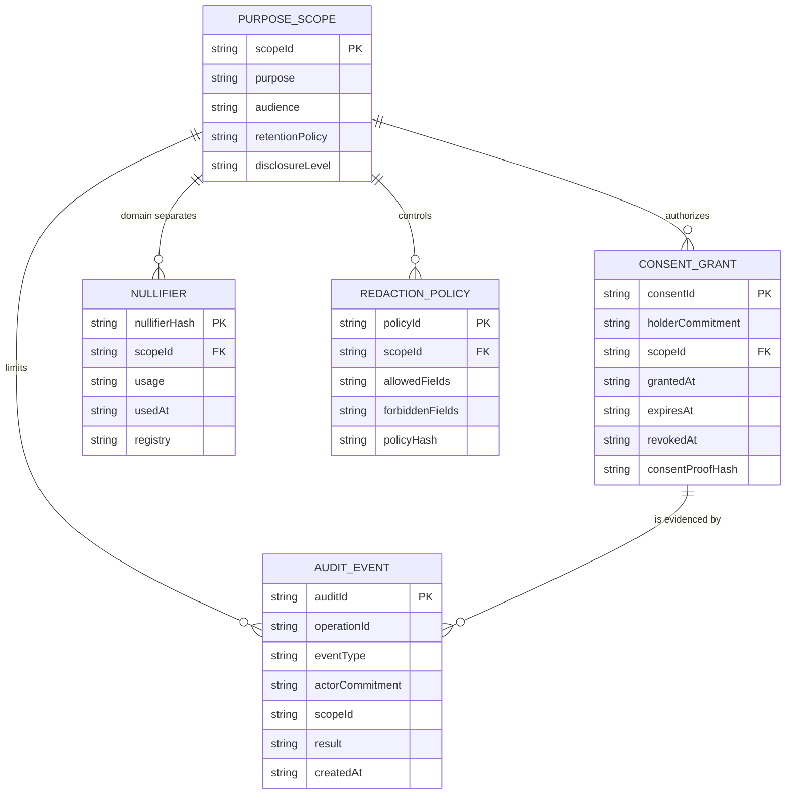
```mermaid
erDiagram
  PURPOSE_SCOPE {
    string scopeId PK
    string purpose
    string audience
    string retentionPolicy
    string disclosureLevel
  }

  CONSENT_GRANT {
    string consentId PK
    string holderCommitment
    string scopeId FK
    string grantedAt
    string expiresAt
    string revokedAt
    string consentProofHash
  }

  NULLIFIER {
    string nullifierHash PK
    string scopeId FK
    string usage
    string usedAt
    string registry
  }

  AUDIT_EVENT {
    string auditId PK
    string operationId
    string eventType
    string actorCommitment
    string scopeId
    string result
    string createdAt
  }

  REDACTION_POLICY {
    string policyId PK
    string scopeId FK
    string allowedFields
    string forbiddenFields
    string policyHash
  }

  PURPOSE_SCOPE ||--o{ CONSENT_GRANT : "authorizes"
  PURPOSE_SCOPE ||--o{ NULLIFIER : "domain separates"
  PURPOSE_SCOPE ||--o{ AUDIT_EVENT : "limits"
  PURPOSE_SCOPE ||--o{ REDACTION_POLICY : "controls"
  CONSENT_GRANT ||--o{ AUDIT_EVENT : "is evidenced by"
```

## Diagram 15. Privacy Boundary ER

This is not a storage schema. It states what may be stored publicly, what must be
encrypted, and what should never be stored in shared registries.

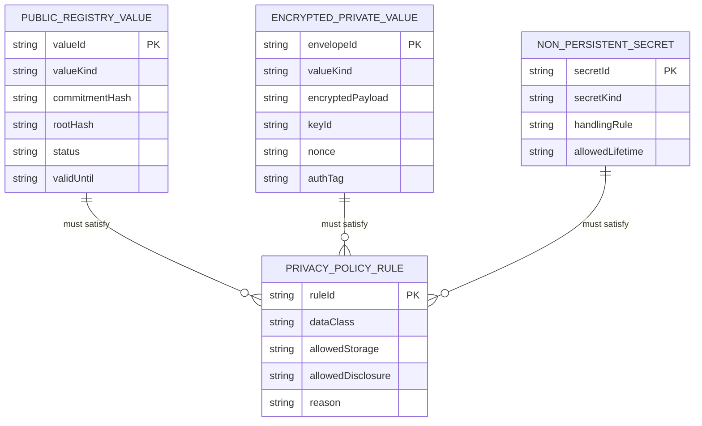
```mermaid
erDiagram
  PUBLIC_REGISTRY_VALUE {
    string valueId PK
    string valueKind
    string commitmentHash
    string rootHash
    string status
    string validUntil
  }

  ENCRYPTED_PRIVATE_VALUE {
    string envelopeId PK
    string valueKind
    string encryptedPayload
    string keyId
    string nonce
    string authTag
  }

  NON_PERSISTENT_SECRET {
    string secretId PK
    string secretKind
    string handlingRule
    string allowedLifetime
  }

  PRIVACY_POLICY_RULE {
    string ruleId PK
    string dataClass
    string allowedStorage
    string allowedDisclosure
    string reason
  }

  PUBLIC_REGISTRY_VALUE ||--o{ PRIVACY_POLICY_RULE : "must satisfy"
  ENCRYPTED_PRIVATE_VALUE ||--o{ PRIVACY_POLICY_RULE : "must satisfy"
  NON_PERSISTENT_SECRET ||--o{ PRIVACY_POLICY_RULE : "must satisfy"
```

### Privacy Boundary Interpretation

| Data class | Storage rule |
|---|---|
| Plain address, name, phone, room, building | Do not store in public registries. Keep local or encrypted. |
| AGID | Public only when the use case permits location disclosure. Otherwise use AGID-S or ZK predicates. |
| AGID-S ciphertext | Prefer off-chain. Do not publish permanently on-chain. |
| AOID body | Private by default. Public descriptor must be redacted. |
| Credential | Store holder-side or encrypted. Publish only commitments, issuer status, roots, and nullifiers. |
| Nullifier | Must be domain-separated by scope and purpose. |
| Audit event | Store minimal metadata and avoid linkable private identifiers. |

## Diagram 16. Cloud And DB Adapter ER

This diagram shows how cloud and database integrations should be shaped. Cloud
adapters must not silently downgrade privacy by storing plaintext address data.

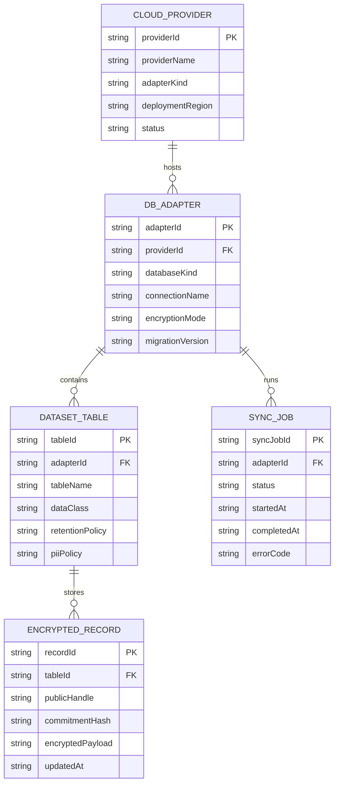
```mermaid
erDiagram
  CLOUD_PROVIDER {
    string providerId PK
    string providerName
    string adapterKind
    string deploymentRegion
    string status
  }

  DB_ADAPTER {
    string adapterId PK
    string providerId FK
    string databaseKind
    string connectionName
    string encryptionMode
    string migrationVersion
  }

  DATASET_TABLE {
    string tableId PK
    string adapterId FK
    string tableName
    string dataClass
    string retentionPolicy
    string piiPolicy
  }

  ENCRYPTED_RECORD {
    string recordId PK
    string tableId FK
    string publicHandle
    string commitmentHash
    string encryptedPayload
    string updatedAt
  }

  SYNC_JOB {
    string syncJobId PK
    string adapterId FK
    string status
    string startedAt
    string completedAt
    string errorCode
  }

  CLOUD_PROVIDER ||--o{ DB_ADAPTER : "hosts"
  DB_ADAPTER ||--o{ DATASET_TABLE : "contains"
  DATASET_TABLE ||--o{ ENCRYPTED_RECORD : "stores"
  DB_ADAPTER ||--o{ SYNC_JOB : "runs"
```

## Diagram 17. Security Review ER

This diagram maps security-sensitive entities to their controls. It supports
threat modeling and vulnerability review.

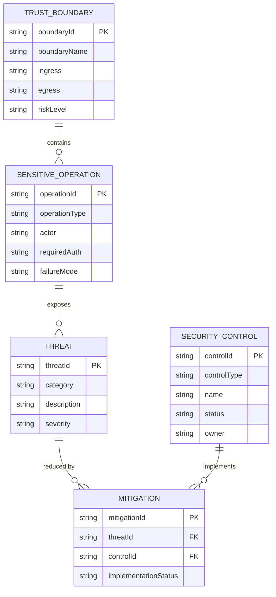
```mermaid
erDiagram
  SECURITY_CONTROL {
    string controlId PK
    string controlType
    string name
    string status
    string owner
  }

  TRUST_BOUNDARY {
    string boundaryId PK
    string boundaryName
    string ingress
    string egress
    string riskLevel
  }

  SENSITIVE_OPERATION {
    string operationId PK
    string operationType
    string actor
    string requiredAuth
    string failureMode
  }

  THREAT {
    string threatId PK
    string category
    string description
    string severity
  }

  MITIGATION {
    string mitigationId PK
    string threatId FK
    string controlId FK
    string implementationStatus
  }

  TRUST_BOUNDARY ||--o{ SENSITIVE_OPERATION : "contains"
  SENSITIVE_OPERATION ||--o{ THREAT : "exposes"
  THREAT ||--o{ MITIGATION : "reduced by"
  SECURITY_CONTROL ||--o{ MITIGATION : "implements"
```

## Diagram 18. Document And Paper Artifact ER

The project has papers, resumes, validation notes, appendices, and application
papers. This ER keeps documents traceable without mixing them with runtime data.

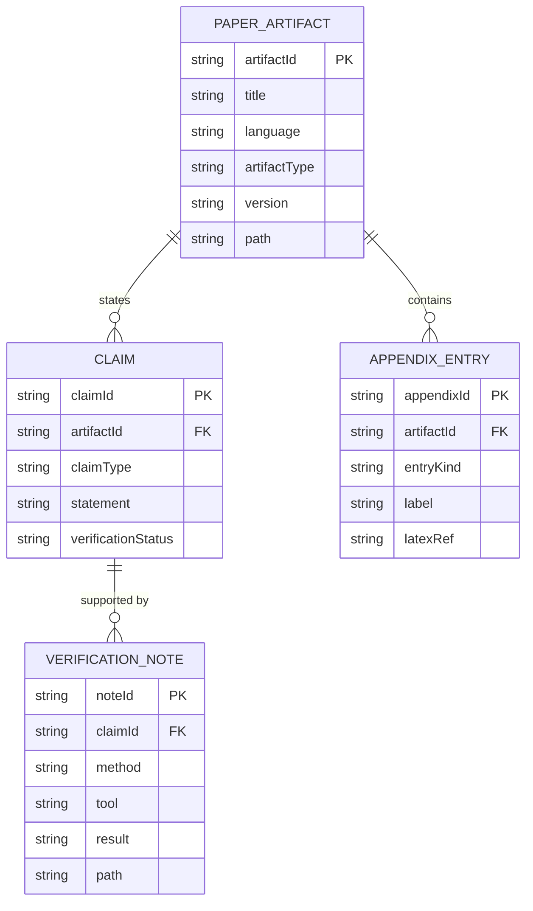
```mermaid
erDiagram
  PAPER_ARTIFACT {
    string artifactId PK
    string title
    string language
    string artifactType
    string version
    string path
  }

  CLAIM {
    string claimId PK
    string artifactId FK
    string claimType
    string statement
    string verificationStatus
  }

  VERIFICATION_NOTE {
    string noteId PK
    string claimId FK
    string method
    string tool
    string result
    string path
  }

  APPENDIX_ENTRY {
    string appendixId PK
    string artifactId FK
    string entryKind
    string label
    string latexRef
  }

  PAPER_ARTIFACT ||--o{ CLAIM : "states"
  CLAIM ||--o{ VERIFICATION_NOTE : "supported by"
  PAPER_ARTIFACT ||--o{ APPENDIX_ENTRY : "contains"
```

## Normalization Rules

1. Keep address semantics, credentials, cryptographic proof state, and POS
   operation state in separate tables or stores.
2. Do not use raw AGID, AOID, address, latitude, longitude, phone, building,
   room, or AGID-S ciphertext as public registry keys.
3. Use domain-separated commitments and nullifiers:
   `hash(secret || scope || purpose || value)` or a keyed construction where
   appropriate.
4. Keep language rendering separate from validation confidence. Language tabs
   change representation, not the verified entity.
5. Use local records for speed; use server registries for operational state; use
   Ethereum only for public audit and multi-party trust; use ZK only when
   selective disclosure is needed.
6. Store audit events with minimal, redacted metadata and bounded retention.
7. Treat POS JTI use, key revocation, issuer revocation, and freshness roots as
   separate operational facts.
8. Keep paper artifacts and verification notes separate from runtime databases.

## Open Implementation Gaps To Track

| Gap | Suggested next ER-backed task |
|---|---|
| POS registry plaintext JTI/key identifiers | Add hashed JTI/key-id columns and migration plan. |
| Multiple SQL adapters | Generate SQLite/Postgres migrations from Diagram 6 and Diagram 16. |
| Ethereum tx receipts | Add durable receipt table and reconcile job from Diagram 8. |
| Address quality scoring | Persist quality summaries and audit steps from Diagram 10. |
| Natural feature rendering | Add feature cache tables from Diagram 11. |
| Language tab behavior | Add rendering rule cache from Diagram 12. |
| ZK proof bundle compatibility | Add proof manifest and circuit registry tables from Diagram 7. |
| Paper traceability | Add document index from Diagram 18. |
