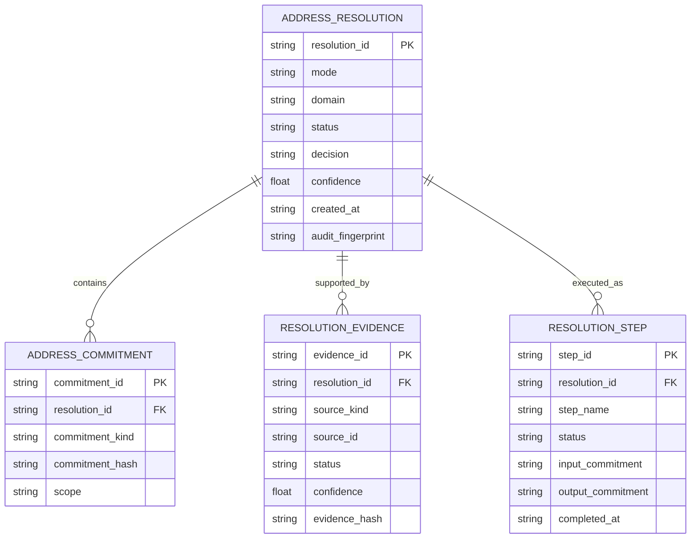
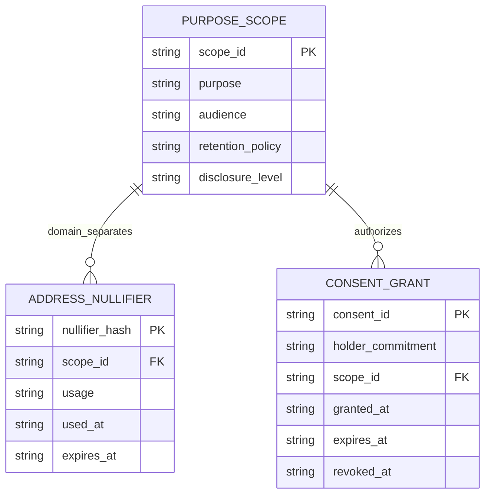
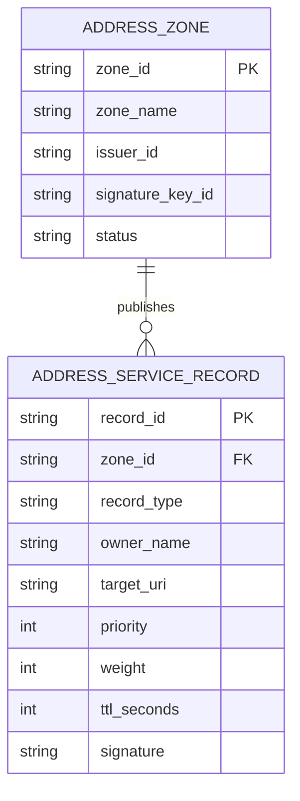
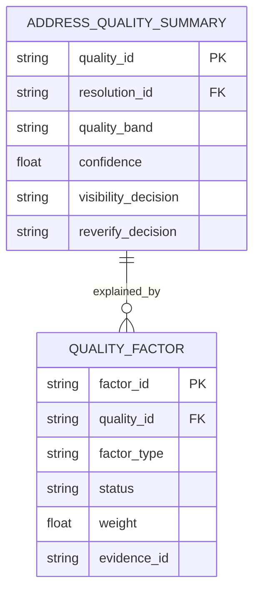

# AGID/AOIDに独創的なデータベース・ER図・SQLを作る価値の研究

Date: 2026-06-17

## 結論

AGID/AOIDで「独創的なデータベース」を作る価値はある。ただし、価値があるのは新しいDBエンジンを自作することではない。価値があるのは、住所を平文で集める一般的な顧客住所DBではなく、住所写像論に基づく「住所解決・根拠・履歴・証明・失効・用途分離」を扱うデータモデルを作ることである。

つまり採用すべき方向は次である。

```text
DBエンジン: SQLite / Postgres / Redis など標準技術を使う
ERモデル: AGID/AOID固有にする
SQL設計: privacy-by-design、証明可能性、監査、再現性を中心にする
公開DB: commitment、root、status、metadataのみ
非公開DB: 暗号化payload、ローカル保存、短期キャッシュ
禁止: 実住所、氏名、電話番号、部屋番号、AGID-S暗号文全文を中央DBに平文保存
```

この方針なら、オープンソースとして信頼されやすく、既存の住所検証サービスやPOS/配送DBと差別化できる。

## 現状確認

現在のリポジトリには、すでに以下の基礎がある。

| 領域 | 現状 |
| --- | --- |
| ローカルDB | `src/lib/appDatabase.ts` に Dexie/IndexedDB。保存AGID、QR、住所登録、AOID、POS、同期キューを保持 |
| POS DB設計 | `docs/delivery-pos-database-ja.md` にPOS配送DB方針あり |
| ER図 | `docs/agid-er-diagrams.md` に概念ER、論理ER、物理ER、プライバシーER、運用ERあり |
| サーバーRegistry | `src/server/posAgidSecureRegistryStore.ts` にfile store |
| DB adapter | `src/server/posAgidSecureRegistryAdapters.ts` にSQLite/Postgres/Redis adapter入口あり |
| Address Resolution System | `src/lib/addressResolutionSystem.ts` に住所DNS、federated resolver、commitment、registry verificationが統合済み |

したがって、次の価値は「新規にDB設計を作る」より、「既存の設計を統一スキーマへ昇格させる」ことにある。

## 作る価値が高い理由

### 1. AGID/AOIDは普通の住所DBではない

通常の住所DBは次のような発想になりがちである。

```text
user_id -> name -> phone -> address -> lat/lon
```

しかしAGID/AOIDでは、この構造は危険である。監視・追跡・漏洩リスクが高く、プロジェクトの思想とも合わない。

AGID/AOIDに必要なのは次の構造である。

```text
address witness/private payload
  -> commitment
  -> resolver decision
  -> quality/audit evidence
  -> revocation/freshness/nullifier
  -> purpose-scoped use
```

この差分が、独自ER図を作る最大の理由である。

### 2. 住所解決は「現在値」ではなく「過程」を保存すべき

AGID/AOIDでは、最終住所だけでなく、次の過程が重要になる。

- 候補生成
- クラスタリング
- unresolved判定
- 履歴更新
- PID/AGID/AOID発行
- 住所品質判定
- 郵便番号・公式データ・逆ジオコーディング根拠
- 失効・鮮度・使用済み確認

したがってDBは、住所値の保存ではなく、解決過程の保存に寄せるべきである。

### 3. プライバシー設計をDBレベルで強制できる

アプリロジックだけで「住所を保存しない」と決めても弱い。DBスキーマ自体が、平文住所を入りにくくする必要がある。

具体的には次をDB制約にする価値がある。

- public registry tableには `raw_address` を作らない
- AGID/AOID本体ではなく `*_commitment` を保存する
- `purpose_scope` をnullifierやaudit eventに必須化する
- `expires_at`、`fresh_until`、`revoked_at` を明示する
- audit payloadはJSONBでも、private field blacklist検査を通す

## 独創性を出すべき部分

### A. Address Resolution Ledger

住所解決を一回ごとの「証跡」として保存する台帳。



これは通常の住所DBよりAGIDらしい。住所を保存せず、解決判断と根拠だけ保存する。

### B. Purpose-Scoped Address Use

配送、返品、本人確認、災害支援、POS受付など、用途を分ける。



これはAOIDを固定IDとして追跡させないために重要である。

### C. Address DNS / Resolver Record

AGIDを「住所版DNS」にするなら、DBはDNS風のrecordを持つ価値がある。ただし個人住所ではなく、resolver、issuer、carrier、revocation endpointなどの公開可能メタデータだけにする。



これにより、`AGID -> resolver / carrier / issuer / revocation endpoint` の問い合わせが可能になる。

### D. Address Quality Evidence Graph

住所品質を単一scoreで終わらせず、根拠グラフとして保存する。



POSではユーザーに細かいscoreを出さず、内部判定として `verified / partial / needs-review` を使う。

## 標準に寄せるべき部分

独創性を出しすぎると危険な部分もある。

| 領域 | 方針 |
| --- | --- |
| DBエンジン | Postgres、SQLite、Redisを使う。自作DBは不要 |
| migration | SQL migrationとして管理する |
| トランザクション | DB標準機能を使う |
| 重複防止 | UNIQUE制約、ON CONFLICT、Redis SETを使う |
| 監査ログ | append-only風にするが、DBは標準でよい |
| 検索 | Postgres index、trigram、FTS、外部検索エンジンを検討 |
| GIS | PostGISを使える場合は使う。独自幾何計算だけにしない |

## SQLスケッチ

以下はPostgres向けの中核スキーマ案である。実住所を直接保存しない前提にする。

```sql
CREATE TABLE address_resolution (
  resolution_id TEXT PRIMARY KEY,
  mode TEXT NOT NULL,
  domain TEXT NOT NULL,
  status TEXT NOT NULL CHECK (status IN ('resolved', 'partial', 'unresolved', 'conflict', 'blocked', 'rejected')),
  decision TEXT NOT NULL CHECK (decision IN ('accept', 'review', 'reject')),
  confidence NUMERIC(5,4) NOT NULL CHECK (confidence >= 0 AND confidence <= 1),
  language_tag TEXT,
  created_at TIMESTAMPTZ NOT NULL DEFAULT now(),
  audit_fingerprint TEXT NOT NULL,
  raw_private_material_stored BOOLEAN NOT NULL DEFAULT FALSE CHECK (raw_private_material_stored = FALSE)
);

CREATE TABLE address_commitment (
  commitment_id TEXT PRIMARY KEY,
  resolution_id TEXT NOT NULL REFERENCES address_resolution(resolution_id) ON DELETE CASCADE,
  commitment_kind TEXT NOT NULL CHECK (commitment_kind IN ('address-reference', 'agid', 'aoid', 'credential', 'evidence')),
  commitment_hash TEXT NOT NULL,
  scope TEXT NOT NULL,
  created_at TIMESTAMPTZ NOT NULL DEFAULT now(),
  UNIQUE (commitment_hash, scope, commitment_kind)
);

CREATE TABLE resolution_step (
  step_id TEXT PRIMARY KEY,
  resolution_id TEXT NOT NULL REFERENCES address_resolution(resolution_id) ON DELETE CASCADE,
  step_name TEXT NOT NULL,
  status TEXT NOT NULL CHECK (status IN ('passed', 'failed', 'skipped', 'review')),
  input_commitment TEXT,
  output_commitment TEXT,
  completed_at TIMESTAMPTZ NOT NULL DEFAULT now()
);

CREATE TABLE resolution_evidence (
  evidence_id TEXT PRIMARY KEY,
  resolution_id TEXT NOT NULL REFERENCES address_resolution(resolution_id) ON DELETE CASCADE,
  source_kind TEXT NOT NULL,
  source_id TEXT NOT NULL,
  status TEXT NOT NULL,
  confidence NUMERIC(5,4) CHECK (confidence >= 0 AND confidence <= 1),
  evidence_hash TEXT NOT NULL,
  license_id TEXT,
  observed_at TIMESTAMPTZ NOT NULL DEFAULT now()
);

CREATE TABLE purpose_scope (
  scope_id TEXT PRIMARY KEY,
  purpose TEXT NOT NULL,
  audience TEXT NOT NULL,
  retention_policy TEXT NOT NULL,
  disclosure_level TEXT NOT NULL,
  created_at TIMESTAMPTZ NOT NULL DEFAULT now(),
  UNIQUE (purpose, audience)
);

CREATE TABLE address_nullifier (
  nullifier_hash TEXT PRIMARY KEY,
  scope_id TEXT NOT NULL REFERENCES purpose_scope(scope_id),
  usage TEXT NOT NULL,
  used_at TIMESTAMPTZ NOT NULL DEFAULT now(),
  expires_at TIMESTAMPTZ,
  metadata JSONB NOT NULL DEFAULT '{}'::jsonb
);

CREATE TABLE address_zone (
  zone_id TEXT PRIMARY KEY,
  zone_name TEXT NOT NULL UNIQUE,
  issuer_id TEXT NOT NULL,
  signature_key_id TEXT NOT NULL,
  status TEXT NOT NULL CHECK (status IN ('active', 'suspended', 'revoked')),
  created_at TIMESTAMPTZ NOT NULL DEFAULT now(),
  updated_at TIMESTAMPTZ NOT NULL DEFAULT now()
);

CREATE TABLE address_service_record (
  record_id TEXT PRIMARY KEY,
  zone_id TEXT NOT NULL REFERENCES address_zone(zone_id) ON DELETE CASCADE,
  record_type TEXT NOT NULL CHECK (record_type IN ('resolver', 'carrier', 'issuer', 'revocation', 'webhook', 'mdns')),
  owner_name TEXT NOT NULL,
  target_uri TEXT NOT NULL,
  priority INTEGER NOT NULL DEFAULT 10,
  weight INTEGER NOT NULL DEFAULT 0,
  ttl_seconds INTEGER NOT NULL CHECK (ttl_seconds > 0),
  signature TEXT NOT NULL,
  created_at TIMESTAMPTZ NOT NULL DEFAULT now(),
  UNIQUE (zone_id, record_type, owner_name, target_uri)
);

CREATE INDEX address_resolution_created_at_idx ON address_resolution(created_at);
CREATE INDEX address_resolution_decision_idx ON address_resolution(decision, status);
CREATE INDEX address_commitment_scope_idx ON address_commitment(scope, commitment_kind);
CREATE INDEX resolution_evidence_source_idx ON resolution_evidence(source_kind, source_id);
CREATE INDEX address_service_record_lookup_idx ON address_service_record(owner_name, record_type);
```

## 研究評価

| 観点 | 評価 |
| --- | --- |
| 独自性 | 高い。住所を値ではなく、解決過程・証明・用途・履歴として扱う点が独自 |
| 実装価値 | 高い。Mode 1 server registry、POS、Address DNS、ZK-readyにそのまま使える |
| OSS価値 | 高い。privacy-by-designのSQLがあるとレビューしやすい |
| セキュリティ価値 | 高い。平文住所DB化をスキーマで防げる |
| 研究価値 | 高い。住所写像論の応用として論文化できる |
| リスク | 中。設計が複雑になりすぎると実装が追いつかない |

## 作らない方がいいもの

次は作る価値が低い、または危険である。

- 自作DBエンジン
- 生住所検索を中心にした中央住所DB
- AGID/AOIDをそのまま主キーにする公開DB
- 国境・居住・配送可否を根拠なしに断定するテーブル
- 住所品質scoreだけを保存して根拠を保存しないDB
- 全用途共通のuser/address identifier
- 期限やscopeのないnullifier

## 優先ロードマップ

### Phase 1. SQL migrationを作る

既存のPOS registry adapterを拡張し、上記の中核テーブルをPostgres/SQLite migrationとして作る。

優先テーブル:

1. `address_resolution`
2. `address_commitment`
3. `resolution_step`
4. `resolution_evidence`
5. `purpose_scope`
6. `address_nullifier`

### Phase 2. Address Resolution Systemの結果を保存する

`resolveAddressSystem()` の返却値から、private fieldを除外して保存する。

保存してよいもの:

- `resolutionId`
- `mode`
- `domain`
- `status`
- `decision`
- `confidence`
- `auditFingerprint`
- commitments
- evidence hash
- resolver steps

保存しないもの:

- `canonicalAddress` の詳細
- raw address text
- raw AGID
- raw AOID
- lat/lon
- recipient identity

### Phase 3. ER図を実装ERに寄せる

`docs/agid-er-diagrams.md` は広く整理されているが、次は「実際のmigrationに対応するER図」を別章として作るべきである。

### Phase 4. Privacy SQL testsを追加する

SQL migrationやadapter testで次を検査する。

- public tablesに `raw_address`, `phone`, `room`, `lat`, `lon` がない
- nullifierはscope必須
- resolutionはaudit fingerprint必須
- raw private material flagは常にfalse
- duplicate nullifierはDB制約で拒否される

## 最終判断

独創的なDB/ER図/SQLを作る価値はある。特に、AGID/AOIDの競争力は「住所コード」だけではなく、「住所を公開せずに、解決可能性・配送可能性・所有/資格・失効・監査を扱えるデータモデル」にある。

ただし、独創性はDBエンジンではなくスキーマと境界設計に置くべきである。

最も良い表現は次である。

> AGID/AOID Database Model is not a customer address database. It is a privacy-preserving address resolution ledger that stores commitments, evidence, resolver decisions, freshness, revocation, purpose scopes, and audit fingerprints while keeping raw address witnesses local or encrypted.
