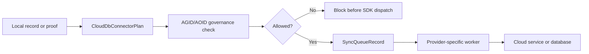

# Cloud and Database Integration Design

Date: 2026-06-07

This note defines how AGID/AOID may connect to cloud services and databases without weakening the local-first privacy model.

## Goal

The app should support many backends through one adapter contract:

- Object storage: Amazon S3, S3-compatible storage, Cloudflare R2, Google Cloud Storage, Azure Blob Storage, Oracle Cloud Infrastructure Object Storage, Alibaba Cloud OSS, Tencent Cloud COS, Huawei Cloud OBS, Baidu AI Cloud BOS
- Relational databases: PostgreSQL, Neon Postgres, Supabase Postgres, Amazon RDS/Aurora PostgreSQL, Azure Database for PostgreSQL, Google Cloud SQL for PostgreSQL, Vercel Postgres, MySQL/MariaDB, Cloudflare D1, SQL Server, Azure SQL, Oracle Database, Oracle Autonomous Database, Oracle MySQL HeatWave, Alibaba Cloud RDS/PolarDB, Tencent Cloud TDSQL-C, Huawei Cloud GaussDB, Baidu AI Cloud RDS, CockroachDB, Turso/libSQL, Google Cloud Spanner
- Document databases: MongoDB, MongoDB Atlas, Firestore, Firebase, DynamoDB, Azure Cosmos DB, Oracle NoSQL Database, Alibaba Cloud Tablestore, TencentDB for MongoDB, Couchbase, Cassandra, Google Cloud Bigtable
- KV/cache systems: Redis, Upstash Redis, Vercel KV, Cloudflare KV
- Analytics warehouses: BigQuery, Snowflake, Redshift, Databricks, Oracle Analytics Cloud, Alibaba Cloud AnalyticDB
- Search and vector indexes: OpenSearch, Elasticsearch, Algolia, Meilisearch, Qdrant, Weaviate, Pinecone
- Enterprise and ledger connectors: Oracle NetSuite SuiteTalk REST, Oracle Blockchain Platform, DingTalk, Feishu/Lark, WeCom
- Custom HTTPS webhooks

The integration layer does not import provider SDKs. It first builds a connector plan, validates the data class, and only then allows a provider-specific worker to dispatch the job.

## Current Support Matrix

AGID has two different levels of database support. They must not be mixed in documentation or UI copy.

### Runtime Address Resolution Ledger adapters

These stores can be selected by the server-side Address Resolution Ledger store factory today:

| Store | Mode | Best use | Caveat |
| --- | --- | --- | --- |
| Memory | `memory` | Tests and ephemeral demos | Not durable |
| SQLite | `sqlite` | Single-node server, desktop, offline POS cache | Not a shared multi-node ledger |
| PostgreSQL | `postgres` | Multi-server production, temporal ledger, spatial/address indexes | Requires migrations and SSL configuration |
| Redis | `redis` | Fast cache, rate-limit state, short-lived nullifier cache | Pair with a durable store for revocation/proof history |
| MongoDB | `mongodb` | Document-shaped evidence and commitment-only audit events | Flexible schemas need denied-private-field validation |

Neon, Supabase, Amazon RDS/Aurora PostgreSQL, Azure Database for PostgreSQL, Google Cloud SQL for PostgreSQL, and Vercel Postgres are treated as Postgres-compatible deployments. They use the Postgres schema and adapter contract, but need provider-specific environment, SSL, failover, and connection-pooling guidance.

### Connector-plan and planned adapters

These providers are represented in the safe Cloud/DB connector planner, but provider-specific SDK dispatch or full ledger persistence is not claimed yet:

| Provider class | Examples | Recommended use now |
| --- | --- | --- |
| Planned relational runtime adapters | MySQL/MariaDB, Cloudflare D1, SQL Server, Azure SQL, Oracle Database, Oracle Autonomous Database, Oracle MySQL HeatWave, Alibaba Cloud RDS/PolarDB, Tencent Cloud TDSQL-C, Huawei Cloud GaussDB, Baidu AI Cloud RDS, CockroachDB, Turso/libSQL, Google Cloud Spanner | Address verification cache, metadata-only mirrors, future ledger adapters |
| Planned document runtime adapters | Firestore, Firebase, DynamoDB, MongoDB Atlas, Azure Cosmos DB, Oracle NoSQL Database, Alibaba Cloud Tablestore, TencentDB for MongoDB, Couchbase, Cassandra, Bigtable | Mobile sync metadata, encrypted settings, public proof/issuer snapshots |
| KV/cache | Cloudflare KV, Upstash Redis, Vercel KV | Edge public AGID cache, rate-limit state, and short-lived verification cache only |
| Analytics warehouses | BigQuery, Snowflake, Redshift, Databricks, Oracle Analytics Cloud, Alibaba Cloud AnalyticDB | Redacted quality analytics and aggregate audit reports only |
| Search/vector indexes | OpenSearch, Elasticsearch, Algolia, Meilisearch, Qdrant, Weaviate, Pinecone | Public or redacted lookup, place-name search, and alias matching only |
| Object storage | S3, S3-compatible, R2, GCS, Azure Blob, OCI Object Storage, Alibaba Cloud OSS, Tencent Cloud COS, Huawei Cloud OBS, Baidu AI Cloud BOS, Vercel Blob | Public data packs, encrypted envelope backups, audit exports |
| Enterprise apps and ledgers | Oracle NetSuite, Oracle Blockchain Platform, DingTalk, Feishu/Lark, WeCom | Alias-only order/waybill mirrors, redacted operational alerts, public proof anchors, issuer/revocation/freshness roots |
| Webhook | Custom HTTPS webhook | Carrier/enterprise handoff after the adapter contract passes |

Analytics warehouses, search engines, and vector databases are deliberately not AOID sync targets. They are useful for redacted address quality monitoring, public search, and alias matching, but their indexing and query surfaces are too easy to misuse for private address history.

Oracle service connectors follow the same boundary:

- OCI Object Storage can store public data packs, audit exports, and encrypted AOID envelopes only after client-side or KMS-backed encryption is configured.
- Oracle Autonomous Database, Oracle Database, Oracle MySQL HeatWave, and Oracle NoSQL are planned runtime adapters until provider-specific migrations, transaction semantics, wallet/TCPS, and key policies are tested.
- Oracle Analytics Cloud is analytics-only and receives aggregate or redacted quality data, not raw addresses or owner timelines.
- Oracle NetSuite is an enterprise-app connector for order, waybill, and address-intent status by alias or commitment. It must not receive raw AGID, AOID, recipient, room, phone, or AGID-S ciphertext.
- Oracle Blockchain Platform is a public-anchor connector for proof bundle commitments, issuer trust roots, and revocation/freshness roots. It must not receive private address payloads.

China-region service connectors follow the same boundary:

- Alibaba Cloud OSS, Tencent Cloud COS, Huawei Cloud OBS, and Baidu AI Cloud BOS are object-export targets for public data packs, audit exports, and owner-encrypted AOID envelopes only.
- Alibaba Cloud RDS/PolarDB, Tencent Cloud TDSQL-C, Huawei Cloud GaussDB, Baidu AI Cloud RDS, Alibaba Cloud Tablestore, and TencentDB for MongoDB are planned adapters until migrations, SSL, key management, partitioning, and transaction semantics are tested with AGID fixtures.
- Alibaba Cloud AnalyticDB is analytics-only and receives aggregate or redacted quality data only.
- DingTalk, Feishu/Lark, and WeCom are enterprise-app notification connectors. They receive short-lived aliases, commitments, and review states only, never raw address strings, precise AGID, AOID, recipient, phone, room, or AGID-S payload material.

The machine-readable matrix is exposed by:

- `src/lib/databaseAdapterCompatibility.ts`
- `GET /api/cloud-db/compatibility`

The endpoint separates `runtime-ledger-adapter`, `postgres-compatible-runtime-adapter`, `planned-runtime-adapter`, `cache-only`, `object-storage-export`, and `webhook-dispatch`.

## Security Boundary

AGID and AOID are not treated the same.

AGID may be used for public references, public lookup caches, and address verification caches after private fields are removed.

AOID remains owner-managed and local-first. Cloud or database sync is allowed only when all conditions are true:

- The payload is an `AOID_SYNC_ENVELOPE`.
- The encrypted payload is opaque owner-device ciphertext.
- The owner has explicitly consented.
- Storage is encrypted at rest.
- Transport is encrypted in transit.
- The server never receives plaintext recipient, phone, room, access instruction, or raw coordinate fields.

Plaintext AOID storage is always forbidden.

## Adapter Flow

## Public/Private Data Shapes

| Purpose | Storage mode | Allowed payload |
| --- | --- | --- |
| Public AGID cache | `public-cache` | AGID reference or public AGID evidence |
| Address verification cache | `address-verification-cache` | Country, postal, source, and validation metadata without recipient data |
| Encrypted AOID sync | `encrypted-envelope` | `AOID_SYNC_ENVELOPE` only |
| Audit log | `metadata-only` | Policy decision, safe fingerprint, status, timestamps |
| ZK proof bundle registry | `metadata-only` | Public proof commitments and status only |
| Credential issuer registry | `metadata-only` | Public issuer trust metadata |
| Revocation freshness anchor | `metadata-only` | Public revocation/freshness roots |
| Settings sync | `encrypted-settings` | Encrypted settings blob and sync cursor |

## Implementation Files

- `src/lib/cloudDbIntegration.ts`: provider profiles, connector plans, sync job contracts.
- `src/lib/cloudDbIntegration.test.ts`: privacy and compatibility tests.
- `src/lib/databaseAdapterCompatibility.ts`: DB/cloud backend support matrix that distinguishes live runtime adapters from planned or connector-only providers.
- `src/lib/databaseAdapterCompatibility.test.ts`: coverage and privacy-boundary tests for the compatibility matrix.
- `src/server/addressResolutionLedgerStore.ts`: runtime Address Resolution Ledger adapters, including MongoDB for commitment-only audit/event storage.
- `db/address-resolution-ledger.mongodb.md`: MongoDB collection and index contract for the Address Resolution Ledger.
- `src/server/routes/coreRoutes.ts`: `/api/cloud-db/connectors`, `/api/cloud-db/compatibility`, `/api/cloud-db/plan`, `/api/cloud-db/sync-job`.
- `src/lib/apiEndpoints.ts`: client endpoint builders.

## Provider SDK Next Step

Provider clients should be added behind this contract only. A worker may dispatch a job when:

1. `plan.allowed === true`
2. all required environment variables are configured outside source control
3. the sync job payload is the queue record created by `buildCloudDbSyncJob`
4. provider logs redact payload bodies and secrets

This keeps cloud support broad while preserving the AOID privacy rule.
