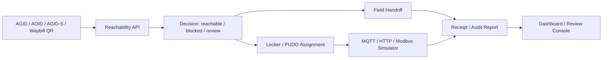
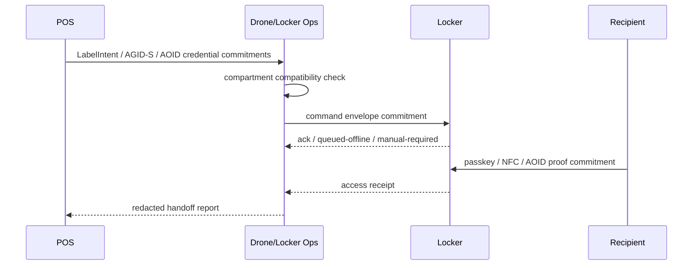

# Drone / Locker Ops Deep Dive

Last updated: 2026-06-20

## 結論

Drone / Locker Ops は、ドローンOS本体でも、フライト制御システムでも、スマートロッカー実機OSでもない。

AGID/AOIDにおける最適な役割は、次の三つに絞るべきである。

```text
1. 到達可否API
2. ロッカー/PUDO連携
3. MQTT / HTTP / Modbus ローカルシミュレータ
```

つまり、このアプリは「飛ばす」「開ける」ための主制御ではなく、配送・支援・ロッカー受け渡しにおいて、

```text
到達できるか
受け渡しできるか
どの証跡を残せるか
どの情報を公開してよいか
```

を判断する運用レイヤーである。

## なぜ最後に作るべきか

Drone / Locker Ops は、住所登録、Portal、POS、Field Handoff、Dashboard、Developer Console、Evidence Vault、Postal Zone Designer の上に乗る応用面である。

先に作るべき基盤はすでに次の通りである。

| 基盤 | Drone / Locker Ops で使う理由 |
|---|---|
| Address Registration | 配送先・ロッカー地点・到達地点の正規化 |
| Address Portal | 住所・受取権限・scopeの同意管理 |
| POS Terminal | 店舗・倉庫・受付でのScan -> Decision -> Handoff -> Report |
| Field Handoff | 配送員・支援者の現場receipt |
| Dashboard / Review Console | 到達不可、ロッカー異常、拒否、再照合 |
| Developer Console | API、Webhook、テストベクトル |
| Evidence Vault | 写真/PDF/証拠を相手へ開示せず証明 |
| Postal Zone Designer | 郵便番号が弱い地域の配送区画設計 |

この順番を守らないと、Drone / Locker Ops が「機体制御っぽい巨大アプリ」になり、AGIDの中核であるプライバシー保護型住所インフラからずれる。

## 明確な非目標

Drone / Locker Ops でやらないことは明示する。

```text
autopilot command emission
flight authorization
remote-control link management
raw flight path publication
precise telemetry publication
raw recipient address storage
raw AGID / AOID publication
locker hardware secret storage
PIN / QR / NFC payload storage
biometric template storage
```

これにより、OSSとして公開しても「危険なドローン制御ソフト」ではなく、「到達可否・ロッカー受け渡し・証跡API」であると説明できる。

## 基本構成



## 1. 到達可否API

到達可否APIは、ドローン、配送員、一般配送者、支援者、ロボット、ロッカー運用者が「その地点へ届けられるか」を報告する共通APIである。

### 主な入力

```ts
type ReachabilityInput = {
  deliveryRef: string;
  reporterClass: "carrier" | "drone-operator" | "field-worker" | "locker-operator" | "community-reporter";
  problemKind:
    | "drone-no-fly"
    | "drone-landing-impossible"
    | "terrain-unreachable"
    | "road-closed"
    | "bridge-closed"
    | "water-crossing"
    | "unsafe-area"
    | "private-access-required"
    | "building-entry-failed"
    | "weather-temporary"
    | "geocode-wrong"
    | "delivery-refused"
    | "other";
  evidenceClasses: Array<"photo-commitment" | "operator-signature" | "coarse-location" | "device-health" | "carrier-status">;
};
```

### 主な出力

```ts
type ReachabilityDecision = {
  status: "reachable" | "temporarily-unreachable" | "unreachable" | "review-required";
  publicationState: "public-safe" | "restricted" | "review-first";
  confidence: number;
  ttlSeconds: number;
  nextAction:
    | "handoff"
    | "retry-later"
    | "use-locker"
    | "manual-review"
    | "restricted-sharing";
};
```

### 判断例

| 条件 | Decision |
|---|---|
| 天候不良で一時的に着陸不可 | temporarily-unreachable / retry-later |
| 恒久的な飛行禁止区域 | unreachable / use-locker or manual-review |
| 橋が通行止め | temporarily-unreachable / retry-later |
| オートロックで入れない | review-required / recipient proof required |
| 危険地域 | restricted / high-risk mode |

## 2. ロッカー / PUDO連携

ロッカー連携は、AGID/AOIDの配送endpoint化である。

AGIDはロッカー拠点やPUDO地点を指し、AOIDは受取権限やcredentialを扱う。AGID-Sは高リスク現場でロッカー位置を限定共有する封筒として使える。

### ロッカーで扱うもの

```text
site alias
compartment id
size class
temperature class
door state
sensor state
battery / power
reservation commitment
recipient proof commitment
command audit hash
offline queue state
```

### 扱わないもの

```text
raw address
raw AGID / AOID
raw waybill body
PIN plaintext
QR payload plaintext
NFC payload plaintext
biometric template
hardware endpoint secret
```

### 予約フロー



## 3. MQTT / HTTP / Modbus ローカルシミュレータ

最初に作るべきは実機ドライバではなく、ローカルシミュレータである。

理由は次の通り。

```text
実機がなくてもUI/業務フローを検証できる
POSやField Handoffと接続できる
オフラインqueueを試せる
低ACK率や遅延を再現できる
ロッカー異常や扉詰まりを安全にテストできる
実機秘密情報を持ち込まない
```

### シミュレータのprotocol-shaped frame

```ts
type SimulatorFrame = {
  protocol: "mqtt" | "http" | "modbus";
  direction: "inbound" | "outbound";
  status: "acknowledged" | "sent" | "queued-offline" | "manual-required" | "rejected";
  operation: string;
  deviceId: string;
  connectorId?: string;
  topicAlias?: string;
  httpPathAlias?: string;
  modbusUnitId?: number;
  modbusRegister?: number;
  payloadCommitment: string;
  auditHash: string;
};
```

本物のMQTT broker、HTTP device endpoint、Modbus TCP/RTU portを直接開かない。まずはこの安全なframeを作り、後で実機adapterが変換する。

## 必要な画面

Drone / Locker Ops の画面は大きく4つに分ける。

### 1. Reachability Cases

到達不可・要確認・一時不可のケース一覧。

必要な表示:

```text
case id
problem kind
reporter class
confidence
TTL
publication state
next action
coarse region
review status
```

必要なボタン:

```text
Mark reachable
Create locker fallback
Queue review
Attach to handoff report
Export redacted receipt
```

### 2. Locker Simulator

MQTT / HTTP / Modbus の端末シミュレーション。

必要な表示:

```text
device list
protocol
online/offline
latency
ack rate
clock skew
firmware ref
offline queue
command frames
rejected frames
```

必要なボタン:

```text
Run simulation
Toggle device offline
Inject door jam
Inject low ACK rate
Inject delayed Modbus ack
Clear local queue
Export simulator frames
```

### 3. Locker Assignment

荷物・受取資格・温度帯・サイズ・高リスク制約から、どのロッカー区画へ割り当てるかを判断する。

必要な表示:

```text
reservation ref
compartment id
size class
temperature class
proof methods
high-risk mode
expiration
assignment status
```

必要なボタン:

```text
Assign
Reserve
Release
Disable compartment
Require stronger proof
```

### 4. Ops Report

到達可否、ロッカー状態、受取proof、端末frame、署名receiptをまとめる。

必要な表示:

```text
reachability receipt
locker command audit hash
recipient proof commitment
device health
offline sync state
review reason
redaction status
```

必要なボタン:

```text
Copy redacted report
Send to Dashboard
Create dispute case
Attach to waybill
```

## POS / Field Handoff との関係

Drone / Locker Ops は、POSやField Handoffを置き換えない。

| Surface | 役割 |
|---|---|
| POS Terminal | 店舗・倉庫・受付でScan -> Decision -> Handoff -> Report |
| Field Handoff | 配送員・支援者の現場受け渡し |
| Drone / Locker Ops | 到達可否、ロッカー代替、端末シミュレーション、ロッカー証跡 |
| Dashboard / Review Console | 到達不可・端末異常・異議申し立ての審査 |

実務上は、POSやField Handoffで「配送不可」「受取人不在」「高リスク」「ロッカー代替」が出たときに Drone / Locker Ops へ遷移する。

## API構成

既存の安全な方向性を維持する。

```text
GET  /api/drone-delivery-evidence/capabilities
POST /api/drone-delivery-evidence/report

GET  /api/warehouse-locker-simulator/capabilities
POST /api/warehouse-locker-simulator/run
```

追加するなら、次がよい。

```text
POST /api/drone-locker-ops/decision
POST /api/drone-locker-ops/locker-fallback
POST /api/drone-locker-ops/redacted-report
```

ただし、最初は既存APIをUIから使える形にするだけで十分である。

## Security / Privacy 必須条件

Drone / Locker Ops は高リスクな誤用が起きやすいので、次を必須にする。

```text
No raw address by default
No raw AGID/AOID public projection
No precise telemetry public projection
No autopilot command path
No hardware secret storage
Short TTL for high-risk handoff
Operator/device receipt signature
Commitment-only proof material
Offline queue conflict -> review required
```

## 最小MVP

最初のMVPは次で十分。

```text
1. Reachability report builder
2. Locker simulator runner
3. Device health cards
4. Protocol frame viewer
5. Locker fallback decision
6. Redacted Ops report
7. Dashboard / Review Console handoff
```

これなら、ドローンOSや実機制御に踏み込まず、AGIDの価値である「住所・配送・証跡・プライバシー」を保てる。

## 将来拡張

実機連携は次の順に進める。

```text
Phase 0: Local simulator only
Phase 1: HTTP mock adapter
Phase 2: MQTT broker adapter
Phase 3: Modbus TCP gateway adapter
Phase 4: Hardware vendor adapter
Phase 5: Certified deployment profile
```

ドローン側は、OSや操縦ではなく次に限定する。

```text
mission receipt import
landing feasibility evidence
no-fly / weather / terrain report
operator signature verification
coarse region publication
restricted telemetry commitment
```

## 最終定義

Drone / Locker Ops は、ドローン配送、ロッカー、PUDO、倉庫、支援現場において、住所や精密位置を公開せずに、到達可否、代替受け渡し、端末状態、配送証跡を管理する AGID/AOID の運用補助アプリである。

一文で言えば、

```text
Drone / Locker Ops = reachability evidence + locker fallback + local hardware simulation
```

であり、

```text
Drone / Locker Ops != drone operating system
```

である。
