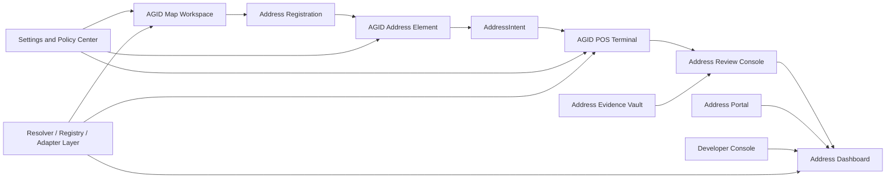
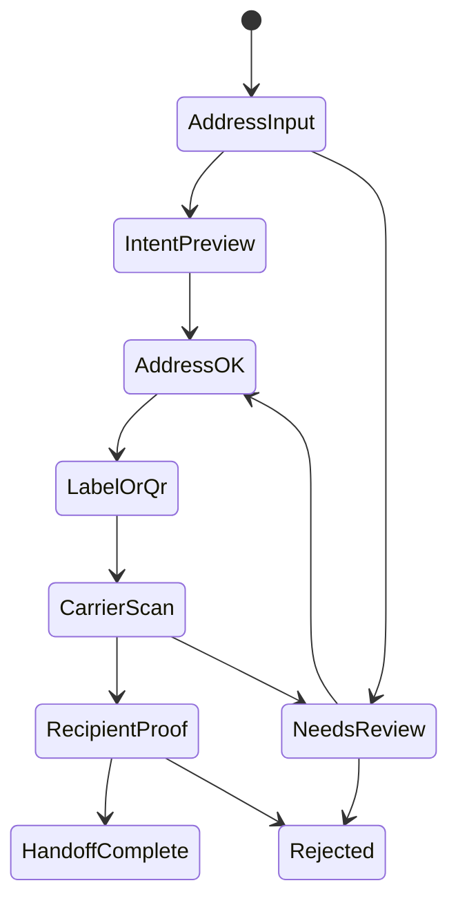
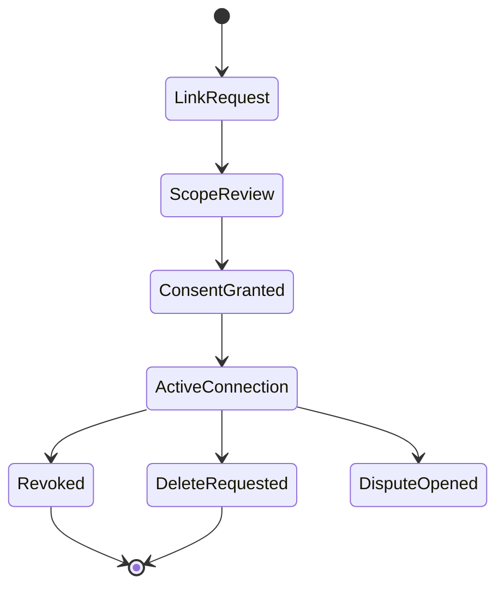
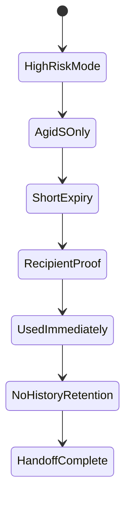
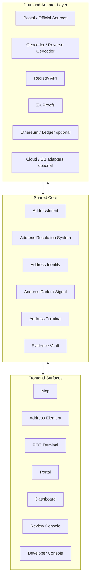
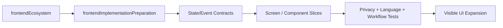

# AGID/AOID Frontend Ecosystem Research

Last updated: 2026-06-18

## 目的

AGID/AOIDのフロントエンドは、地図アプリ、POS、住所登録、ユーザー同意、管理ダッシュボード、開発者向け組み込みUIが混在しやすい。
この文書は、必要な画面、機能、相関、エコシステムを整理し、以後のUI実装を「思いつきの画面追加」ではなく、共通モデルに沿った増築にするための設計台帳である。

対応する実装台帳:

```text
src/lib/frontendEcosystem.ts
src/lib/frontendEcosystem.test.ts
src/lib/frontendImplementationPreparation.ts
src/lib/frontendImplementationPreparation.test.ts
```

## 現状のフロントエンド構造

現在の主要ルートは次の4つである。

| Route | Surface | 役割 |
| --- | --- | --- |
| `/` | AGID Map Workspace | AGID検索、地図、住所表示、住所登録、設定 |
| `/pos` | AGID POS Terminal | QR/NFC/AGID-S受付、配送ハンドオフ、端末診断 |
| `/portal` | Address Portal | ユーザーの住所接続、scope、失効、削除管理 |
| `/dashboard` | Address Dashboard | API、Webhook、端末、issuer、レビュー、監査の統合管理 |

実装上は `src/RootApp.tsx` がこれらを遅延ロードしている。これは良い方向で、POSやDashboardを地図本体から分離できている。

## 中核原則

1. `AddressIntent` を中心にする

   「住所を登録したい」「配送可能性を確認したい」「送り状を発行したい」「AOID所有を確認したい」を、全部 `AddressIntent` として扱う。UIはIntentの状態に応じて、入力、検証、要確認、拒否、完了へ進む。

2. 画面ごとに責務を分ける

   Mapは探索、Address Elementは入力部品、POSは現場判断、Portalはユーザー同意、Dashboardは運用監査、Review Consoleは例外処理に集中する。

3. スコアは内部判定にし、ユーザーには操作判断を出す

   住所品質、配送可能性、issuer trust、registry freshnessなどは内部で持つ。ただし表示は `Address OK`、`Needs Review`、`Rejected`、`Recipient Pending` のような行動可能な状態にする。

4. 高リスク用途は最初から別扱いにする

   DV、避難、難民、人道支援、監視リスクのある用途では、精密AGID表示、長期QR、住所履歴保存、広いログ出力を避ける。AGID-S、短期alias、即時失効、commitment-onlyを優先する。

## 必要画面

| Surface | 必要度 | 状態 | 主な利用者 | 主要機能 |
| --- | --- | --- | --- | --- |
| AGID Map Workspace | P0 | implemented | 一般ユーザー、調査者、運用者 | 地図検索、AGID選択、住所表示、言語タブ、住所品質 |
| Address Registration Flow | P0 | partial | 受取人、現場作業者 | 郵便番号補完、AGID補完、OCR、住所修正、フィードバック |
| AGID Address Element | P0 | partial | EC、CMS、買い物Agent | 埋め込み住所入力、QR/NFC、AddressIntent生成 |
| AGID POS Terminal | P0 | implemented | 店舗、配送、支援現場 | QR/NFC受付、AGID-S復号、受取人proof、端末診断 |
| Address Portal | P1 | implemented | ユーザー、受取人 | 接続管理、scope確認、失効、削除、安全export |
| Address Dashboard | P1 | implemented | 管理者、issuer、配送業者 | ログ、Webhook、端末、issuer、レビュー、QR使用状況 |
| Address Review Console | P1 | partial | 審査者、監査者 | 要確認、拒否、異議、再照合、証跡確認 |
| Developer Console | P2 | planned | 開発者、企業導入担当 | APIキー、Webhook、SDK例、Launch checklist |
| Address Evidence Vault | P1 | partial | ユーザー、審査者 | 写真/PDF OCR、redaction、暗号化証跡 |
| Settings and Policy Center | P0 | partial | 全ユーザー、管理者 | 言語、Mode、provider、鍵、端末、高リスク設定 |

## 機能整理

| 機能 | 担当画面 | 備考 |
| --- | --- | --- |
| 多言語検索・住所表示 | Map, Address Element, Registration | 言語タブは表示文字だけでなく整形・検索にも効かせる |
| 住所品質内部判定 | Map, Registration, Address Element, Review | スコアをユーザーに直接出さず判断状態へ変換 |
| AddressIntent生成 | Registration, Address Element, POS | 配送、返品、支援、本人確認、通関を統一 |
| QR/NFC受付 | POS, Address Element | QR payloadは保存せずcommitment/receipt化 |
| AGID-S復号 | POS | 鍵管理、失効、使用済み、短期期限が必須 |
| 受取人proof | POS, Review | Passkey、AOID credential、NFC、proof codeを抽象化 |
| Portal同意管理 | Portal | どの組織へ何を許可しているかを可視化 |
| 監査・再照合 | POS, Dashboard, Review | carrier scan、recipient proof、端末署名、freshnessを再構築 |
| OCR Evidence | Registration, Evidence Vault, Review | 読み取り後に必ず編集・redactionできる |
| 開発者導入 | Developer Console, Dashboard | SDK、OpenAPI、Webhook、Launch checklist |

## 相関図



## 画面遷移案

### 通常配送



### ユーザー同意



### 高リスク配送・支援



## エコシステム整理



## 優先実装順

実装準備コードは `src/lib/frontendImplementationPreparation.ts` に分離した。
`frontendEcosystem` は「必要な画面・機能・関係」を保持し、`frontendImplementationPreparation` は「追加するコード、テスト、安全ゲート、実装順」を返す。

追加UIを作るときは、いきなり画面を増やさず、まず次を確認する。

1. `buildFrontendImplementationRoadmap()` で最初に触るP0/P1 surfaceを確認する。
2. `buildFrontendImplementationPackage(surfaceId)` で targetPath、privacy gate、test planを確認する。
3. 共有契約、state model、event contractを先に追加する。
4. 画面コンポーネントを追加する。
5. 言語反映、raw payload拒否、high-risk mode、review/auditのテストを通す。



1. Settings and Policy Center

   言語、Mode 0-4、provider、鍵、端末、高リスク設定を一箇所に寄せる。今は設定がMap/POS/adaptersに散っているため、全体の安全境界が見えにくい。

2. Address Registration Flowのstepper化

   `Import / Autofill`、`Edit / Correct`、`Verify / Intent Preview` の3段階にする。OCR、郵便番号、AGID補完、ユーザー修正、フィードバック学習を同じ流れへ入れる。

3. POSのタスクレーン化

   `Intake`、`Decision`、`Handoff`、`Devices`、`Queue`、`Reports`、`Settings` に分ける。現場ではスキャンから判断までを最短にし、管理機能は横に逃がす。

4. Review ConsoleをDashboardから独立したケース管理にする

   要確認、拒否、住所衝突、QR再利用、issuer失効、PID merge/split、配送証跡再照合を扱う。

5. Developer Consoleを追加

   APIキー、Webhook、SDK snippet、Address Element設定、Launch checklist、redaction simulatorをまとめる。

## Surface別の安全な追加単位

新しい画面を直接増やす前に、各surfaceへ足すものを `component / state / test` の順に分ける。
UIを先に肥大化させるより、state model と public event contract を先に固定する方が安全である。

| Surface | Product shape | まず足すcomponent | まず足すstate / contract | 必須test |
| --- | --- | --- | --- | --- |
| AGID Map Workspace | 同一アプリsurface | `MapWorkspacePanels` | `SelectedAgidCellState` | hoverではAGIDを出さず、clickでのみ表示する。言語タブが住所表示へ効く。 |
| Address Registration | 同一アプリsurface | `AddressRegistrationStepper`, `EvidenceImportStep` | registration candidate / correction / feedback consent state | OCR候補は編集可能。raw correctionは外部へ出ない。 |
| AGID Address Element | 埋め込みcomponent | host向けAddress Element wrapper | `AddressElementEventMap` | host eventにraw AOID、AGID-S、proof code、recipient secretが混ざらない。 |
| AGID POS Terminal | 分離可能なPOS app | `PosTaskLanes` | `PosTaskLaneState` | scan-to-decision、端末診断、言語設定、offline queueが安定遷移する。 |
| Address Portal | 分離可能なuser app | `PortalConnectionDetail` | Address Item permission / revocation state | revoke/delete/exportがsafe referenceだけで動く。 |
| Address Dashboard | dashboard module | `DashboardOperationsTabs` | redacted log / webhook / terminal / issuer view state | dashboardへraw address、raw AGID、raw AOID、proof codeを入れない。 |
| Address Review Console | dashboard module | `AddressReviewConsole` | `ReviewCaseState` | encrypted evidence ref、reason code、manual decision receiptだけで遷移する。 |
| Developer Console | dashboard module | `DeveloperConsoleTab` | `FrontendProviderDataFlowPreview` | webhook署名、log redaction、API key環境分離、high-risk mode checklistを要求する。 |
| Evidence Vault | shared engine feature | `EvidenceVaultPanel` | evidence envelope / OCR candidate / redaction state | evidence bytesとOCR textは明示操作までlocal/encrypted扱い。 |
| Settings and Policy Center | shared engine feature | `SettingsPolicyCenter` | `FrontendPolicyState` | 言語、Mode 0-4、provider警告、高リスク設定がMap/POS/Elementへ伝播する。 |

## OSS / App / Feature / Commercial の切り分け

無理にすべてを同じアプリへ入れない。OSSにすべきものは「プロトコルを検証できる最低限」、商用にしてよいものは「ホスティング、運用、SLA、監査保持、企業設定」である。

| Surface | OSSにするもの | 同一アプリ/分離アプリ判断 | 商用にしてよいもの | Open coreに入れないもの |
| --- | --- | --- | --- | --- |
| Map Workspace | AGID表示、local resolver、住所表示、言語タブ、品質状態 | ルート `/` のreference app | 高負荷resolver cache、任意の有料geocoder adapter | paid API必須化、high-risk AGID追跡 |
| Address Registration | 郵便番号/AGID補完、修正、feedback consent、redaction contract | Map内機能で開始してよい | managed OCR、人手review、証跡保持 | 文書の自動外部upload、同意なし共同学習 |
| Address Element | 埋め込みUI、event schema、test vectors、host examples | npm/package化するcomponent | 大規模EC向け運用分析、不正検知tuning | raw AOIDやproofのhost漏洩 |
| POS Terminal | QR/NFC受付、AGID-S local検証、端末診断、receipt/offline queue | `/pos` は分離deploy可能なappにする | fleet管理、SLA同期、端末certification、長期監査 | hosted registry必須化、raw payload telemetry |
| Portal | 接続、scope、revoke/delete/exportのreference UI | `/portal` の分離user app | hosted account管理、通知、削除workflow | 強制中央ID、raw address一覧 |
| Dashboard | 最小admin reference、redacted logs、launch checklist | dashboard module | hosted dashboard、SLA、multi-tenant issuer/carrier管理 | 長期raw log、hosted secret混入 |
| Review Console | review case model、redacted viewer、decision receipt | dashboard module | managed reviewer queue、advanced Radar、enterprise escalation | opaque scoreだけの判断、無監査raw evidence access |
| Developer Console | OpenAPI explorer、SDK snippets、webhook署名例、redaction simulator | dashboard module | live API key管理、quota、team roles | 実key同梱、private request body log |
| Evidence Vault | envelope形式、local OCR候補、redaction、encrypted ref | 機能としてRegistration/Reviewへ埋め込む | managed encrypted storage、legal hold、private OCR | 外部OCR自動upload、unredacted sync |
| Settings/Policy | 言語、Mode、provider警告、高リスクdefault | 全surface共通feature | enterprise policy template、org-wide config | hidden provider enablement、surface別にズレる言語設定 |

判断基準は単純にする。

1. 標準・SDK・検証・ローカル運用に必要ならOSS。
2. 利用者が自分でホストできる必要がある安全境界はOSS。
3. 大量運用、監視、SLA、組織権限、長期ログ保持、managed proof/OCRは商用でもよい。
4. 個人住所、AOID private descriptor、AGID-S payload、proof secret、電話番号、部屋番号を扱うものは、OSS/商用に関係なくpublic payloadへ出さない。
5. DashboardやReviewはOSS referenceを残しつつ、商用運用版を別moduleとして育てる。

## デザイン方針

- 業務画面はoperator consoleとして設計する。
- Marketing hero、装飾カード、過剰なグラデーションは避ける。
- POSでは `Address OK`、`Carrier Scan OK`、`Recipient Pending`、`Handoff Complete` を大きく出す。
- 警告は隠さず、次の操作とセットで出す。
- 言語設定は全画面へ反映し、RTLも壊さない。
- ボタン、サイドメニュー、スキャン領域は固定寸法にして、状態変化で揺れないようにする。

## 外部連携UIの扱い

Google、Microsoft、Adobe、Cisco、Oracle、配送API、DB、Ethereum、ZKなどのadapterは、画面では「有効/無効」「何が外部へ送られるか」「どのModeで使うか」を先に見せる。
中核はOSS/local resolverとし、外部サービスは任意adapterにする。

| Adapter種別 | UIで見せるべきこと |
| --- | --- |
| Geocoder / Maps | 住所または座標が外部へ送られるか |
| OCR | 写真/PDFが外部へ送られるか、保存されるか |
| Notification | 本文に住所を入れないこと |
| DB / Cloud | raw address保存禁止、commitment/encrypted envelopeだけ |
| Ethereum / Ledger | 何を公開台帳に載せるか、ガス代と遅延 |
| ZK | 証明対象、公開signal、secret witnessの境界 |

## 成功条件

- ユーザーが「住所を渡す」のではなく「配送可能」「地域内」「受取人確認」「住所所有」など必要な事実だけを許可できる。
- POS担当者が3秒以内に次の行動を理解できる。
- 管理者がレビュー、監査、Webhook、端末、issuer、QR使用済みを一箇所で追える。
- 開発者がAddress Element、Resolver API、POS Terminal、Portalを安全に埋め込める。
- 高リスク用途で精密住所やAGIDが不用意に表示・保存・通知されない。

## 実装メモ

この文書の内容は `src/lib/frontendEcosystem.ts` に構造化した。
今後UIを追加するときは、先に `FrontendSurface`、`FrontendCapability`、`FrontendRelationship` を更新し、`src/lib/frontendEcosystem.test.ts` を通してから画面を作る。
