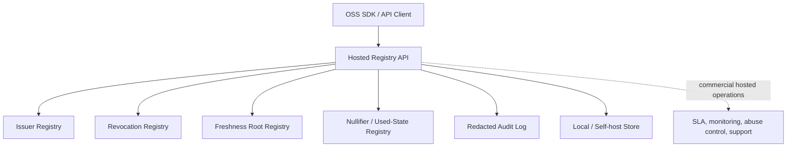

# Hosted Registry API

The Hosted Registry API is the Mode 1 AGID/AOID/PID-compatible registry surface
for deployments that need fast server-side checks without requiring ZK proofs or
Ethereum.

Normative materials:

- [Hosted Registry API v0.1](specs/hosted-registry-api-v0.1.md)
- [OpenAPI YAML](specs/hosted-registry-api.openapi.yaml)

It stores only public verification metadata:

- issuer id and issuer public-key commitment
- credential, address-reference, AOID, or AGID commitments
- revocation records for commitments
- freshness roots and validity windows
- domain-separated nullifier hashes
- audit events that do not contain raw addresses, raw AGIDs, raw AOIDs, AGID-S
  ciphertexts, recipient names, phone numbers, emails, or coordinates

It must not be used as a raw address database.

## OSS / Commercial Boundary

OSS includes:

- API specification and OpenAPI schema
- local and self-hosted registry implementation
- in-memory and file-backed stores
- tests and synthetic fixtures
- client-side SDK hooks

Commercial hosted operation includes:

- public hosted registry availability
- monitoring, rate limits, abuse controls, RBAC, tenant isolation
- backups, retention, exports, incident response, and support
- private deployment and enterprise support

In other words, the open-source project defines and verifies the protocol. The
commercial service operates the public hosted infrastructure.

## System Diagram



## Endpoints

The hosted API is mounted under:

```text
/api/registry/hosted
```

It mirrors the existing Mode 1 local server registry:

```text
GET  /api/registry/hosted/capabilities
GET  /api/registry/hosted/status
GET  /api/registry/hosted/audit
POST /api/registry/hosted/issuer/register
POST /api/registry/hosted/revocation/revoke-commitment
POST /api/registry/hosted/freshness/anchor
POST /api/registry/hosted/verify
POST /api/registry/hosted/nullifier/mark-used
```

Admin writes require:

```text
X-AGID-Registry-Admin-Token: <server configured token>
```

Set the token with:

```text
AGID_REGISTRY_ADMIN_TOKEN=...
```

## Storage

The hosted route uses a file-backed store by default in the app server:

```text
.agid-runtime/hosted-registry.json
```

Override the path with:

```text
AGID_REGISTRY_FILE_PATH=/secure/path/hosted-registry.json
```

Use the same adapter directly in tests or self-hosted deployments:

```ts
import { createConfiguredAgidRegistryApiStore } from './src/server/hostedRegistryStore';

const store = createConfiguredAgidRegistryApiStore({
  storageMode: 'file',
  filePath: '/secure/path/hosted-registry.json',
});
```

## Privacy Boundary

Accepted material:

- `issuerId`
- `publicKeyCommitment`
- `metadataHash`
- `credentialCommitment`
- `addressReferenceCommitment`
- `aoidCommitment`
- `agidCommitment`
- `freshnessRoot`
- `nullifierHash`
- `scope`

Rejected material:

- raw address text
- raw AGID
- raw AOID
- AGID-S ciphertext
- latitude/longitude
- recipient name
- phone number
- email
- room, unit, or apartment number

For public interoperability, clients should treat this API as a trusted server
registry, not as a public blockchain or ZK verifier. For stronger multi-party
auditability, use Ethereum Registry Only or Full ZK + Ethereum modes.
