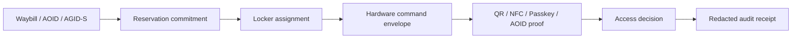

# Locker System OS

Locker System OS is the AGID/AOID parcel-locker and PUDO operating layer. It turns lockers into addressable delivery endpoints without storing raw addresses, raw AGID/AOID values, PINs, QR payloads, NFC payloads, biometric templates, hardware secrets, or waybill bodies.

The first implementation is intentionally a pure TypeScript contract layer:

- Hardware connectors: `mqtt`, `http`, `modbus`, `gpio-adapter`, and `simulated`.
- Locker compartments: size, temperature class, door/sensor state, battery, handling compatibility, and health warnings.
- QR/NFC readers: reader id, online/degraded/maintenance state, supported methods, connector binding, tamper status, battery, and latency.
- Reservation planning: waybill and recipient commitments are assigned to compatible compartments.
- Access control: QR, NFC, PIN, biometric, passkey, AOID credential, and operator override are modeled as committed proof methods.
- Real-time monitoring: connector heartbeat, command latency, acknowledgement rate, jammed doors, maintenance state, occupancy, cold-chain capacity, and battery alerts.
- PUDO operation: convenience stores, stations, shopping malls, warehouses, offices, campuses, apartments, hospitals, and humanitarian sites can share the same data model.

For the broader research position, standards landscape, and production-readiness gaps, see `docs/smart-locker-os-research-ja.md`. The current module should be understood as a redacted locker endpoint orchestration layer, not yet as an embedded hardware operating system or safety-certified access controller.

## Security Boundary

The module is designed to be safe for OSS publication and external integration:

```text
raw address                 not stored
raw AGID / AOID             not stored
raw waybill                 not stored
PIN / QR / NFC payload      not stored
biometric template          not stored
hardware endpoint secrets   not stored
```

The public surface is limited to site aliases, compartment state, reservation commitments, health metrics, command commitments, and audit hashes.

## Core Flow



## Reservation Rules

`planLockerReservations` assigns reservations to available compatible compartments. It checks:

- size compatibility
- cold-chain compatibility
- hazardous/heavy/high-value handling compatibility
- door and sensor health
- high-risk mode constraints
- absence of raw private material

High-risk reservations are stricter:

- maximum TTL: 5 minutes
- QR-only proof is not enough
- at least one strong proof method is required: NFC, biometric, passkey, or AOID credential
- raw address or raw proof material blocks assignment

## Access Rules

`evaluateLockerAccess` accepts a handoff only when:

- the reservation is assigned
- the compartment matches
- the reservation is not expired
- the access method is allowed
- a compatible QR/NFC/passkey/AOID reader is online, unless an authorized operator override is used
- the proof is supplied as a commitment

Raw `pin`, `qrPayload`, `nfcPayload`, or `biometricTemplate` fields are rejected. PIN/NFC/QR/biometric systems should hash, sign, or commit proofs before passing them into this layer.

QR and NFC are first-class locker access hardware, not just labels on a receipt. A locker site can declare separate QR and NFC readers, and health snapshots expose `readerTotals.qrReady` and `readerTotals.nfcReady` so POS, field staff, and review consoles can distinguish a door/connector failure from a scanner/tap-reader failure.

## Hardware Commands

Commands are not raw device packets. They are safe envelopes:

```ts
{
  action: "reserve" | "lock" | "open" | "release" | "disable" | "notify",
  dispatch: "ready" | "queued-offline" | "manual-required",
  connectorId?: string,
  protocol?: "mqtt" | "http" | "modbus" | "gpio-adapter" | "simulated",
  targetCompartmentId?: string,
  reservationId?: string,
  payloadCommitment: string,
  auditHash: string
}
```

Real MQTT/HTTP/Modbus drivers can consume this envelope and translate it into device-specific commands later.

## Local MQTT / HTTP / Modbus Simulator

`src/lib/warehouseLockerLocalSimulator.ts` provides the first local simulator for warehouse and locker operations. It does not open a real MQTT broker, HTTP device endpoint, or Modbus TCP/RTU port. Instead, it converts locker reservations, access state, connector health, and optional scripted events into protocol-shaped local frames:

- MQTT: topic alias, publish direction, payload commitment, and audit hash.
- HTTP: method, path alias, payload commitment, and audit hash.
- Modbus: unit id, register, value, payload commitment, and audit hash.

The simulator is intentionally local-first and dependency-light. It is useful for:

- testing warehouse/locker command flow before hardware integration;
- checking offline queues and low ACK-rate devices;
- rehearsing scanner, POS, and locker operation paths;
- validating that raw addresses, raw AGID/AOID values, QR payloads, PINs, and hardware secrets are rejected or committed before leaving the local boundary.

API endpoints:

- `GET /api/warehouse-locker-simulator/capabilities`
- `POST /api/warehouse-locker-simulator/run`

This simulator is the safe bridge between `LockerHardwareCommand` envelopes and later production adapters. Real drivers should consume simulator-compatible command frames, then translate them to broker messages, local HTTP calls, serial adapters, or Modbus register writes.

## API Surface

- `listLockerSystemCapabilities()`
- `planLockerReservations(input)`
- `evaluateLockerAccess(input)`
- `buildLockerHealthSnapshot(site, generatedAt)`
- `buildLockerSystemSnapshot(input)`

## How It Fits AGID/AOID

Locker System OS is not a replacement for AGID, AOID, AGID-S, Address Terminal, or shipping-label QR. It is the endpoint layer:

- AGID identifies public or semi-public locker/PUDO sites.
- AOID and credentials represent recipient authority.
- AGID-S can safely share delivery location information where precision must be protected.
- Shipping label QR carries short-lived handoff intent.
- Locker System OS assigns compartments, evaluates committed access proofs, and emits redacted audit evidence.

This keeps lockers useful for retail pickup, carrier handoff, field logistics, and humanitarian delivery without turning the locker database into a plaintext address or identity registry.
