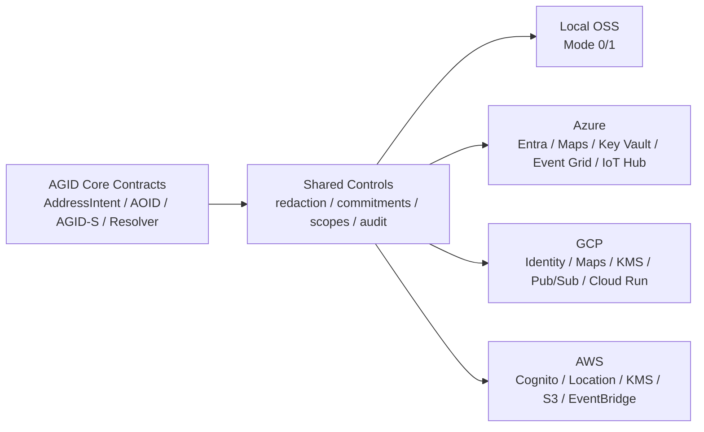

# Azure / GCP / AWS 互換設計

AGID/AOIDは、特定クラウドの住所台帳になってはいけない。中核はローカル実行可能なOSS SDKとして残し、Azure、GCP、AWSは用途別に差し替え可能なアダプタとして扱う。

この方針により、企業、自治体、NGO、配送業者、POS事業者が既存クラウドを使っても、AGIDのプライバシー境界と監査モデルを壊さずに導入できる。

## 基本方針

1. 住所・AOID・AGID-S本体をクラウド依存にしない。
2. クラウドに保存するのは、原則として commitment、encrypted envelope、secret reference、aggregate metrics、redacted event のみ。
3. 生住所や書類画像を外部クラウドに渡す機能は任意アダプタに分離し、同意、TLS、サーバー側プロキシ、短期処理、ログ秘匿を必須にする。
4. 高リスクモードでは、外部OCR・外部ジオコーディングより local resolver、AGID-S、短期alias、失効を優先する。
5. Azure/GCP/AWSは同じ workload contract で呼び出し、UIやPOSの業務フローはクラウドごとの差分を意識しない。

## 互換レイヤー

実装側の入口は `src/lib/multiCloudCompatibility.ts`。

主な役割:

- workloadごとに local / Azure / GCP / AWS の対応サービスを定義する。
- 各サービスが扱えるデータ感度を固定する。
- 生住所をクラウドへ送る計画をデフォルトで拒否する。
- AWS parity が未実装の領域を warning として明示する。
- 高リスクモードで外部plaintext処理を選んだ場合に warning を出す。

## Workload Matrix

| Workload | Local | Azure | GCP | AWS |
| --- | --- | --- | --- | --- |
| Identity / Access | Local RBAC + passkey | Entra ID / External ID | Identity Platform / Workspace | Cognito / IAM Identity Center |
| Credential verification | AOID credential verifier | Entra Verified ID | Google issuer trust adapter | AWS issuer trust adapter |
| Key / Secret management | Local OS keystore | Key Vault | Cloud KMS / Secret Manager | KMS / Secrets Manager / SSM |
| Address geocoding | Local Resolver + Pelias/Nominatim/libpostal | Azure Maps | Google Maps Geocoding / Address Validation / Places | Amazon Location Service |
| Document OCR | Local OCR pipeline | Azure AI Document Intelligence | Document AI / Vision OCR | Amazon Textract |
| Event bus | Local webhook dispatcher | Event Grid | Pub/Sub | EventBridge / SNS |
| Async queue | Local durable sync queue | Service Bus | Cloud Tasks / Pub/Sub | SQS |
| Serverless runtime | Local worker/container | Functions / Container Apps | Cloud Run / Cloud Functions | Lambda / ECS Fargate |
| Object evidence storage | Local encrypted vault | Blob Storage | Cloud Storage | S3 |
| Relational ledger | SQLite/Postgres | Azure Database for PostgreSQL / Azure SQL | Cloud SQL for PostgreSQL | RDS / Aurora PostgreSQL |
| Document metadata store | Local metadata store | Cosmos DB | Firestore | DynamoDB |
| Analytics dashboard | Local aggregate export | Fabric / Power BI | BigQuery / Looker Studio | Redshift / QuickSight |
| Observability / Security | Local audit log | Monitor / Sentinel / Defender | Cloud Logging / Monitoring / SCC | CloudWatch / Security Hub / GuardDuty |
| API Gateway | Express/OpenAPI | API Management | Apigee / API Gateway | API Gateway |
| Device fleet | Local terminal/device registry | IoT Hub | Pub/Sub + Cloud Run device adapter | IoT Core |
| Notification | Local notification outbox | Communication Services / Teams | FCM / Gmail / Chat | SNS / SES |

## データ境界

| Data class | 許可される使い方 | 例 |
| --- | --- | --- |
| `public-metadata` | 公開可能な組織・issuer・endpoint情報 | issuer metadata、API endpoint |
| `commitment-only` | 生住所を出さず照合・監査に使う | nullifier、credential commitment |
| `encrypted-envelope` | クライアントまたはサーバーで暗号化済みの証拠 | encrypted evidence PDF、AGID-S payload |
| `aggregate-only` | 個別住所に戻せない統計 | 国別品質、POS処理時間、配送成功率 |
| `secret-reference` | 秘密値ではなく参照だけ保存 | Key Vault URI、KMS key id |
| `ephemeral-plaintext` | 明示同意のある一時処理のみ | 住所検証API、OCR、ジオコーディング |

デフォルトでは `ephemeral-plaintext` を含む plan は拒否される。許可する場合でも、以下が必要になる。

- owner consent
- TLS
- server-side proxy
- no provider-side canonical storage
- deterministic log redaction
- retention minimization

## 既存実装との接続

既にある実装を使う:

- `src/lib/microsoftServiceIntegration.ts`: Azure / Microsoft 連携の個別安全判定。
- `src/lib/googleServiceIntegration.ts`: Google / GCP 連携の個別安全判定。
- `src/lib/cloudDbIntegration.ts`: S3、GCS、Azure Blob、RDS、Cloud SQL、Cosmos DB、Firestore、DynamoDB、BigQuery、RedshiftなどのDB・ストレージ計画。
- `src/lib/awsServiceIntegration.ts`: Cognito/IAM Identity Center、KMS、Location、Textract、EventBridge、SQS、Lambda、S3、RDS、DynamoDB、API Gateway、IoT Core、SNS/SESの個別安全判定。
- `src/lib/cloudServiceExpansion.ts`: Cloudflare、OCI、Alibaba Cloud、Tencent Cloud、Huawei Cloud、IBM Cloud、DigitalOcean、Vercel、Supabase、MongoDB Atlas、Snowflake、Databricksの拡張カタログ。三大クラウドほど深い個別RPC実装ではなく、用途・payload・安全境界の判定を先に固定する。

新しい `src/lib/multiCloudCompatibility.ts` は、これらを上位から束ねる。個別サービスの細かい判定は各モジュール、クラウド横断の整合性は multi-cloud compatibility が見る。

## 推奨導入順

1. Local first: Local Resolver、SQLite/Postgres、local outbox、local device registry を基準契約にする。
2. Storage parity: Azure Blob / GCS / S3、Postgres系、document metadata store を同じデータ境界で運用する。
3. Event parity: Event Grid / Pub/Sub / EventBridge を redacted event のみで接続する。
4. Identity parity: Entra / Google identity / Cognito を住所claimなしで接続する。
5. OCR/geocoding optionality: Azure Maps、Google Maps、Amazon Location、Document Intelligence、Document AI、Textractは任意アダプタにする。
6. Device fleet parity: Azure IoT Hub、AWS IoT Core、GCP custom device adapter をPOS/ロッカー/ドローン向けに揃える。

## 高リスクモード

DV、難民、災害、人道支援、監視リスクがある場合:

- 生住所を外部ジオコーディングへ送らない。
- 書類OCRはローカル優先。
- AGID本体ではなくAGID-Sまたは短期aliasを使う。
- QRは短期失効、jti必須、使用済みnullifier必須。
- ログは commitment と判定理由だけにする。

## 実装上の次タスク

- Cloud provider adapter interface を `resolver`、`storage`、`event`、`queue`、`secret`、`identity` に分ける。
- AWS SDKを直接呼ぶ実RPC clientは、`awsServiceIntegration` の判定を通過したplanだけを受け付ける。
- OpenAPIに `cloudProvider`, `workload`, `dataSensitivity`, `privacyMode` を入れる。
- Dashboardに「クラウド互換性チェック」を追加し、危険な構成を赤、未実装parityを黄、local/OSS safeを緑で表示する。

## 参照

- AWS Location Service: <https://docs.aws.amazon.com/location/>
- Amazon Textract: <https://docs.aws.amazon.com/textract/>
- Amazon EventBridge: <https://docs.aws.amazon.com/eventbridge/>
- Amazon SQS: <https://docs.aws.amazon.com/sqs/>
- Amazon API Gateway: <https://docs.aws.amazon.com/apigateway/>
- Google Secret Manager: <https://docs.cloud.google.com/secret-manager/docs>
- Azure Key Vault + Event Grid: <https://learn.microsoft.com/en-us/azure/key-vault/general/event-grid-overview>
