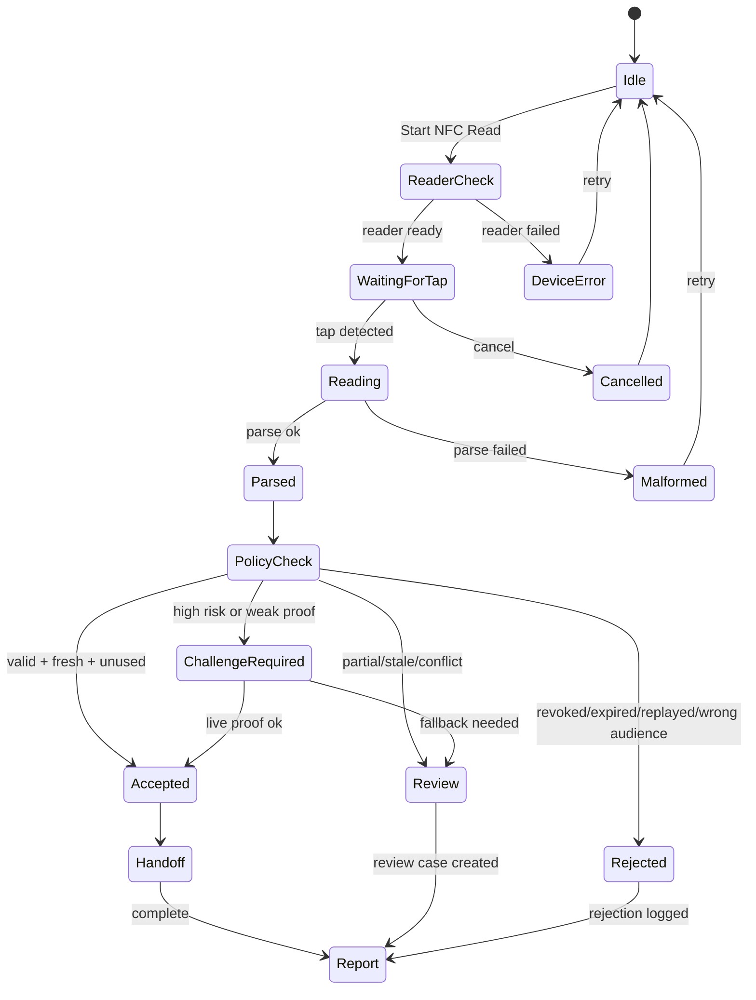

# NFC Device and POS Integration Design

## Purpose

NFC support should make the POS handoff faster without weakening privacy. The POS must treat NFC as one intake channel inside the existing flow:

```text
Scan -> Decision -> Handoff -> Report
```

NFC is not a replacement for QR, passkey, AOID credential, or staff approval. It is a short-range device channel that can carry a signed alias, an AGID-S envelope reference, a recipient proof reference, a staff card assertion, or a locker access assertion.

The default rule is:

```text
read locally, decide locally when possible, persist only commitments and receipts
```

## Device Classes

| Device | Main Use | POS Role |
| --- | --- | --- |
| NFC reader | Recipient tap, staff card, parcel tag | Scan and Handoff |
| NFC writer | Issue short-lived pickup card or field tag | Handoff only, restricted |
| Phone NFC | Customer or operator tap from wallet/app | Recipient proof |
| Locker NFC panel | Locker open/close proof | Handoff and Report |
| Staff NFC card | Operator authentication | Staff permission check |

Supported adapter families should be abstracted behind the same interface:

```text
browser-web-nfc
hid-reader
serial-reader
native-bridge
simulated-reader
```

`simulated-reader` should ship first so POS flows, tests, and demos work without hardware.

## Main POS Screens

### 1. NFC Intake Panel

Location: POS Scan screen.

Primary role: read NFC as one scan source alongside QR, barcode, manual entry, and AGID-S.

Recommended UI:

- Large tap target zone with a visible NFC icon.
- Status strip: Reader ready, waiting for tap, reading, accepted, review, rejected.
- One primary button: `Start NFC Read`.
- Secondary buttons: `Use QR instead`, `Cancel`, `Reader test`.
- Compact diagnostics: reader name, trust state, last sync age, offline mode.

The panel should not expose AGID, AOID, exact address, or proof internals by default.

### 2. NFC Device Diagnostics

Location: POS Settings -> Devices, and POS terminal diagnostics.

Needed controls:

- `Pair reader`
- `Run tap test`
- `Check device signature`
- `Rotate device key`
- `Forget reader`
- `Export device health report`

Needed checks:

- Reader connected
- Firmware or bridge version known
- Device key present
- Device trust active
- Clock drift acceptable
- Offline queue writable
- Registry sync recent enough

### 3. Tap-to-Verify Recipient

Location: POS Handoff screen.

Role: confirm the recipient without showing the recipient's private address data.

Possible accepted proofs:

- Recipient NFC card
- Phone wallet tap
- AOID credential presentation
- Passkey fallback
- One-time proof code fallback

High-risk mode should require live challenge signing rather than accepting a static NFC read.

### 4. Tap-to-Open Locker

Location: Locker handoff or Field Handoff app.

Role: bind locker access to a signed handoff receipt.

Flow:

```text
read parcel/recipient assertion
check freshness and used-state
open locker or mark access pending
record locker event commitment
issue signed POS/locker receipt
```

### 5. NFC Report Review

Location: POS Report screen and Review Console.

Report should show:

- NFC device used
- trust state
- decision outcome
- freshness result
- used-state result
- terminal receipt signature status
- operator id commitment
- reason codes

It should not show raw tag content, exact address, phone number, or recipient name.

## Buttons

### Scan Screen

| Button | Type | Notes |
| --- | --- | --- |
| Start NFC Read | Primary | Stable width, large touch target |
| Use QR instead | Secondary | Immediate fallback |
| Manual entry | Secondary | For reader failure |
| Reader test | Utility | Opens quick diagnostic |
| Cancel | Utility | Stops active read |

### Decision Screen

| Button | Type | Notes |
| --- | --- | --- |
| Accept handoff | Primary | Enabled only after policy passes |
| Require recipient proof | Primary when needed | Used for high-risk or weak proof |
| Send to review | Secondary | For partial, conflict, stale, or unclear results |
| Reject | Destructive | Requires reason |
| View reason codes | Utility | No private payload exposure |

### Handoff Screen

| Button | Type | Notes |
| --- | --- | --- |
| Wait for recipient tap | Primary | Starts challenge window |
| Use passkey fallback | Secondary | Strong fallback |
| Use proof code fallback | Secondary | Low-friction fallback |
| Retry NFC | Secondary | Keeps previous decision visible |
| Complete handoff | Primary | Requires receipt inputs |

### Report Screen

| Button | Type | Notes |
| --- | --- | --- |
| Print receipt | Primary/secondary by context | Uses redacted receipt |
| Export report | Secondary | JSON/PDF without private address fields |
| Sync now | Secondary | Sends queued commitments only |
| Open audit case | Secondary | For conflict or replay suspicion |

## Animation System

Animations should make operator state obvious, not decorative.

| State | Animation | Purpose |
| --- | --- | --- |
| Idle | Slow NFC ring pulse | Shows tap area |
| Reader check | Short scanning sweep | Device is being verified |
| Waiting for tap | Gentle expanding rings | Invite tap |
| Detecting | Tight ripple under icon | Tag was detected |
| Policy checking | Small progress bar | Avoids frozen UI feel |
| Accepted | Green check flash, then steady badge | Clear success |
| Needs review | Amber badge pulse, no flashing loop | Visible but calm |
| Rejected | Brief horizontal shake, then steady red state | Error without chaos |
| Offline queued | Amber sync dot with queue count | Tells operator it is not fully synced |

Accessibility requirements:

- Respect `prefers-reduced-motion`.
- Never rely on animation alone; every state needs text and icon.
- Avoid rapid flashing.
- Keep button sizes stable while states change.

## State Machine



## Safe Event Model

The NFC adapter should emit a sanitized event to the POS UI:

```ts
type PosNfcEvent = {
  eventId: string
  sessionId: string
  readerId: string
  readerTrust: 'trusted' | 'untrusted' | 'unknown'
  channel: 'nfc'
  purpose: 'recipient-proof' | 'staff-auth' | 'parcel-tag' | 'locker-access' | 'agid-s-envelope'
  payloadCommitment: string
  envelopeKind: 'signed-alias' | 'credential-proof' | 'handoff-claim' | 'device-test'
  receivedAt: string
  expiresAt?: string
  offline: boolean
  warnings: string[]
}
```

The adapter boundary may parse the tag locally, but UI state, logs, reports, sync queues, and review records should use commitments and reason codes.

## POS Integration

### Scan

NFC can start a POS session from:

- parcel tag
- AGID-S envelope reference
- recipient proof card
- staff card
- locker panel event

The scan result should immediately create or attach to an Address Intent / Label Intent / Handoff Intent.

### Decision

The POS decision engine should check:

- reader trust
- audience binding
- expiry
- freshness
- revocation
- used-state
- local duplicate queue
- policy mode
- high-risk mode

Decision output:

```text
accepted
requires_recipient_proof
requires_review
rejected
offline_queued
```

### Handoff

NFC is strongest here. It can prove presence at the counter or locker without exposing address details.

High-risk handoff should use:

```text
POS challenge -> recipient tap/sign -> terminal signed receipt
```

### Report

The report should include NFC reason codes and signatures, not tag content.

Minimum report fields:

- handoff id
- terminal id
- reader id
- reader trust
- decision result
- freshness result
- used-state result
- receipt signature status
- created at
- offline sync state

## Security and Privacy Rules

P0 mandatory:

- Do not store raw NFC tag content.
- Do not log exact address, AGID body, AOID body, recipient name, phone number, or proof material.
- Bind reads to purpose, audience, POS id, and expiry.
- Require `jti` or equivalent unique event identifier for replay resistance.
- Store used-state locally first, then sync.
- Mark offline conflicts as review required.
- Require live challenge proof for high-risk mode.
- Sign terminal receipts.
- Redact audit logs by default.

## Implementation Plan

### P0: Simulated and Local-First NFC

- Add `posNfcDevice` library with state machine and safe event schema.
- Add simulated reader events for demo and tests.
- Add NFC panel to POS Scan screen.
- Add NFC recipient proof state to Handoff.
- Add NFC fields to redacted report.
- Add no-private-field tests for NFC events and reports.

### P1: Real Device Adapters

- Add Web NFC adapter where browser support exists.
- Add native bridge adapter for desktop/POS deployments.
- Add HID/serial adapter shape, even if first implementation is simulated.
- Add reader pairing and device diagnostics to POS settings.

### P2: Fleet and Field Operations

- Device fleet trust registry.
- Reader key rotation.
- Locker panel simulator integration.
- Field Handoff app NFC mode.
- Offline conflict reconciliation.

## Suggested Files

```text
src/lib/posNfcDevice.ts
src/lib/posNfcStateMachine.ts
src/lib/posNfcRedaction.ts
src/components/PosNfcPanel.tsx
src/components/PosNfcDiagnosticsPanel.tsx
src/components/PosRecipientProofPanel.tsx
src/lib/__tests__/posNfcDevice.test.ts
src/components/__tests__/PosNfcPanel.test.tsx
```

## UX Acceptance Criteria

- Operator can identify NFC state within one second.
- A failed reader has an obvious QR/manual fallback.
- Handoff cannot complete from stale, revoked, replayed, or wrong-audience NFC reads.
- Offline accepted reads are visibly queued and later reconciled.
- Reports prove the decision path without exposing private address data.
- The same POS flow works with simulated NFC before hardware is available.
