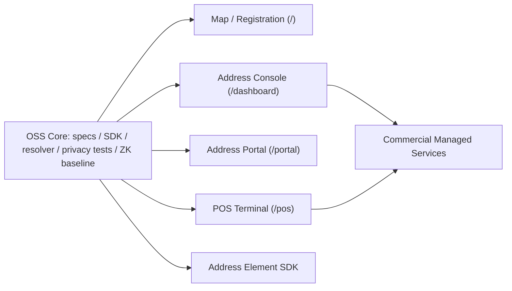

# AGID/AOID Open Core Product and Service Split

Last updated: 2026-06-18

この文書は、AGID/AOIDをオープンソースとして公開する範囲、商用機能として扱ってよい範囲、アプリ分割、サービス分割を固定するための実装向け設計メモである。対応する機械可読モデルは `src/lib/openCoreProductStrategy.ts` に置く。

## 結論

AGID/AOIDは、標準・SDK・ローカル解決・基本POS・プライバシー検証をOSSにするのがよい。商用化してよいのは、Hosted Registry、端末fleet、SLA、長期ログ、審査運用、Managed ZK、Evidence Vault、専用デプロイなどの運用負荷が大きい領域である。

2026-06-18時点の方針として、以下は「無料枠」ではなく、OSSとして公開し続ける非交渉領域に固定する。

- AGID生成、AGID decode、AGID-Sローカル復号
- ローカル住所表示、言語タブ、郵便番号補完、基本住所検証
- QR/NFC受付、基本POS、offline queue、基本receipt
- Address Element埋め込みUI
- ユーザーの同意確認、取消、削除、export
- 高リスクモード、redaction、no-raw-addressテスト、セキュリティ修正

| 区分 | 数 |
| --- | ---: |
| OSSにする機能領域 | 8 |
| OSSから外さない非交渉機能群 | 6 |
| 商用にしてよい機能領域 | 8 |
| アプリ/コンポーネント分割 | 5 |
| サービス | 12 |
| MVPで先に成熟させるサービス | 5 |

守るべき原則は、商用サービスを使わなくてもAGID/AOID標準を検証・実装・ローカル運用できること。特にMode 0 Local Onlyは、Hosted Registry、ZK、Ethereum、Managed Serviceなしで成立させる。

## OSSにする機能

| 領域 | OSSにするもの | 理由 |
| --- | --- | --- |
| AGID/AOID標準 | AGID仕様、AOID公開仕様、AGID-S仕様、test vectors | ID・QR・公開仕様は第三者が独立実装できる必要がある。 |
| SDK/CLI | AGID生成、AGID encode/decode、AGID decode、AOID validation、AGID-S暗号化/復号、AGID-Sローカル復号、OpenAPI、CLI | 開発者がHosted APIなしで検証・導入できる入口。 |
| Local Resolver | ローカル住所解決、ローカル住所表示、住所表示、言語タブ、郵便番号補完、基本住所検証 | 中央サーバーに依存しない住所インフラとしての信用を作る。 |
| Address Element | Address Element埋め込みUI、EC/CMS/買い物Agent向け埋め込み住所入力UI | 採用面の主戦場なので、イベント仕様とUIの安全性を公開する。 |
| 基本POS | QR/NFC受付、基本POS、AGID-S復号、ローカル検証、基本receipt、offline queue | 店舗・災害現場・小規模配送で無料運用できる参照実装。 |
| Privacy/Security | public/private separation、脅威モデル、no-raw-address tests、高リスクモード、redaction、セキュリティ修正 | 監視や住所漏洩に使えない設計をコードとテストで説明する。 |
| ZK基礎 | 基本回路、public signal schema、nullifier/ownership/freshnessの検証仕様 | 秘匿証明はブラックボックス化すると信頼を失う。 |
| Docs | 論文、数理モデル、検証ノート、導入ガイド | 主張・限界・検証済み範囲を公開し、過剰主張を防ぐ。 |

## 商用にしてよい機能

商用化してよいのは、OSS機能そのものではなく、運用負荷、外部費用、長期保管、SLA、専用導入、人的審査、managed computeである。たとえばHosted Registryを有料化しても、registry schema、self-host API、local nullifier validationはOSSに残す。Managed ZKを有料化しても、回路、public signal schema、self-host prover pathはOSSに残す。

| 領域 | 商用向きの機能 | ガードレール |
| --- | --- | --- |
| Hosted Registry API | issuer、revocation、freshness、nullifier、used-stateの運用 | self-host可能なスキーマとOpenAPIは公開する。住所平文は保存しない。 |
| Enterprise Dashboard | 監査、Webhook、APIキー、SLA、組織権限、長期ログ | ログはredactedを既定にし、raw evidence閲覧には権限と理由を要求する。 |
| 高度POS管理 | 端末fleet、スタッフ権限、プリンタ/計測器診断、拠点管理 | 基本POSはOSSで残し、端末テレメトリにraw addressを入れない。 |
| Review Console高度版 | 人手審査queue、異議申し立て、Address Radar高度リスク判定 | 判定理由は説明可能にし、審査証跡を残す。 |
| Managed ZK | proof生成サーバー、proof queue、prover infrastructure | witnessとprivate inputはログに残さない。self-host prover経路を残す。 |
| Evidence Vault managed版 | 暗号化証跡保管、OCR、legal hold、保持期限管理 | ローカル/暗号化を既定にし、外部OCR送信は明示同意にする。 |
| Private Deployment | 自治体、NGO、配送業者、倉庫、大企業向け専用環境 | 公開標準を閉じず、導入支援と運用を商用価値にする。 |
| 商用サポート | 導入支援、監査対応、SLA、カスタム連携 | サポートがなくてもプロトコル検証できる状態を保つ。 |

## アプリ分割

AGID/AOIDは単一アプリに詰め込みすぎると、POS、Portal、Dashboard、埋め込みUIの責務が混ざる。以下の4アプリ + 1コンポーネントに分ける。

| アプリ/コンポーネント | ルート | 役割 | 境界 |
| --- | --- | --- | --- |
| AGID Map / Registration App | `/` | 地図、住所表示、住所登録、住所修正、フィードバック | OSS reference app |
| AGID POS Terminal App | `/pos` | 配送受付、QR/NFC、AGID-S復号、受取人proof、送り状、端末診断 | OSS reference app。高度fleetは商用 |
| Address Portal App | `/portal` | ユーザーが許可、scope、失効、削除を管理 | OSS reference app |
| Address Console App | `/dashboard` | Dashboard、Review Console、Developer Console、監査、Webhook、issuer、端末 | 最小版OSS、高度運用は商用 |
| AGID Address Element | なし | EC/CMS/買い物Agentに埋め込む住所入力コンポーネント/SDK | OSS core |

## サービス分割

サービス数は12個に整理する。MVPでは、Resolver、Validation、Address Element、POS、Hosted Registry APIの5つを先に成熟させる。

| サービス | 境界 | 主な役割 |
| --- | --- | --- |
| AGID Resolver Service | OSS core | AGID生成、逆引き、住所表示、地名検索 |
| Address Validation Service | OSS core | 郵便番号、国別住所制度、配送可否、品質判定 |
| AGID Address Element | OSS core | EC/CMS/買い物Agent向け埋め込み住所入力 |
| AGID POS Terminal | OSS reference app | QR/NFC受付、送り状、受取人proof、配送handoff |
| Address Portal | OSS reference app | ユーザーの同意、scope、失効、削除管理 |
| Address Console / Dashboard | 商用拡張中心 | API、Webhook、端末、issuer、監査、ログ管理 |
| Hosted Registry API | 商用managed service | issuer、revocation、freshness、nullifier、used-state |
| Address Review Console | 商用拡張中心 | 要確認、拒否、異議申し立て、住所衝突、再照合 |
| Address Evidence Vault | 商用managed service | 写真/PDF/OCR、redaction、暗号化証跡 |
| Address Radar / Signal | 商用拡張中心 | 不正登録、QR再利用、怪しいhandoff、リスク判定 |
| Managed ZK Proof Service | 商用managed service | ZK proof生成、proof queue、verifier連携 |
| Payment / Settlement / Carrier Label Service | 商用managed service | 先払い、着払い、escrow、送り状、配送業者連携 |

## MVP順序

1. AGID Resolver Service
2. Address Validation Service
3. AGID Address Element
4. AGID POS Terminal
5. Hosted Registry API

この順序にする理由は、住所解決・住所品質・入力UI・POS受付・失効/使用済み管理がそろうと、ZKやEthereumがなくても実運用に近い価値を出せるためである。

## 公開前チェック

- AGID/AOID標準をHosted APIなしで検証できる。
- Mode 0 Local Onlyが動く。
- raw address、raw AOID、AGID-S payload、recipient secret、proof codeがログ・イベント・公開payloadに出ない。
- 商用機能はOSS仕様やtest vectorを置き換えない。
- Address Element、POS、Portalは商用Dashboardなしでも最小運用できる。
- ZKやEthereumは追加の検証レイヤーであり、必須依存にしない。
