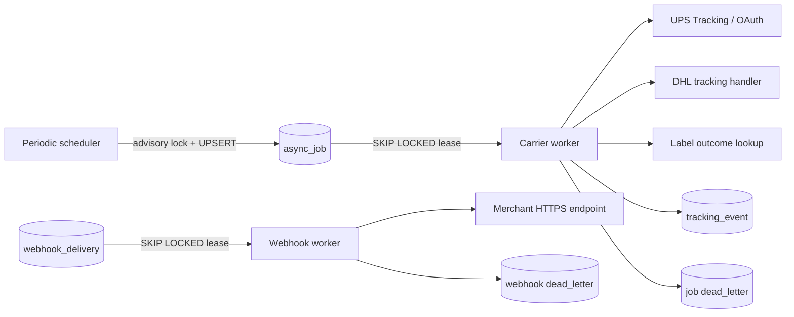

# Veygrit -ship asynchronous workers

## Runtime flow



`VeygritShipWorkerRuntime` schedules due work and runs Carrier and Webhook batches without overlapping its own cycles. Multiple processes may run concurrently: the scheduler uses `pg_try_advisory_xact_lock`, and queue consumers use `FOR UPDATE SKIP LOCKED`.

Carrier HTTP requests occur after the lease claim transaction has committed. The request does not hold a PostgreSQL row lock.

## Job types

| Job | Trigger | Success scheduling | Terminal handling |
| --- | --- | --- | --- |
| `tracking_update` | Active label and due `next_tracking_poll_at` | Default 15 minutes, stopped at delivery | DLQ after attempts or permanent error |
| `carrier_reconciliation` | Active or void-pending shipment and due reconciliation | Default 6 hours, stopped at delivered/voided | DLQ for operator review |
| `label_outcome_reconciliation` | Unsafe label write returns `outcomeUnknown` | 30-second retry while Carrier result remains pending | Deadline expiry is DLQ; never recreate blindly |
| `ups_token_refresh` | Active UPS connection, five minutes before expiry | Saves only expiry and schedules the next refresh | Marks connection `reauthorization_required` on DLQ |

Each active job type/dedupe key is unique. A crashed worker's expired lease is reclaimable. Failed attempts use bounded exponential backoff and store a normalized error code. DLQ transitions append an Audit Event.

## Unknown label result

When UPS or DHL label creation returns a timeout, network failure, or 5xx with `outcomeUnknown=true`, the shipment orchestration layer must call:

```ts
await workerStore.markLabelOutcomeUnknown({
  shipmentRef,
  carrierRequestId,
  deadlineAt,
});
```

This marks the shipment `unknown` and enqueues reconciliation. The worker asks the Carrier-specific lookup using the original request reference. It accepts only:

- `found`: persist an idempotent label record and begin tracking;
- `not_found`: only when the Carrier positively confirms absence;
- `pending`: retry until the deadline, then send to DLQ for manual review.

Deadline expiry does **not** prove absence and never authorizes automatic label recreation.

## UPS connection bridge

`ConnectorCarrierWorkerGateway` resolves an `UpsConnector` from `connectionRef`. UPS tracking calls the existing safe-read `track()` method. Token jobs call `refreshOAuthToken()`, which invalidates the local cache, shares an in-flight refresh with concurrent requests, and returns only `expiresAt`; the bearer token is never written to PostgreSQL or returned from the worker gateway.

The deployment resolver must load the Carrier credentials referenced by `credential_secret_ref` from the secrets manager. DHL tracking is injected as a normalized handler because MyDHL Express and DHL eCommerce Americas have separate account/API contracts.

## Webhook delivery

The Webhook worker resolves `endpoint_ref`, `payload_ref`, and the signing secret outside PostgreSQL, verifies the payload SHA-256, then sends a POST with:

- `Veygrit-Event-Id`
- `Veygrit-Event-Type`
- `Veygrit-Signature: t=<unix>,v1=<HMAC-SHA256>`

Only public HTTPS endpoints are accepted. Obvious loopback/private hosts are rejected; production must additionally provide a DNS-aware `allowEndpoint` policy to stop rebinding. Reserved signature and event headers cannot be overridden by resolver headers.

HTTP 408, 425, 429, 5xx, timeouts, and network failures retry. `Retry-After` is honored. Other 4xx responses, integrity failures, missing signing secrets, and denied endpoints go directly to DLQ. PostgreSQL also enforces `max_attempts` even if a caller mistakenly asks for another retry.

Operators can inspect and explicitly replay DLQs with `listDeadLetters()` / `replayDeadLetter()` and `listDeadLetterWebhookDeliveries()` / `replayWebhookDeadLetter()`.

## Deployment requirements

1. Apply both migrations with `npm run migrate:veygrit-ship`.
2. Construct one pooled `SqlPool` per process and share it between the stores.
3. Provide Carrier Connection → secrets manager → Connector resolution.
4. Provide UPS response normalization plus MyDHL Express and DHL eCommerce tracking handlers.
5. Provide Label outcome lookup supported by each Carrier/account contract; do not invent an endpoint.
6. Provide webhook endpoint/payload/signing-secret resolution and a DNS-aware egress allowlist.
7. Export cycle, retry, DLQ age, token-refresh failure, reconciliation lag, and webhook latency metrics.
