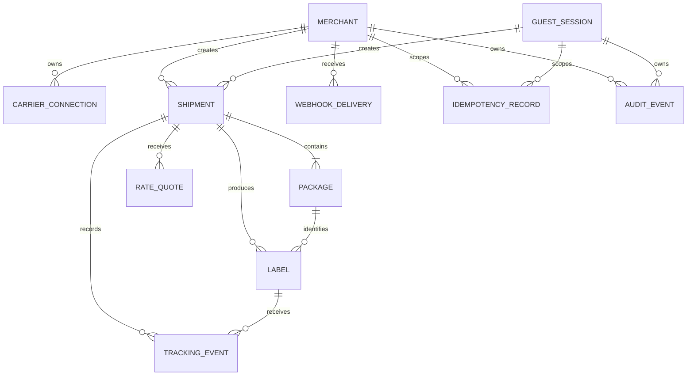

# Veygrit -ship PostgreSQL foundation

## Scope

The core migration persists the eleven operational entities required for the UPS/DHL limited release:

`Merchant`, `Guest Session`, `Carrier Connection`, `Shipment`, `Package`, `Rate Quote`, `Label`, `Tracking Event`, `Webhook Delivery`, `Idempotency Record`, and `Audit Event`.



## Apply the migration

Set a PostgreSQL URL for a migration-capable role, then run:

```powershell
$env:VEYGRIT_SHIP_POSTGRES_URL='postgresql://...'
npm run migrate:veygrit-ship
npm run verify:veygrit-ship-store
```

The migration runs in one transaction and takes a PostgreSQL advisory lock. The application store never applies DDL automatically. Production should use a pooled URL and a non-owner runtime role named `veygrit_ship_app` (or an equivalent role with the same narrow grants).

## Runtime contract

- Use `createVeygritShipStoreFromEnv()` once per server process. It creates one `pg.Pool`; do not create a connection per request.
- `createShipmentWithPackages()` is a short transaction. Address validation, rating, UPS calls, and DHL calls happen outside it.
- `reserveIdempotency()` stores only SHA-256 hashes of keys and request bodies. A repeated key with a different body returns `conflict`; a completed operation returns `replay`.
- `claimWebhookDeliveries()` uses an atomic `FOR UPDATE SKIP LOCKED` claim. Expired delivery leases are reclaimable after a worker crash.
- `appendTrackingEvent()` uses carrier IDs and a fingerprint to discard duplicate carrier events.
- Audit rows are append-only at the database level. Runtime grants do not include `DELETE`.

## Security and storage boundaries

- `credential_secret_ref` points to a secrets manager. UPS/DHL client secrets and OAuth access tokens are not database columns.
- `artifact_key` points to encrypted object storage. Label PDF/ZPL/PNG bytes are not database columns.
- Address fields use Address Wallet references and optional encrypted snapshot references; raw address payloads are not copied into the shipment row.
- Webhook and carrier response bodies use object references plus SHA-256 hashes.
- Guest tokens and idempotency keys are hashed before insertion.
- Audit details are restricted to a JSON object of at most 16 KiB and must be redacted by the caller.

## DHL product-code compatibility

New shipment and rate rows persist `product_id_code`, never a localized product name. The earlier `veygrit_ship_dhl_product_selection` table can remain during adapter migration. The unified shipment service should create the core `Shipment` first and then let the DHL router update its compatibility record; after all callers use the core store, the compatibility table can be retired in a separate migration.

## Operational follow-ups before live traffic

1. Provision PostgreSQL backups, point-in-time recovery, TLS, a pooled runtime URL, and separate migration/runtime roles.
2. Provision a secrets manager and encrypted object storage for credentials, address snapshots, labels, carrier payloads, and webhook payloads.
3. Add retention jobs for expired guest sessions, idempotency records, carrier payload artifacts, and webhook dead letters. Audit retention should follow the legal/security policy and remain append-only.
4. Wire the unified shipment orchestration service to the store around UPS/DHL calls. Never hold a database transaction during a carrier network request.
5. Add a live migration smoke test and restore drill in staging before enabling `HEXASHIP_CARRIER_LIVE_TRAFFIC_ENABLED`.

The asynchronous queue, reconciliation, Webhook retry/DLQ, and UPS token refresh design is documented in `docs/ops/veygrit-ship-async-workers.md`.
