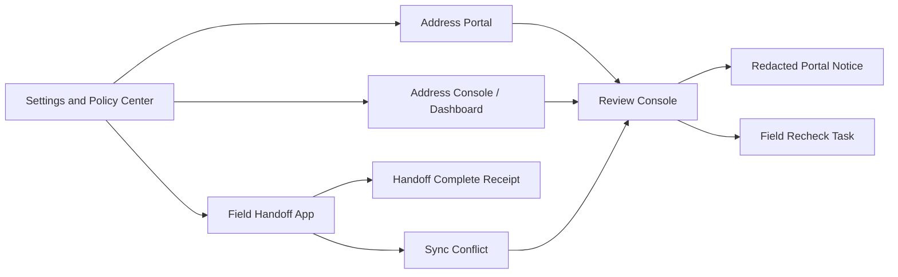

# P0プロダクト成熟実行計画

Last updated: 2026-06-18

この資料は、AGID/AOIDの次のP0を「実装順・画面・状態・テスト・無料/有料境界」まで固定するための実行計画である。

- Settings and Policy Center
- Address Portal成熟
- Dashboard成熟
- Review Console
- Field Handoff App

型付きの実行計画は `src/lib/p0MaturityExecutionPlan.ts` に置く。検証は `src/lib/p0MaturityExecutionPlan.test.ts` で行う。

## 結論

このP0指定は正しい。理由は、AGID/AOIDが単なる地図UIではなく、住所・同意・配送・監査・現場実行を扱う住所インフラになってきたからである。

ただし、5つを同列に作るのではなく、次の順番で成熟させる。

| 順位 | P0 | 目的 |
| ---: | --- | --- |
| 1 | Settings and Policy Center | 言語、運用モード、provider、端末、高リスク設定を一元化する |
| 2 | Address Portal成熟 | ユーザーが同意、scope、取消、削除、export、異議申し立てを管理できるようにする |
| 3 | Dashboard成熟 | 管理者・issuer・配送業者・NGOが運用できるConsoleへ育てる |
| 4 | Review Console | partial、rejected、conflict、suspicious、disputeを監査可能に処理する |
| 5 | Field Handoff App | POSから現場・配送員・支援者向けのモバイル/オフライン実行を分離する |

## なぜSettingsが先か

Settingsは画面ではなく、全アプリのpolicy rootである。

ここが弱いままPortal、Dashboard、Review、Fieldを作ると、次のような問題が起きる。

- POSだけ言語設定が違う。
- Portalでは高リスクモードだが、Dashboardでは通常モードとして扱われる。
- Provider adapterを有効化した時に、何が外部へ出るか分からない。
- Mode 0 Local Onlyのはずなのに、ReviewやFieldがHosted Registry前提になる。
- 高リスクユーザーが精密AGIDや住所履歴を残してしまう。

したがって、Settingsは最初に「共通設定モデル」として切り出す。

## 共通基盤

P0全体で共有するものは次である。

| 共通基盤 | 内容 |
| --- | --- |
| Policy schema | language、mode、high-risk、provider、device、registry、key reference |
| Redaction contract | raw address、raw AGID、raw AOID、AGID-S payload、proof secret、recipient identityを共有ログから排除 |
| Review case schema | Portal dispute、Dashboard queue、POS refusal、Field sync conflictを同じcaseに寄せる |
| Receipt model | Portal操作、Dashboard操作、Review判断、Field handoffをredacted receipt化する |
| Free baseline | local/self-hosted、revoke/delete/export、high-risk controls、local scan/decrypt/receiptを無料固定にする |

## 画面と状態

### 1. Settings and Policy Center

必要な画面:

- language and locale policy
- Mode 0-4 operation selector
- privacy and high-risk defaults
- provider adapter data-flow review
- device connector policy
- key reference and rotation hints
- policy impact preview

最低限の状態:

- `local_only`
- `server_registry`
- `zk_only`
- `ethereum_registry`
- `full_zk_ethereum`
- `provider_disabled`
- `provider_enabled`
- `high_risk_enabled`

完成条件:

Map、POS、Portal、Address Element、Dashboard、Review、Fieldが同じsettings objectを読む。さらに、その設定で「何がlocalに残り、何が外部へ出るか」を説明できる。

### 2. Address Portal成熟

必要な画面:

- connection list
- connection detail
- scope timeline
- revoke confirmation
- delete request
- safe export request
- dispute and correction request
- high-risk connection review

無料固定:

- connection view
- scope view
- revoke
- delete
- export
- dispute start

表示してはいけないもの:

- raw address
- raw AGID
- raw AOID
- recipient name
- phone
- proof secret

完成条件:

ユーザーが、どの組織に何を許可しているかを理解し、取消、削除、export、異議申し立てまで実行できる。

### 3. Dashboard成熟

必要なタブ:

- overview
- redacted API logs
- webhook debugger
- issuer registry
- terminal fleet
- QR usage and used-state
- launch readiness
- privacy guardrail status

扱ってよいもの:

- metrics
- references
- commitments
- roots
- nullifiers
- statuses
- redacted evidence refs

扱ってはいけないもの:

- raw request body
- AGID-S payload
- private key
- proof witness
- recipient identifier

完成条件:

管理者が、赤い警告や件数を見るだけでなく、該当する運用タブへ掘っていける。Hosted運用がなくてもself-hosted redacted event viewerとして使える。

### 4. Review Console

必要な画面:

- case queue
- case detail
- evidence timeline
- redaction view
- decision receipt
- dispute and appeal
- merge and split review

状態:

- `needs_review`
- `waiting_for_correction`
- `waiting_for_recipient_proof`
- `approved`
- `rejected`
- `escalated`
- `disputed`

重要な制約:

Reviewは必ずredacted evidenceから始める。raw evidenceへ進むには、role、scope、reason、signed audit receiptを必須にする。

完成条件:

住所の曖昧さ、配送拒否、住所衝突、異議申し立て、PID merge/splitを、理由付きで監査可能に処理できる。

### 5. Field Handoff App

必要な画面:

- scan task
- route stop detail
- recipient proof prompt
- reachability report
- offline queue
- high-risk mode
- sync conflict review
- handoff receipt

状態:

- `assigned`
- `arrived`
- `recipient_pending`
- `handoff_complete`
- `cannot_reach`
- `offline_pending_sync`
- `sync_conflict`

高リスク運用:

- AGID-Sを使う。
- 有効期限を短くする。
- 精密AGIDを共有reportに残さない。
- 受取後はused-state/nullifierへ寄せる。
- 到達不能報告はsafe categoryで共有する。

完成条件:

配送員、pickup staff、NGO field workerが、通信なしでもscan、recipient proof、handoff receipt、cannot reach reportを作り、後で安全に同期できる。

## 画面遷移

## テストゲート

P0では、UI追加より先に次のテストを必須にする。

| テスト | 目的 |
| --- | --- |
| no raw payload test | shared payloadにraw address、raw AGID、raw AOID、AGID-S payload、proof secret、private key、recipient name、phoneが入らない |
| Mode 0 test | Local OnlyでSettings、Portal表示、POS/Field receipt、self-hosted Dashboard logが動く |
| high-risk free test | 高リスク設定、AGID-S、短期失効、coarse receiptが無料で使える |
| language propagation test | 言語設定がMap、POS、Portal、Dashboard、Review、Fieldに反映される |
| receipt/state transition test | reject、escalate、sync、completeの全てがredacted receiptまたはreview caseを作る |

## 無料と有料の線引き

無料に固定するもの:

- Mode 0 Local Only
- language settings
- high-risk mode
- local scan
- local AGID-S decrypt
- local receipt
- Portal revoke/delete/export/scope view
- Review case schema
- redacted event viewer
- basic offline queue

有料になり得るもの:

- hosted registry operations
- SLA monitoring
- long-term log retention
- managed provider credentials
- centralized device fleet policy
- managed human review
- enterprise RBAC
- managed fleet sync

判断基準は単純である。

プロトコル・安全性・自己ホスト・高リスク保護に必要なものは無料。ホスティング、SLA、人手、長期保管、組織運用、端末fleet管理のように運用費が発生するものだけ有料にできる。

## 実装スライス

### Slice 1

- shared policy schemaを作る。
- POSの言語設定をschemaへ接続する。
- PortalとDashboardは読み取りだけ先に対応する。
- no-raw-address設定exportテストを追加する。

### Slice 2

- Portal connection detailを作る。
- revoke/delete/export/dispute receiptを作る。
- disputeからReview case referenceを作る。

### Slice 3

- Dashboardをtabsへ分割する。
- redacted event tableを作る。
- webhook debuggerとlaunch readinessを追加する。

### Slice 4

- Review case schemaとstate machineを作る。
- Review queue/detail/decision receiptを作る。
- raw escalation gateを作る。

### Slice 5

- `/field` routeを作る。
- POS scan/receipt contractを再利用する。
- reachability reportとoffline queueを作る。
- sync conflictをReview caseへ送る。

## 結論

P0はこの5つでよい。

ただし、優先度は「画面が目立つ順」ではない。Settingsでpolicyを固定し、Portalでユーザー制御を保証し、Dashboardで運用視界を作り、Reviewで曖昧さを処理し、Fieldで現場実行へ出す。この順番が一番安全で、コードも資料も散らかりにくい。
