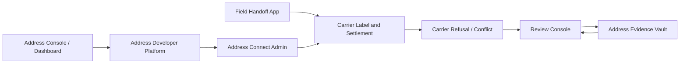

# P1プロダクト成熟実行計画

Last updated: 2026-06-18

この資料は、P0の次に成熟させるP1アプリ群を「実装順・画面・状態・テスト・無料/有料境界」まで固定するための実行計画である。

- Address Evidence Vault
- Address Developer Platform
- Address Connect Admin
- Carrier Label and Settlement

型付きの実行計画は `src/lib/p1MaturityExecutionPlan.ts` に置く。検証は `src/lib/p1MaturityExecutionPlan.test.ts` で管理する。

## 結論

P1は、P0で作るSettings、Portal、Dashboard、Review、Fieldの上に乗る拡張層である。

順番は次がよい。

| 順位 | P1 | 目的 |
| ---: | --- | --- |
| 1 | Address Evidence Vault | 写真、PDF、送り状、公共料金明細などをlocal-firstで証拠化する |
| 2 | Address Developer Platform | SDK、OpenAPI、Webhook、test vectors、Address Element、Launch Centerを統合する |
| 3 | Address Connect Admin | issuer、carrier、NGO、自治体、endpoint、scope、鍵、trustを管理する |
| 4 | Carrier Label and Settlement | 送り状、carrier受理、着払い/先払い、通関補助、handoff receiptをPOSから切り出す |

P1は華やかな機能が多いが、むやみに先に作ると危険である。Evidenceはプライバシー、Developerは公開例、Connectは組織信頼、Carrierは配送と決済を扱うため、P0のredaction、review、settings、field receiptが前提になる。

## 共通基盤

| 共通基盤 | 内容 |
| --- | --- |
| Evidence envelope | local、redacted、encrypted、attached、retained、expired、legal holdを扱う |
| Developer launch contract | OpenAPI、SDK snippets、webhook fixtures、test vectors、redaction simulation、Mode 0 quickstart |
| Organization trust record | issuer、carrier、NGO、自治体、endpoint、public key、scope、status |
| LabelIntent contract | address decision、carrier acceptance、waybill QR、payment gate、customs assist、handoff receipt |
| Paid boundary rule | managed OCR、hosted API、trust operations、endpoint monitoring、payment/carrier pass-through、escrow、reconciliationだけ有料化可能 |

## 1. Address Evidence Vault

Evidence Vaultは、住所証拠を扱うが、中央の生文書データベースにしてはいけない。

必要な画面:

- local upload and import
- OCR candidate review
- candidate-to-address comparison
- redaction editor
- encrypted evidence envelope detail
- retention and legal-hold policy
- evidence attachment picker
- review-case evidence view

状態:

- `local_only`
- `ocr_ready`
- `redaction_required`
- `redacted`
- `encrypted`
- `attached_to_case`
- `retention_expired`
- `legal_hold`

無料固定:

- local file import
- editable OCR candidates
- local redaction
- encrypted local evidence envelope
- self-hosted review caseへのlocal evidence attachment

有料になり得るもの:

- managed OCR compute
- encrypted hosted storage
- legal hold
- retention policy operations

重要な制約:

外部OCR送信をデフォルトにしない。証拠をReviewへ渡す場合は、raw fileではなくredacted evidence referenceにする。

## 2. Address Developer Platform

Developer Platformは、AGID/AOIDを使う開発者の入口である。

必要な画面:

- API key and environment overview
- OpenAPI explorer
- webhook debugger
- Address Element snippets
- test vectors and conformance
- launch center
- redaction simulator
- Mode 0 self-host quickstart

状態:

- `test_mode`
- `live_ready`
- `webhook_unverified`
- `webhook_verified`
- `launch_blocked`
- `launch_ready`
- `self_hosted`

無料固定:

- OpenAPI explorer for self-hosted APIs
- SDK snippets
- test vectors
- webhook signature fixtures
- Mode 0 quickstart

有料になり得るもの:

- hosted API key operations
- enterprise support
- SLA-backed webhook delivery

重要な制約:

サンプルpayloadはfixtureから作る。live private request bodyから生成しない。test、live、local、high-risk environmentは明確に分ける。

## 3. Address Connect Admin

Address Connect Adminは、組織とendpointの信頼管理である。個人住所帳ではない。

必要な画面:

- organization onboarding
- issuer registration
- carrier endpoint discovery
- scope template editor
- trust registry
- revocation status
- webhook subscriptions
- key rotation and suspension

状態:

- `draft`
- `pending_verification`
- `active`
- `suspended`
- `revoked`
- `rotation_required`
- `endpoint_degraded`

無料固定:

- self-hosted issuer/carrier metadata schema
- scope templates
- trust registry viewer
- revocation status viewer

有料になり得るもの:

- hosted organization onboarding
- managed trust operations
- enterprise endpoint monitoring

重要な制約:

Connect recordに個人住所、AOID secret、proof witness、電話番号、受取人IDを入れない。扱うのは、組織、endpoint、public key、scope、statusである。

## 4. Carrier Label and Settlement

Carrier Label and Settlementは、POSに入れ続けると肥大化するため、分離する価値が高い。

必要な画面:

- LabelIntent creation
- address and carrier decision
- carrier acceptance
- address refusal policy
- prepaid and collect payment gate
- customs and HS assist
- waybill QR
- handoff report
- settlement and reconciliation status

状態:

- `requires_address`
- `validating`
- `carrier_review`
- `accepted`
- `label_issued`
- `payment_pending`
- `in_transit`
- `completed`
- `refused`

無料固定:

- LabelIntent state model
- waybill QR format
- local carrier acceptance simulator
- manual payment status record

有料になり得るもの:

- payment network fees
- carrier API pass-through
- escrow operations
- merchant reconciliation

重要な制約:

支払い成功を住所証明や受取人証明と混ぜない。Carrier label eventにはfull address、raw AGID-S payload、proof code、private evidenceを出さない。

## 画面遷移

## テストゲート

P1では次を必須にする。

| テスト | 目的 |
| --- | --- |
| evidence redaction gate | managed sync前にredactionと明示同意がある |
| developer fixture gate | サンプルやWebhook fixtureがlive private payload由来ではない |
| connect organization-only gate | Connect recordに個人住所やsecretが入らない |
| label issuance gate | address decisionとcarrier acceptance前にlabelを発行できない |
| payment separation gate | payment statusをaddress proofやrecipient proof扱いしない |

## 無料と有料の線引き

無料に固定するもの:

- local evidence import
- local redaction
- encrypted local evidence envelope
- SDK snippets
- OpenAPI explorer
- test vectors
- webhook signature fixtures
- self-hosted issuer/carrier schema
- LabelIntent state model
- waybill QR format
- manual payment status record

有料になり得るもの:

- managed OCR compute
- encrypted hosted storage
- legal hold
- hosted API key operations
- SLA-backed webhook delivery
- managed trust operations
- endpoint monitoring
- payment/carrier pass-through
- escrow
- reconciliation

判断基準はP0と同じである。

標準、自己ホスト、開発者互換、local privacy、安全な手動運用は無料。ホスティング、外部費用、人手、SLA、保管、決済、carrier API、法的保持など運用費が出るものだけ有料にできる。

## 実装スライス

### Slice 1: Evidence Vault

- evidence envelope schemaを作る。
- local importとOCR candidate reviewのhooksを作る。
- Review Consoleへredacted evidence refsを接続する。
- retentionとmanaged sync consent gateを追加する。

### Slice 2: Developer Platform

- DashboardにDeveloper tabを追加する。
- SDKとAddress Element snippetsをstatic fixturesから表示する。
- Webhook signature testerを作る。
- Launch CenterをP0 privacy gateと接続する。

### Slice 3: Address Connect Admin

- organization recordとendpoint recordを定義する。
- issuer/carrier onboarding screenを作る。
- scope templateをAddress Access/Auth policyへ接続する。
- key rotation/suspension receiptを作る。

### Slice 4: Carrier Label and Settlement

- LabelIntentとwaybill QR contractを定義する。
- `/carrier` routeまたはPOS-linked moduleを作る。
- carrier refusalをReview Consoleへ接続する。
- payment statusをaddress proofとは別gateとして扱う。

## 結論

P1はこの4つでよい。

ただし、P1は「便利機能」ではなく、P0の信頼性を外部統合へ伸ばす層である。Evidenceで証拠を安全に扱い、Developerで統合しやすくし、Connectで組織を信頼可能にし、Carrierで配送・送り状・決済へつなぐ。この順番なら、プライバシーと実運用の両方を崩しにくい。
