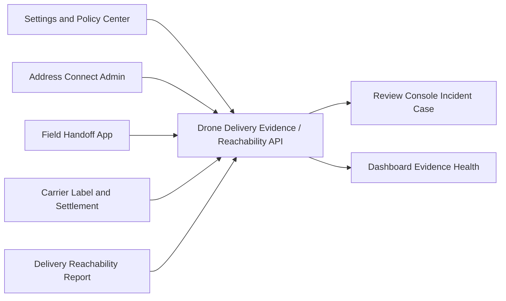

# P2プロダクト成熟実行計画

Last updated: 2026-06-18

この資料は、P2の将来候補であるドローン運用を、Drone OS本体や機体制御アプリとして作らず、配送証跡・到達可否APIとして安全に切り出すための実行計画である。

型付きの実行計画は `src/lib/p2MaturityExecutionPlan.ts` に置く。検証は `src/lib/p2MaturityExecutionPlan.test.ts` で行う。

## 結論

ドローン運用はP2でよい。ただしP2で作るものは「ドローンOS本体」ではなく、配送証跡・到達可否APIである。

理由は、P0/P1の土台がない状態でドローンOS、スマートロッカー、PUDO、端末fleet、route safety、access grantを作ると、AGID/AOIDがハードウェア依存の複雑な業務アプリに引っ張られすぎるからである。

先に作るべきものは、画面そのものではなく次の契約である。

- drone delivery evidence API
- delivery reachability report
- cannot-reach reason codes
- public/restricted projection
- restricted operator receipt
- no-flight-control guarantee

## 位置付け

| 優先度 | 対象 | 判断 |
| --- | --- | --- |
| P0 | Settings、Portal、Dashboard、Review、Field | 先に成熟させる |
| P1 | Evidence、Developer、Connect、Carrier Label | P0の上に乗せる |
| P2 | Drone Delivery Evidence / Reachability API | OS本体ではなく、証跡・到達可否APIに絞る |

ドローン運用は、POSの配送ハンドオフやField Handoffの延長ではあるが、P2では別アプリ化しない。まずはAPIとして、配送できた・到達できなかった・高リスクなので制限共有する、という証跡だけを扱う。

理由:

- ドローンOSやautopilotは安全・法規制・責任の範囲が大きい。
- 機体制御を入れると特定ハードウェアSDKへ依存しやすい。
- 支払い・送り状・証跡を飛行許可と誤認してはいけない。
- 高リスク配送では精密なroute/recipient情報を公開できない。
- 到達不可情報は公共価値がある一方、ストーカーや監視に悪用され得る。

## 依存関係

Drone / Locker Operations Appは、次に依存する。

| 依存 | 理由 |
| --- | --- |
| Settings and Policy Center | high-risk、local/hosted、provider、device policyを読む |
| Field Handoff App | 現場handoff receipt、recipient proof、cannot-reach reportを使う |
| Carrier Label and Settlement | waybill、carrier acceptance、label stateを使う |
| Address Connect Admin | carrier、drone operator、endpoint、public key、trust statusを使う |

## 必要なAPI面

P2で先に作るAPI面は次である。

- `GET /api/drone-delivery-evidence/capabilities`
- `POST /api/drone-delivery-evidence/report`
- public projection preview
- restricted operator receipt
- cannot-reach reason picker
- evidence class summary
- manual review handoff
- redacted audit export

## 状態モデル

最低限の状態は次である。

- `attempted`
- `completed`
- `cannot-reach`
- `held-for-review`
- `reported`
- `confirmed`
- `restricted`
- `review-first`
- `expired`

この状態は、飛行状態ではなく配送証跡と到達可否の状態である。機体のarming、takeoff、return-to-home、landingなどはP2 APIの対象外にする。

## 共通部品

API/管理画面で必要になる部品:

- `DroneDeliveryEvidenceReceipt`
- `DeliveryReachabilityReport`
- `PublicReachabilityProjection`
- `RestrictedOperatorReceipt`
- `ReachabilityReasonCode`
- `EvidenceClassSummary`
- `ManualReviewQueueLink`
- `RedactedAuditExport`

## テストゲート

P2では、ハードウェア接続より先に次のテストを必須にする。

| テスト | 目的 |
| --- | --- |
| public projection privacy gate | public projectionにraw address、raw AGID、raw AOID、AGID-S payload、proof secret、private key、recipient name、phone、precise coordinates、raw telemetryが入らない |
| restricted receipt gate | high-risk / precise telemetry / drone no-fly はrestricted operator receiptになる |
| cannot-reach reason gate | 到達不可報告は標準reason codeとcoarse locationで作る |
| no-flight-control gate | API出力は`autopilotCommandsEmitted=false`、`flightControlStateStored=false`を保証する |
| local-free gate | managed IoT、carrier API、Ethereum、ZK、Hosted Registry、Drone OSなしでAPIが動く |

## プライバシー設計

公開してよいもの:

- receipt id
- delivery ref
- coarse zone / coarse AGID
- problem kind
- publication state
- evidence classes
- confidence
- TTL

公開してはいけないもの:

- raw address
- raw AGID
- raw AOID
- AGID-S payload
- raw telemetry
- precise coordinates
- recipient secret
- proof witness
- private key
- phone number
- precise high-risk route

高リスク配送では、routeやaccess proofはpublic telemetryではなくrestricted operator receiptへ入れる。

## 無料と有料の線引き

無料に固定するもの:

- drone delivery evidence API schema
- delivery reachability report schema
- public/restricted projection model
- cannot-reach reason codes
- redacted operator receipt model
- no-flight-control tests

有料になり得るもの:

- managed evidence retention
- certified operator integrations
- carrier/PUDO/drone network support
- review and incident response SLA

判断基準:

標準、schema、自己ホスト、基本API、安全テストは無料。長期証跡保全、監視SLA、認定operator連携、carrier/PUDO/drone network運用支援は運用費があるので有料にできる。

## 画面遷移

## 実装スライス

### Slice 1: API契約抽出

- delivery reachability reportをドローン証跡APIとして薄く包む。
- completed / attempted / cannot-reach / held-for-review を扱う。
- public projectionとrestricted operator receiptを分ける。
- POS/Field/Carrierの既存receiptと接続できるようにする。

### Slice 2: cannot-reach / restricted sharing

- drone-no-fly、drone-landing-impossible、unsafe-areaなどを標準reason code化する。
- precise telemetryやhigh-risk modeではrestricted operator receiptに落とす。
- public側にはcoarse AGID、problem kind、confidence、TTLだけを出す。

### Slice 3: no-flight-control boundary

- API出力にautopilot command、flight authorization、remote-control stateを入れない。
- `autopilotCommandsEmitted=false` と `flightControlStateStored=false` をテストする。
- `Drone OS`系モジュールは証跡作成時の補助情報源に留める。

### Slice 4: future UI shell

- `/api/drone-delivery-evidence` を先に安定させる。
- DashboardやReview Consoleにはpublic projection / restricted receiptの閲覧導線だけ作る。
- 実ハードウェアadapterやDrone OS統合は後にする。

## 作ってはいけないもの

- POS内にドローンOSやfleet controlを押し込む。
- 1社の専用ハードウェアSDKにAGID/AOIDを強く依存させる。
- 支払い成功、送り状受理、証跡receiptだけで飛行許可とみなす。
- high-risk routeやrecipient proofをpublic telemetryに流す。
- API契約なしで実ハードウェア専用実装へ進む。

## 結論

ドローン運用は有望だが、今はP2でよい。

今やるべきことは、ドローンOS本体を作り込むことではなく、配送証跡、到達可否、cannot-reach reason、public/restricted projection、restricted operator receipt、no-flight-control boundaryを固めることである。これを先にやれば、将来ドローン、スマートロッカー、PUDO、ロボット配送へ拡張しても、AGID/AOIDの中核がハードウェア都合で崩れにくい。
