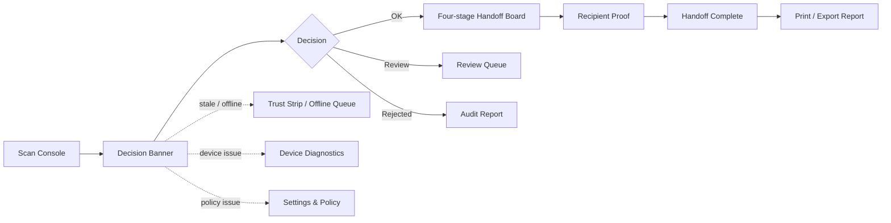

# POS UI Hardening Plan

Last updated: 2026-06-18

この文書は、AGID POS Terminal の UI/UX を「スキャンから判定まで速く、信頼状態が見え、危険な開示を防ぐ」方向へ強化するための実装方針である。対応する実行可能モデルは `src/lib/posUiHardening.ts` に置く。

## 結論

POS UI の最重要課題は、装飾ではなくオペレーター判断の迷いを減らすことである。特に、配送受付、店舗受け渡し、災害現場、越境配送では、次の4つが同時に必要になる。

1. 今リリースしてよいかが一瞬で分かる。
2. 住所、配送業者、受取人、端末署名のどこまで証明済みかが分かる。
3. 失効、使用済み、鮮度、issuer、AGID-S鍵、オフライン同期の状態が隠れない。
4. 高リスク用途では、実住所、raw AGID、raw AOID、proof code を出さない。

## P0 強化策

| 項目 | 目的 | UI方針 |
| --- | --- | --- |
| Decision Banner | 現在の判断を見落とさない | `Address OK`、`Review`、`Rejected`、`Offline Deferred` を最上位に出す |
| Four-stage Handoff | 送り状連携を迷わせない | `Address OK` -> `Carrier Scan OK` -> `Recipient Pending` -> `Handoff Complete` |
| Warning Visibility | 危険な警告を隠さない | stale registry、nullifier replay、住所不備、配送不可を主ボタン横に出す |
| High-risk Privacy | DV/避難/難民/人道支援で漏洩しない | AGID-Sのみ、短期期限、即失効、住所履歴なし、raw住所非表示 |

## P1 強化策

| 項目 | 目的 | UI方針 |
| --- | --- | --- |
| Scan Console | QR/NFC/barcode/manual を速くする | 1画面に集約し、失敗後は再スキャンか手入力へ即誘導 |
| Trust Strip | 信頼状態を常時見せる | registry、issuer、freshness、AGID-S key、offline queue を横断表示 |
| Review Queue | 通常受付と例外を分ける | 要確認、拒否、異議申し立て、再照合を別レーンへ |
| Device Diagnostics | 現場の詰まりを減らす | printer、cash drawer、barcode reader、NFC、計測器を設定/管理画面で診断 |
| Settings & Policy | 言語・モード・権限を散らさない | POS言語、Mode 0-4、スタッフ権限、高リスク設定を1箇所に集約 |

## P2 強化策

| 項目 | 目的 | UI方針 |
| --- | --- | --- |
| Reconciliation Report | 後から説明できる | 送り状alias、carrier receipt、recipient proof、freshness、端末署名、判定理由を出す |
| Print / Export | 現場運用に合わせる | 印刷はredacted、JSON/PDFは監査用、raw住所やproof codeは出さない |

## 状態モデル

POSの主画面は、次の状態に分ける。

```text
idle
  -> scanning
  -> address-ok
  -> carrier-scan-ok
  -> recipient-pending
  -> handoff-complete

side states:
  requires-review
  rejected
  offline-deferred
```

各状態には主ボタンを1つだけ置く。

| 状態 | 主ボタン |
| --- | --- |
| idle | Scan QR/NFC |
| scanning | Cancel scan |
| address-ok | Request carrier scan |
| carrier-scan-ok | Request recipient proof |
| recipient-pending | Verify recipient proof |
| handoff-complete | Print report |
| requires-review | Open review case |
| rejected | Rescan or escalate |
| offline-deferred | Sync queue |

## 画面遷移



## デザイン方針

- POSはダッシュボードではなく、作業コンソールとして設計する。
- カードを増やすより、判定・証明段階・信頼状態・次アクションを強くする。
- 警告は隠さない。詳細は折りたたんでも、理由コードと操作判断は常時表示する。
- 言語切替でボタン幅やサイドメニュー幅が暴れないように、操作ボタンは安定寸法にする。
- `Rejected` と `Review` は履歴ではなく、作業キューとして扱う。
- 高リスク時は便利さより非開示を優先する。

## テスト方針

`src/lib/posUiHardening.test.ts` では次を固定する。

- P0強化策が定義されている。
- 各状態が主ボタンを1つ持つ。
- `rejected` は `Complete handoff` を無効化する。
- 高リスクモードで raw address が見える場合は blocked。
- stale registry、端末異常、オフラインキュー、言語未設定は該当画面へ誘導される。
- 完了状態は `Print report` を主操作にする。

## 次の実装順

1. メイン画面上部に Decision Banner を固定する。
2. 送り状連携の中心を Four-stage Handoff Board に寄せる。
3. Trust Strip を全タブ共通で見える位置に置く。
4. Review Queue と Audit Report を「履歴」ではなく作業画面として分離する。
5. Settings & Policy Center に言語、Mode 0-4、スタッフ権限、端末、印刷、AGID-S鍵を集約する。
6. 高リスクモードで raw住所・raw AGID・raw AOID が画面、印刷、ログに出ないことをUIテストで固定する。

この順番なら、POSを大きく壊さず、判断速度と安全性を同時に上げられる。
