# Playlist Commerce Diagrams

This document prepares the visual explanation set for Playlist Commerce. The
goal is to make the concept understandable to developers, investors, merchants,
and internal product teams without overclaiming novelty.

Recommended wording:

- "playlist-centered commerce platform"
- "integrated architecture for commerce, identity, address, delivery, and travel"
- "new commerce experience built around purpose-based shopping lists"

Avoid unsupported wording such as "world first" until prior-art, patent, and
market research have been completed.

## 1. Service Relationship Diagram

Use this as the first slide. It shows that Playlist Commerce is not an isolated
wishlist feature. It is a commerce layer inside Address Identity Network.

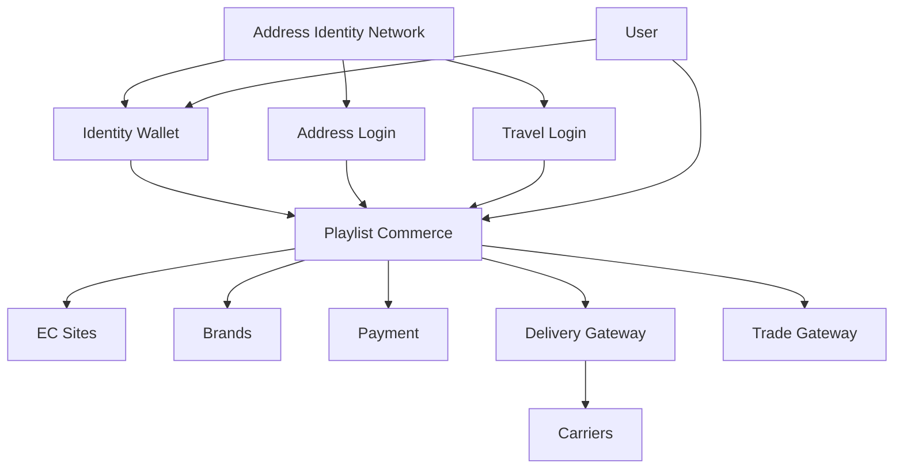

## 2. Service Architecture Diagram

Use this for engineering and investor explanation. It separates user
experience, SDK/API surfaces, commerce surfaces, and delivery/identity layers.

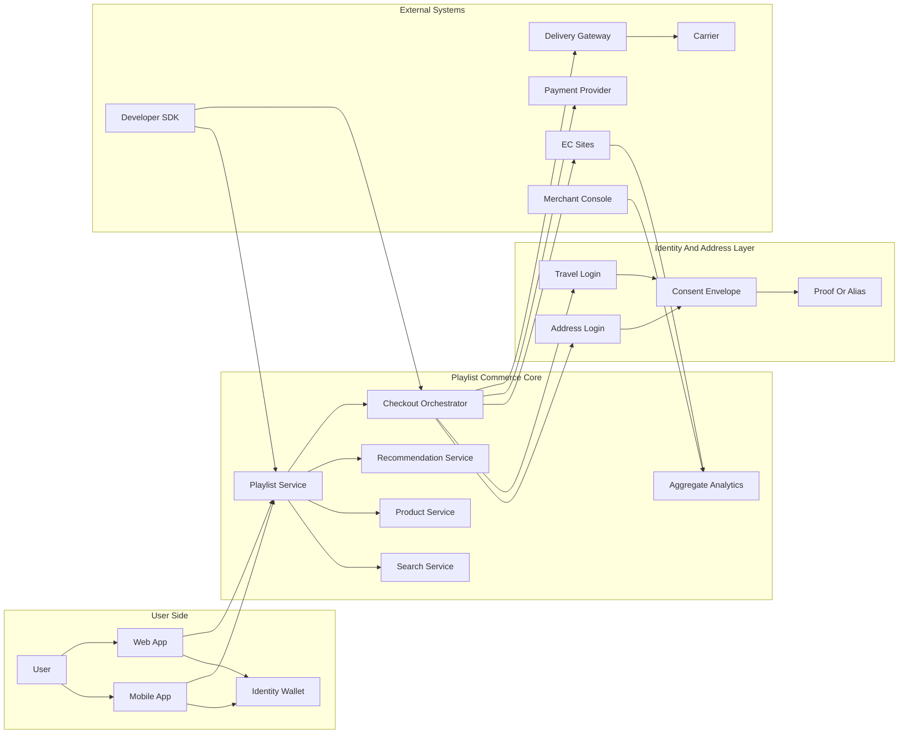

## 3. User Flow Diagram

Use this for product demos and onboarding. It explains the simplest path from
discovery to delivery.

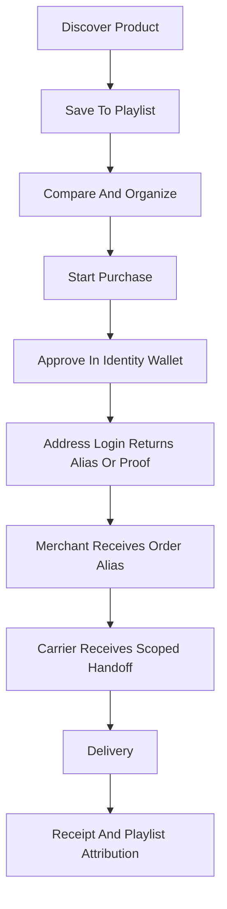

## 4. EC Integration Diagram

Use this for merchant sales material. It shows that merchants can integrate
without replacing their existing EC stack.

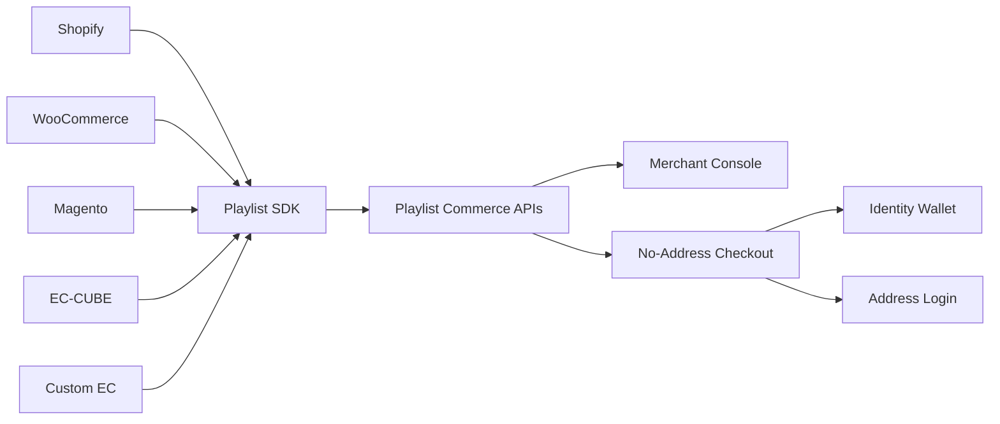

## 5. SDK And API Composition Diagram

Use this for developers. It shows the minimum public integration surface.

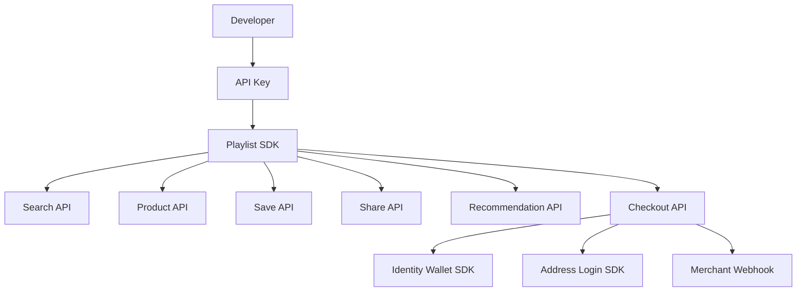

## 6. Data Flow Diagram

Use this to explain what data moves through the system and where private data
must not be persisted.

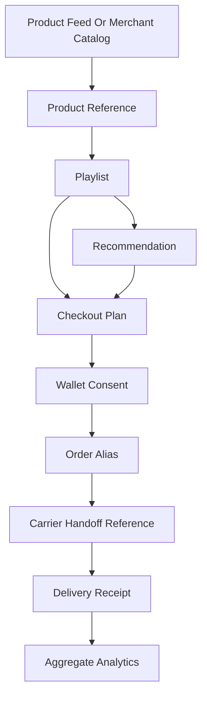

Private boundary:

```text
raw address, recipient phone, proof witness, private key, biometric template
must not be stored in Playlist Commerce public APIs or merchant analytics.
```

## 7. System Architecture Diagram

Use this for engineering planning. It is intentionally ordinary and practical.

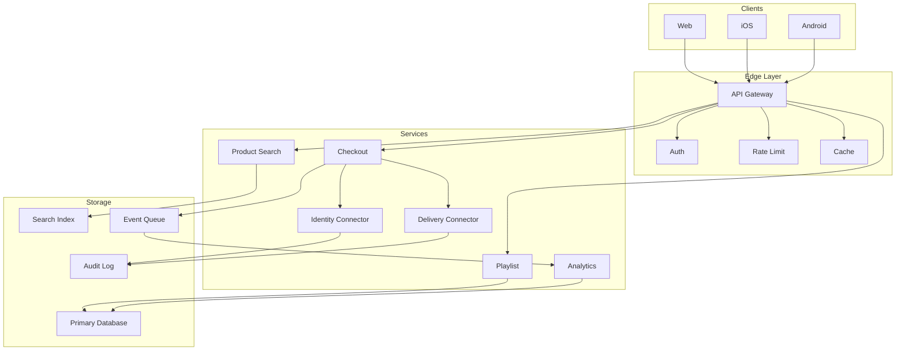

## 8. Permission And Authentication Diagram

Use this to explain why Address Login and Identity Wallet are necessary.

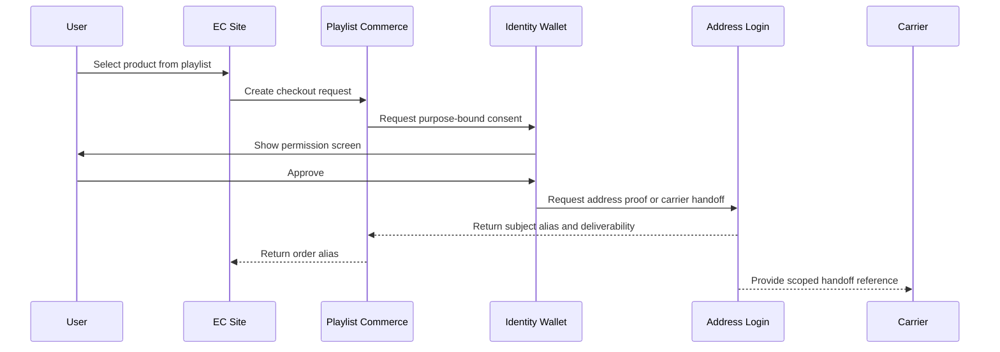

## 9. Merchant Value Diagram

Use this for EC operators. It keeps the benefit chain simple.

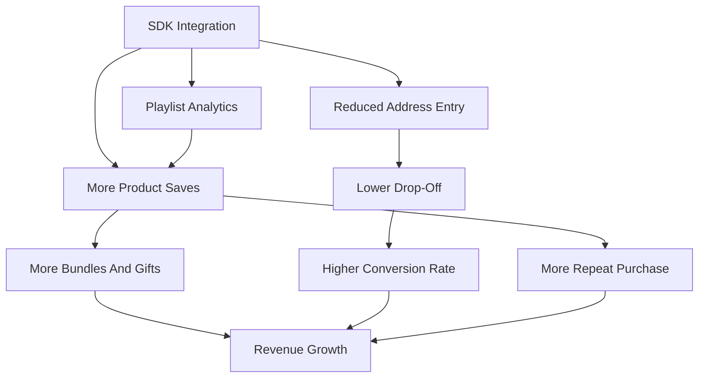

## 10. Developer Integration Diagram

Use this as a quickstart mental model.

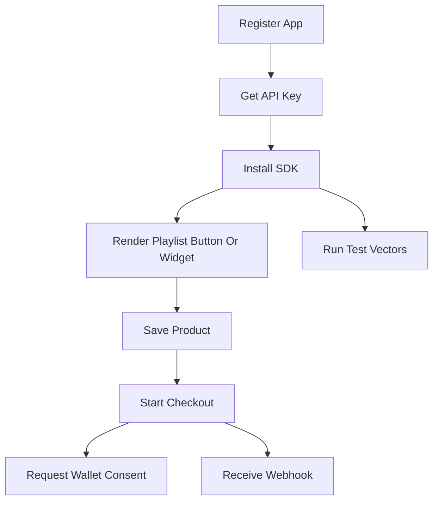

## 11. Novelty Positioning Diagram

This is useful when explaining why the project is not merely a wishlist.

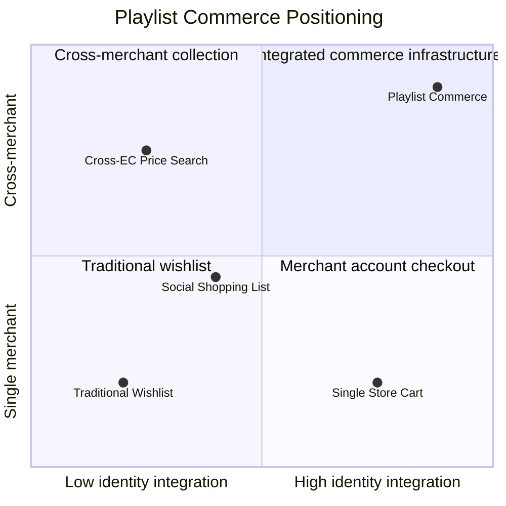

Safe interpretation:

```text
The novelty is not "a playlist" alone.
The novelty is the integrated architecture:
cross-EC playlist + wallet consent + no-address checkout + gift/hotel delivery
+ developer SDK + merchant analytics.
```

## 12. Slide Order Recommendation

For investors:

1. Service Relationship Diagram
2. User Flow Diagram
3. Merchant Value Diagram
4. Service Architecture Diagram
5. Novelty Positioning Diagram

For EC operators:

1. EC Integration Diagram
2. User Flow Diagram
3. Merchant Value Diagram
4. Data Flow Diagram
5. Permission And Authentication Diagram

For developers:

1. SDK And API Composition Diagram
2. Developer Integration Diagram
3. System Architecture Diagram
4. Data Flow Diagram
5. Permission And Authentication Diagram

## 13. Implementation Coverage Table

This table keeps the diagram deck connected to the tested widget, SDK
contracts, checkout fixture, webhook fixtures, and safe non-claim boundaries.
When a diagram is changed, update the corresponding implementation evidence
instead of letting the slide become a standalone claim.

| Diagram | Primary reader | Widget evidence | Executable evidence | Non-claim boundary |
| --- | --- | --- | --- | --- |
| Service Relationship Diagram | investor | Read by role, Investor view, Capabilities | 20 executable capabilities, capability graph | Do not claim a standalone world-first playlist service. |
| Service Architecture Diagram | operator | Flow, Wallet, Carrier, Webhook | checkout orchestrator fixture, signed merchant webhook fixtures | Do not claim payment, carrier, or marketplace ownership. |
| User Flow Diagram | merchant | Playlist to no-address checkout, Checkout, Merchant visibility | order_alias_pc_checkout_self_delivery_001, handoff_pc_checkout_self_delivery_001 | Do not expose or imply merchant-visible raw address data. |
| EC Integration Diagram | merchant | Merchant view, No-address checkout response, Aggregate merchant analytics | playlist.product_saved, playlist.shared, checkout.alias_created, delivery.receipt_created, analytics.aggregate_ready | Do not claim merchants must replace their existing EC stack. |
| SDK And API Composition Diagram | developer | Developer view, Developer method surface, Public SDK quickstart | createPlaylist, saveProduct, sharePlaylist, searchProducts, getRecommendations, listHistory, startCheckout, verifyWebhook, listCapabilities, buildTestVectors | Do not accept private address, witness, or key material in public SDK methods. |
| Data Flow Diagram | operator | Privacy boundary, Contract JSON, blocked:, raw_address | raw_address, recipient_phone, carrier_decryptable_address, proof_witness, private_key, biometric_template, room_number, passport_data | Do not persist private address, proof witness, biometric, or private-key material. |
| System Architecture Diagram | operator | Webhook, Contract JSON, checkout fixture valid | accepted, order_alias_pc_checkout_self_delivery_001, evt_pc_saved_001, evt_pc_shared_001, evt_pc_checkout_001, evt_pc_delivery_001, evt_pc_analytics_001 | Do not imply production traffic, payment processing, or carrier API execution in the demo. |
| Permission And Authentication Diagram | developer | no raw address SDK, consentEnvelopeRef, Privacy boundary | consent_pc_checkout_self_delivery_001, subject_alias_user_alias_demo_001, raw_address, recipient_phone, carrier_decryptable_address, proof_witness, private_key, biometric_template, room_number, passport_data | Do not expose passkeys, witnesses, private keys, biometrics, or raw address payloads. |
| Merchant Value Diagram | merchant | Merchant view, Aggregate merchant analytics, No-address checkout response | 10 API surfaces, playlist.product_saved, playlist.shared, checkout.alias_created, delivery.receipt_created, analytics.aggregate_ready | Do not promise conversion lift, revenue growth, or merchant analytics beyond aggregate demo signals. |
| Developer Integration Diagram | developer | Developer method surface, Public SDK quickstart, webhook verification | createPlaylist, saveProduct, sharePlaylist, searchProducts, getRecommendations, listHistory, startCheckout, verifyWebhook, listCapabilities, buildTestVectors | Do not require production API keys, live payments, or raw address payloads for local test vectors. |
| Novelty Positioning Diagram | investor | Read by role, Investor view, Merchant view, Developer view | not-full-marketplace, not-payment-processor, not-price-guarantee, not-raw-address-store, not-scraping-default | Do not use unsupported world-first claims before prior-art, patent, and market review. |
| Slide Order Recommendation | operator | Read by role, Investor view, Merchant view, Developer view | 20 executable capabilities, 10 API surfaces, 10 public SDK methods | Do not reuse one audience narrative for investors, merchants, and developers without checking evidence. |
