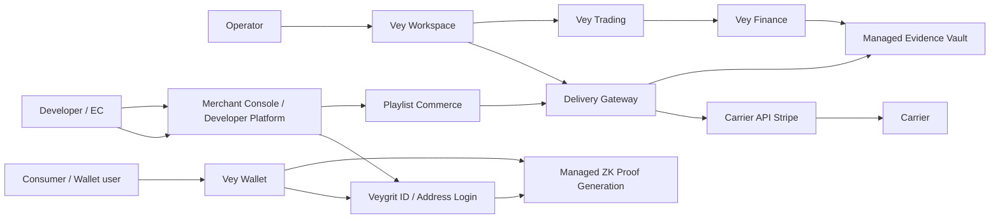

# Vey Ecosystem Strategy

Status: research draft, executable registry backed by `src/lib/veyEcosystemResearch.ts`

Date: 2026-07-04

Vey is an address-native commerce and logistics ecosystem. The core thesis is:
Wallet owns identity and consent, Address Login removes repeated address entry,
Playlist Commerce aggregates purchase intent, Delivery Gateway abstracts
carriers, and Workspace/Trading/Finance turn execution into auditable
operations.

## Product Map



## Development Split

1. `vey-oss-contracts`

OSS. Owns Address Login specs, SDK skeletons, OpenAPI, webhook verification,
Carrier API Stripe adapter contract, local mocks, synthetic fixtures, and
no-raw-address tests.

2. `veygrit-hosted-identity`

Commercial. Owns Vey Wallet, hosted Address Login, account/device consent,
Merchant Console setup, Credential/revocation references, and enterprise
identity operations.

3. `vey-commerce-delivery`

Commercial with shared contracts. Owns Playlist Commerce, Delivery Gateway,
Carrier API Stripe adapters, rate shopping, fastest or cheapest selection,
label creation, tracking webhooks, delivery proof receipts, and CMS plugins.

4. `vey-operations-suite`

Commercial. Owns Vey Workspace, B2B operations planning, Vey Trading, Vey
Finance, settlement states, audit queues, and exception handling.

5. `vey-regulated-trust`

Commercial/private deployment. Owns Managed Evidence Vault, Managed ZK Proof
Generation, retention policy, verifier hooks, key/circuit operations, regulated
deployment runbooks, and support/SLA.

## User Strategy

The consumer-facing goal is a wallet-centered super-app pattern, not a generic
social network. The first home surfaces should be:

- Home: active deliveries, travel handoff, saved addresses, fastest or cheapest
  delivery choice, QR/pass actions, and recent consent.
- Friends: safe sharing, gift playlists, travel coordination, and permissioned
  address requests.
- My Page: credentials, permissions, security, revocation, export, passkeys,
  and settings gear.

Vey Wallet can later export short-lived QR/pass artifacts to Apple/Google wallet
style surfaces. The pass is only a handoff artifact; it is not identity proof by
itself and must not reveal private address material.

## Developer And EC Strategy

Vey should feel like adding a modern auth provider:

```tsx
<VeygritProvider publishableKey={VEYGRIT_PUBLISHABLE_KEY}>
  <AddressLoginButton
    purpose="shipping"
    disclosureMode="carrier_decryptable"
    requestedClaims={["deliverable", "not_revoked", "freshness"]}
  />
</VeygritProvider>
```

The adoption path is:

1. Install React or Next.js package.
2. Create a Merchant Console project.
3. Add button or callback handler.
4. Run local sandbox mock.
5. Run webhook preflight.
6. Enable hosted live mode after redirect URI, state, nonce, PKCE, webhook
   signature, and no-raw-address gates pass.

CMS plugins should package the same flow for Shopify-like, WooCommerce-like,
and custom EC stacks. Plugins must expose rollback, test/live separation, and
webhook verification.

## Carrier API Stripe

Carrier API Stripe is the delivery-provider abstraction layer. Its job is not
to pretend every carrier is identical; its job is to normalize the common
commercial flow:

- rates;
- fastest or cheapest selection;
- carrier capability matrix;
- label creation;
- pickup and locker/PUDO options;
- tracking alias;
- delivery exception;
- proof of delivery;
- refund/dispute evidence.

OSS should include adapter contracts, sandbox carriers, schemas, and conformance
tests. Commercial operations should include real carrier credentials, managed
adapters, label operations, settlement, support, and private deployment.

The first executable registry is `src/lib/deliveryGatewayCarrierApi.ts`. It
defines the rate, allocation, label, pickup, tracking, proof, dispute, and
capability surfaces, then maps them to `CarrierLabelIntent` status and evidence
states. The local gate is:

```bash
npm run verify:delivery-gateway-carrier-api
```

The same gate includes a `sandbox-carrier` smoke: `rate -> allocate -> label ->
tracking webhook -> delivery proof`. It generates only references,
commitments, and receipts; it does not call production carrier APIs, store raw
label payloads, or expose raw address material to merchant-visible outputs.

Skipship is the developer-facing facade for this layer. Its first OSS contract
is intentionally small: `shipping.createShipment()` accepts a `recipientId`,
parcel profile ref, wallet consent ref, and a service preference such as
`fastest`, `cheapest`, or `balanced`. The facade maps that request to the
sandbox Delivery Gateway flow and returns only shipment refs, webhook event
names, and redacted carrier receipts. It does not compare live carrier prices,
purchase labels, or expose carrier credentials in public fixtures.

## Technical Stack

| Layer | Recommended stack |
| --- | --- |
| Wallet / mobile | Expo/React Native first, native wallet pass export later |
| Web SDK | TypeScript, React, Next.js, Vite examples |
| Hosted APIs | TypeScript + Node.js, OpenAPI, webhook HMAC, Postgres |
| Address core | AddressQL, PostgreSQL/PostGIS, Rust core where performance matters |
| Carrier adapters | TypeScript server adapters, sandbox simulators, durable webhook queue |
| Evidence | Postgres append-only records, object storage for regulated deployments, redacted fixtures |
| ZK hooks | proof input schema, verifier hook, non-claim tests before real circuits |
| Operations | React admin console, RBAC, audit log, usage billing |
| CI | dedicated verify scripts for each product boundary |

## Monetization Boundary

OSS:

- Address Login protocol;
- SDK skeletons;
- Carrier API Stripe contracts;
- synthetic fixtures;
- local sandbox mocks;
- no-raw-address validators;
- OpenAPI and webhook schemas.

Commercial:

- hosted Address Login;
- Wallet account and credential operations;
- Merchant Console;
- real carrier adapters and label operations;
- Evidence Vault;
- Managed ZK Proof Generation;
- Workspace/Trading/Finance suite;
- private deployment, support, SLA, and regulated retention.

Commercial modules must not weaken OSS privacy, no-raw-address, source evidence,
and non-claim boundaries.

## Sequencing

1. Lock OSS contracts and SDK skeletons.
2. Ship hosted Address Login plus Wallet consent as the first commercial wedge.
3. Add Playlist Commerce checkout and Merchant Console as demand aggregation.
4. Build Delivery Gateway and Carrier API Stripe for rates, labels, tracking,
   proof, and exception recovery.
5. Expand into Workspace, Trading, Finance, Evidence Vault, and Managed ZK where
   operational liability justifies commercial deployment.

## Verification

```bash
npm run verify:vey-ecosystem
npm run verify:address-login-spec
npm run verify:playlist-commerce
npm run verify:delivery-gateway-carrier-api
```

## Non-Claims

- Vey does not replace Clerk/Auth0/Auth.js/Firebase for general authentication.
- Vey does not claim complete global country, carrier, postal-code, island, POI,
  or old-name coverage until source completeness gates prove it.
- Carrier API Stripe is an abstraction and adapter program, not a guarantee that
  every carrier exposes identical features.
- Apple/Google wallet QR/pass export is a handoff artifact, not identity proof.
- Commercial modules must not weaken OSS privacy, no-raw-address, and non-claim
  boundaries.
