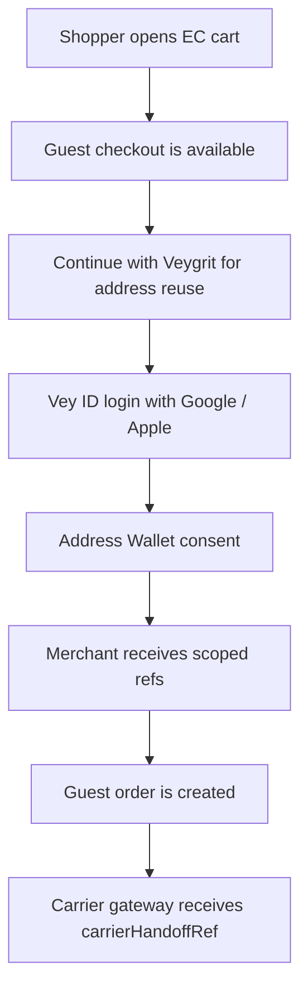

# Vey ID Demo EC Flow

この仕様は、Vey ID をECへ導入したときに最初に作れるデモ導線を固定します。

目的は、Playlist Commerce と EC Social Login を混ぜずに、次の境界を実行可能なテストへ落とすことです。

- Playlist Commerce: ユーザーがログインボタンを押さなくてもストアを探し、買い物を始められる入口。
- EC Social Login: ECサイト側で `Continue with Veygrit` を押し、Vey ID と Address Wallet の承認で住所入力をなくす入口。

## Demo Rule

Vey ID のアカウント作成は Google / Apple のみです。

ECではゲスト購入を始められます。ただし、Address Wallet の住所を使い回す瞬間だけ、Vey ID の認証と Address Wallet consent が必要です。

EC側が受け取ってよいもの:

- `pairwiseSubjectAlias`
- `accessTokenRef`
- `idTokenRef`
- `addressCredentialRef`
- `walletConsentRef`
- `guestCheckoutAlias`
- `carrierHandoffRef`

EC側が受け取ってはいけないもの:

- `rawAddress`
- `recipientName`
- `recipientPhone`
- Google / Apple provider token
- `privateKey`
- `proofSecret`
- carrier credential
- production credential

## Merchant-visible redaction affordance

SDK/UI は `merchant-visible-redaction` boundary をそのまま表示カードにできます。

表示してよい field:

- `pairwiseSubjectAlias`
- `guestCheckoutAlias`
- `walletConsentRef`
- `addressCredentialRef`
- `carrierHandoffRef`

ready の next action は `create-guest-order-from-refs` です。Address Wallet consent がまだ無い場合は `request-address-wallet-consent` のまま止めます。

このカードは `rawAddress`、`recipientName`、`recipientPhone`、`privateKey`、`proofSecret`、carrier credential、production credential を表示しません。

## Flow



If Address Wallet consent is missing, the flow stays blocked at `request-address-consent`.

## Privacy And Non-Claims

- `production traffic: false`
- Vey ID is not general KYC.
- Vey ID is not proof of residence without a separate approved claim.
- Guest checkout does not permit address reuse without wallet consent.
- `carrierHandoffRef` does not guarantee final delivery, customs clearance, or carrier acceptance.

## Verification

Run:

```bash
npx tsx --test src/lib/veyIdDemoEcFlow.test.ts
npm run verify:veygrit-id
```
