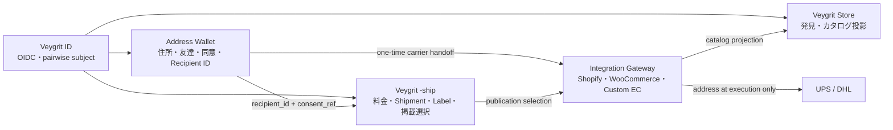
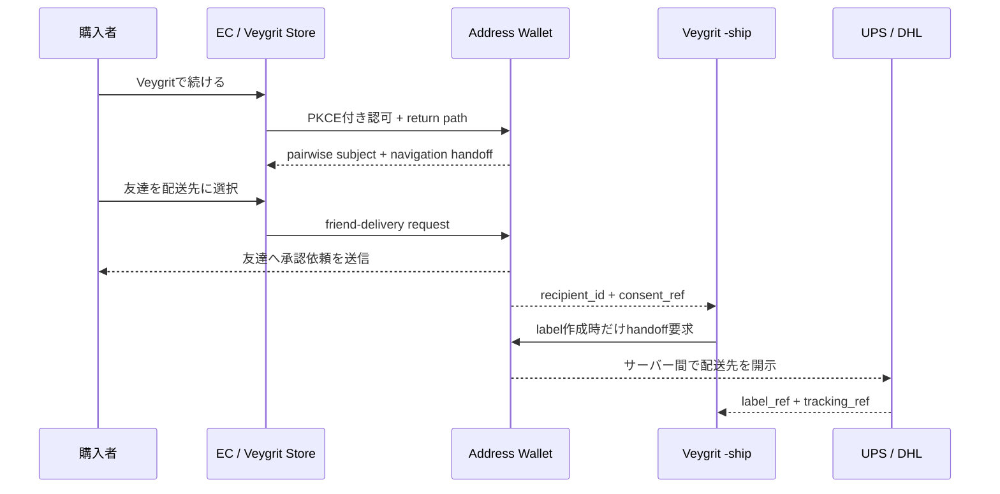

# Veygrit ecosystem address bridge

Veygritは、住所を全サービスへ複製するのではなく、Address Walletが発行する取り消し可能な`recipient_id`を使い回す。推奨する分離数は5サービス。公開画面は増やしても、データ所有境界は増やさない。

## IDの役割

| ID | 所有者 | 再利用範囲 | 外へ出さないもの |
|---|---|---|---|
| `pairwise_subject_alias` | Veygrit ID | 1クライアント／Store接続内 | Google/Appleのtoken、全世界共通user ID |
| `address_credential_ref` | Address Wallet | Wallet内部のみ | 住所本文 |
| `recipient_id` | Address Wallet | merchant/store・目的・期限の同意範囲 | 住所、電話、受取人本名 |
| `wallet_consent_ref` | Address Wallet | 1配送または明示した期間 | 同意画面の私的内容 |
| `store_ref` | Veygrit Store | Store/Ship/Adapter共通 | EC資格情報 |
| `navigation_handoff_ref` | Veygrit ID | 1回・短時間 | login session、provider token |
| `shipment_ref` | Veygrit -ship | 配送ライフサイクル内 | Carrier Secret |

自己住所は同じStoreに対する有効な同意期間だけ再利用できる。友達配送は原則1注文ごとに承認し、購入者へ住所本文を返さない。

## 画面遷移

## EC互換性

| 対象 | 表示層 | 安全な実装層 | 初期言語 | P0 |
|---|---|---|---|---|
| Shopify | Theme app extensionは「Veygritで続ける」入口 | Shopify app backend、Functions/CarrierService/fulfillment API | TS/JS | 米国の対象プランで検証 |
| WooCommerce | Checkout Block extension、任意のtheme block | WordPress plugin、`WC_Shipping_Method`、Store API | PHP + TS/JS | Blocksとclassic checkoutを検証 |
| Custom / Headless | Hosted chooserまたはSDK | REST/OpenAPI、Webhook、Idempotency | 任意。公式SDKはPHP・TS/JS | 最優先 |

テーマへ住所、Recipient ID発行鍵、Carrier Secretを置かない。テーマは交換可能なUI、アプリ／プラグインは署名検証とサーバー通信を担う。

## 最小API

- `GET /v1/wallet/recipients`
- `POST /v1/wallet/friend-delivery/requests`
- `POST /v1/navigation-handoffs`
- `GET /v1/store-connections`
- `PATCH /v1/store-connections/{store_ref}/publication`

`recipient_id`の本番発行は暗号学的乱数、失効、期限、audience、purpose、監査を必須にする。既存Sandboxの決定的ハッシュIDはテスト専用で、本番IDとして使わない。
