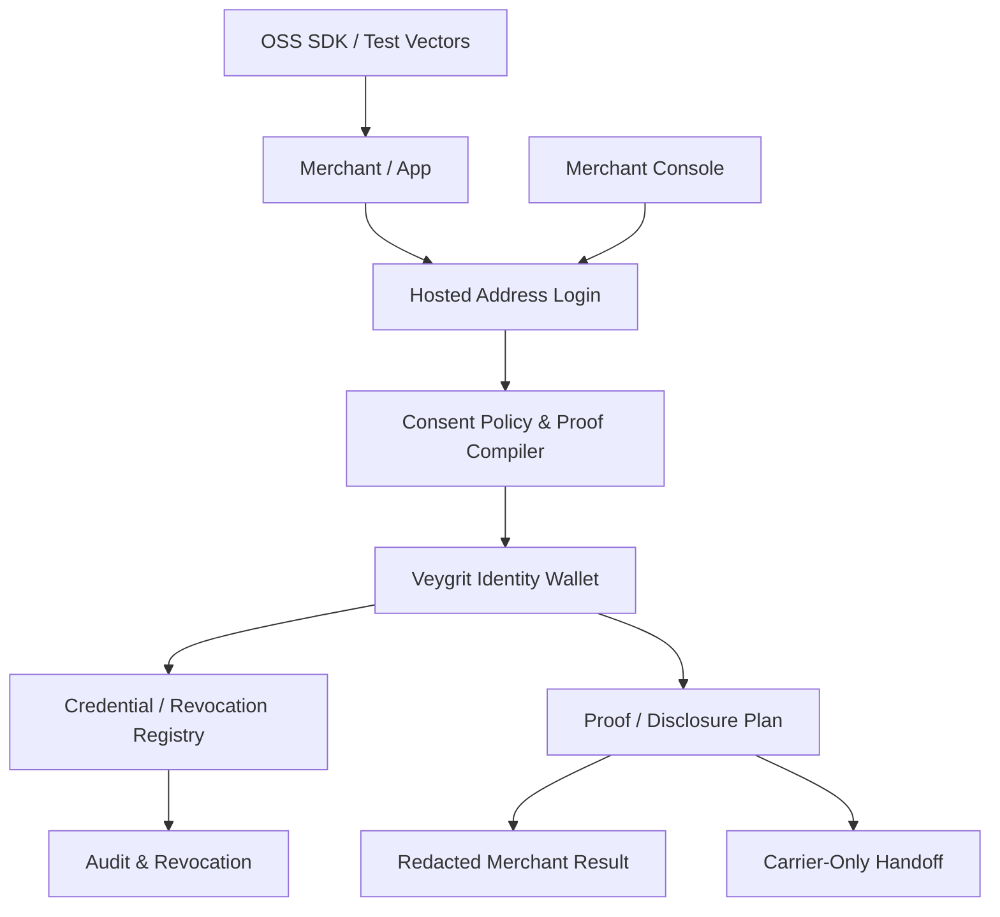

# Veygrit ID / Address Login Product Plan

Veygrit ID is the commercial identity and consent layer. Address Login is the protocol, SDK, and product surface that lets merchants ask for address-related facts without collecting raw address text by default.

Core thesis:

```text
Merchants should ask for purpose-bound address claims.
Users should approve who sees what.
Carriers should receive only scoped execution access.
Veygrit ID should operate the hosted identity, registry, consent, carrier handoff, and enterprise control plane.
```

## Product Definition

Veygrit ID / Address Login is not a normal social login. It is an address-aware identity flow:

- A merchant requests a purpose such as shipping, pickup, return, hotel delivery, travel check-in, or regulated identity.
- The wallet chooses an Address Credential or address alias.
- The policy compiler chooses proof-only, selective disclosure, or carrier-only decryption.
- The user approves a consent envelope.
- The merchant receives a redacted result.
- The carrier receives a scoped decrypt or handoff reference only when delivery execution requires it.

## OSS / Commercial Boundary

| Boundary | Belongs here | Must not contain |
| --- | --- | --- |
| OSS | Protocol docs, SDK request/result types, synthetic fixtures, local callback validator, proof hook contracts | production credentials, hosted registry data, raw recipient records |
| Shared contract | Claim taxonomy, consent envelope schema, redacted webhook schema, policy/proof compiler semantics, non-claims | private customer state, carrier secrets, managed proof keys |
| Commercial | Hosted login, Identity Wallet, credential registry, issuer trust, revocation, merchant console, carrier handoff, managed audit, support, enterprise deployment | default public raw-address export |

This boundary keeps the project fundable as open source while leaving the operationally heavy pieces commercial.

## Layered Architecture



### Identity Wallet

Commercial. Stores aliases, credential references, device approval, consent history, and proof references. It must show who sees what before approval.

### Hosted Address Login

Commercial. Provides OAuth-style authorize and token exchange, redirect URI allowlists, state, nonce, and PKCE for public clients.

### Credential Registry

Commercial. Manages issuer trust, credential status, revocation roots, freshness roots, and public-key discovery. It does not expose raw credential bodies to merchants.

### Consent Policy & Proof Compiler

Shared contract. Converts purpose, risk, role, country, and merchant policy into a proof/disclosure plan.

### Carrier-Only Handoff

Commercial. Lets carriers receive only scoped execution access after user approval. Merchants do not receive decrypt capability by default.

### Merchant Console

Commercial. Handles client setup, policies, webhooks, logs, support review, team roles, and billing.

### Developer Platform

OSS. Provides protocol docs, SDKs, synthetic fixtures, local validators, and conformance tests.

## Google/Apple account creation is bootstrap, not trust root

Vey ID account creation is limited to Google/Apple in the MVP. This can help onboarding, but it should not be the foundation of address trust.

Recommended position:

- Google/Apple login: account bootstrap, recovery hint, low-friction session start.
- Passkey/device approval: wallet authorization and high-risk approval only.
- Address Credential issuer: address verification state.
- Registry: revocation and freshness.
- Proof/disclosure compiler: least-disclosure plan.

Non-claim:

```text
Google/Apple login is not proof of residence.
Email ownership is not address verification.
```

## Default Use Cases

| Use case | Risk | Disclosure | Merchant sees | Wallet keeps private |
| --- | --- | --- | --- | --- |
| EC shipping | standard | carrier-decryptable | deliverable flag, proof ref, carrier handoff ref | raw address, phone, unit, proof witness |
| Address Wallet Friend Delivery | high | carrier-decryptable | friend delivery request ref, recipient alias, deliverability claim, carrier handoff ref | recipient raw address, phone, selected address list, private delivery notes |
| Hotel delivery | standard | selective disclosure | hotel delivery alias, deliverable, arrival window claim | home address, full travel document |
| Regulated identity | regulated | proof-only | region membership, not revoked, freshness, device bound | full address, document image, credential witness |

## Address Wallet Friend Delivery

Address Wallet Friend Delivery is the clearest consumer use case for Address Login. A buyer signs into an EC site with Address Wallet, adds an item to the cart, and chooses a friend instead of typing a shipping address. If the wallet session is fresh, checkout re-login is not required.

The EC creates a friend-delivery request, the recipient receives a wallet notification, reviews the item and sender context, chooses an approved address, and grants consent. The purchaser never sees the recipient address. The merchant should prefer a carrier-decryptable handoff; legacy warehouse or label systems may request merchant-visible release only as an elevated, explicitly approved fallback.

This turns Address Login from a generic address-proof button into a social commerce primitive:

- purchaser selects a person, not an address
- recipient controls which address is used
- merchant receives references and delivery state by default
- carrier receives scoped execution access when delivery requires it
- all approvals, releases, revocations, and expirations become wallet history

Non-claim:

```text
Friend Delivery is not a proof that two users are socially close, and it does not guarantee carrier delivery success.
```

## Carrier-Only Handoff

Carrier-only handoff is the most important commercial wedge.

Rules:

- Decrypt or delivery execution access must be purpose-bound.
- Access must be time-bound.
- Carrier ID and delivery ID must be bound into the authorization.
- Merchant must not be able to decrypt.
- Handoff receipt must be auditable.
- Analytics must not contain address lines or decrypt payloads.

## Merchant Console

The first merchant console should include:

- client registration
- redirect URI allowlist
- allowed purposes
- disclosure policy
- carrier IDs
- webhook endpoint and HMAC key status
- synthetic test vectors
- callback validator
- redacted event logs
- support review reason codes

It should not include raw address export.

## EC Developer Adoption

Veygrit ID / Address Login should feel as easy to adopt as a modern hosted auth product, but it is focused on EC address login and wallet address reuse. The first developer promise is:

```text
Add privacy-preserving Address Login to checkout in minutes.
No raw address storage for merchants.
Carrier-only execution access when delivery requires it.
Synthetic conformance tests included.
```

The best default integration is a hosted redirect plus prebuilt UI component. EC sites can embed Vey ID directly, create/open accounts with Google/Apple only, and reuse saved Address Wallet addresses after user consent. Veygrit handles address consent, Address Credential references, proof/disclosure planning, and carrier-only handoff.

### Playlist Commerce is not EC Social Login

Playlist Commerce and EC Social Login are complementary, not the same product.

| Item | Playlist Commerce | EC Social Login |
| --- | --- | --- |
| Product question | which EC to use | how to buy at that EC |
| Start point | Veygrit app | merchant EC site |
| Install target | Veygrit app Store surface | Shopify, WooCommerce, or custom EC |
| Login button | not required to shop or choose a store | Continue with Veygrit is required for wallet address reuse |
| Address Wallet reuse | wallet-side consent sheet | EC-side Address Login redirect |

Playlist Commerce may let the user reuse an Address Wallet address while staying
inside Veygrit, but shopping and store selection must not require a login
button. EC Social Login is the product an EC installs when it wants saved-address
reuse, address autofill, friend delivery, or carrier handoff inside its own
checkout. In that case, the checkout displays `Continue with Veygrit`, and Vey
ID creation or opening uses Google/Apple only.

### Guest Checkout

EC checkout must support a guest-first path. The buyer can start checkout
without creating a Vey ID account. Veygrit returns only safe refs such as
`guestCheckoutRef`, `checkoutAlias`, `walletConsentRef`, and
`carrierHandoffRef`.

Guest checkout does not remove wallet consent. Before saved-address reuse,
friend delivery, or carrier handoff, Address Wallet still shows who sees what
and records a consent envelope. After checkout, the guest may optionally upgrade
to Vey ID using Google/Apple only.

Guest checkout must block:

- saving an address without an account and explicit consent
- persisting raw address in merchant logs
- creating a wallet account without Google/Apple
- friend delivery without recipient approval

### Package Strategy

| Package | Purpose | Main exports |
| --- | --- | --- |
| `@veygrit/address-login-react` | Drop-in React checkout and account UI | `VeygritProvider`, `VeyIdSignInButton`, `AddressLoginButton`, `AddressLoginModal`, `AddressLoginStatus`, `useAddressLogin` |
| `@veygrit/address-login-nextjs` | Next.js callback, route handler, and webhook helpers | `verifyAddressLoginCallback`, `createAddressLoginRouteHandler`, `requireAddressClaims`, `verifyVeygritWebhook` |
| `@veygrit/address-login-js` | Framework-neutral browser client | `createAddressLoginClient`, `buildAuthorizeUrl`, `parseAddressLoginResult`, `assertNoRawAddress` |
| `@veygrit/address-login-node` | Backend exchange, proof, handoff, and webhook utilities | `exchangeAddressLoginCode`, `verifyProofReference`, `requestCarrierHandoff`, `verifyWebhookSignature` |

The current OSS-prep implementation packages are tracked in
`sdk/veygrit-address-login-packages.manifest.json`. Before splitting or
publishing the React / Next.js packages, run
`npm run verify:veygrit-address-login-packages` together with each package's
own verifier. The manifest is evidence for local package readiness only; it
does not claim production readiness or hosted service availability.

### Implementation Traceability

The local implementation traceability model is in
`src/lib/veygritIdAddressLoginPlan.ts` and is verified by
`src/lib/veygritIdAddressLoginPlan.test.ts`. It binds this product plan to the
SDK package manifest and keeps package readiness as an OSS-prep claim.

Commit Candidate Paths:

- `docs/product/veygrit-id-address-login-plan.md`
- `src/lib/veygritIdAddressLoginPlan.ts`
- `src/lib/veygritIdAddressLoginPlan.test.ts`
- `scripts/verify-veygrit-address-login-test-helpers.ts`
- `scripts/verify-veygrit-address-login-packages.ts`
- `sdk/veygrit-address-login-test-helpers/README.md`
- `sdk/veygrit-address-login-test-helpers/hostedCallbackValidationVectors.ts`
- `sdk/veygrit-address-login-test-helpers/merchantVisibleRedactionFixtures.ts`
- `sdk/veygrit-address-login-react/README.md`
- `sdk/veygrit-address-login-nextjs/README.md`

`package.json` is intentionally excluded from this commit-candidate set because
the root workspace can carry unrelated script changes. If a future package
script change is needed, review and stage that hunk separately.
The preflight still reports excluded root file statuses so a dirty root
manifest is visible without adding it to this focused bundle.

The two SDK README entries are part of this traceability set because their
`Verification order` sections must stay aligned with the package manifest:
package-specific gate first, cross-package traceability preflight second, and
local OSS-prep evidence only.

The shared SDK callback test helper is also part of this traceability set
because hosted `callbackValidationVectors` drive both React and Next.js parser
conformance. It is test-only evidence and must not become a published runtime
surface or a hosted-service readiness claim.

The shared SDK test-helper README, verifier, and merchant-visible redaction
fixture helper are included for the same reason: they keep both SDK package
publication-safety gates tied to the same executable fixture boundary. Run
`npm run verify:veygrit-address-login-test-helpers` before the cross-package
traceability preflight when changing these helpers.

To print the current candidate set without staging files, pushing, or touching
remote GitHub state, run:

```bash
npx tsx scripts/verify-veygrit-address-login-packages.ts --report-commit-candidates
```

For a human-readable one-paragraph summary, run:

```bash
npx tsx scripts/verify-veygrit-address-login-packages.ts --report-commit-summary
```

For a dry-run stage plan that prints the candidate `git add --` command without
executing it, run:

```bash
npx tsx scripts/verify-veygrit-address-login-packages.ts --report-stage-plan
```

For a patch-free final scope review, run:

```bash
npx tsx scripts/verify-veygrit-address-login-packages.ts --report-diff-scope
```

For a final GitHub update memo that is safe to paste into a commit or update
note, run:

```bash
npx tsx scripts/verify-veygrit-address-login-packages.ts --report-github-update-memo
```

For the final non-mutating local check before any manual stage or commit, run:

```bash
npx tsx scripts/verify-veygrit-address-login-packages.ts --report-final-local-check
```

The report emits candidate paths, excluded root file statuses, git status
markers, verifier commands, and the non-production readiness claim only. It
does not print file contents or sensitive material.

GitHub Update Preflight copy:

```bash
npm run verify:veygrit-address-login-packages
npx tsx scripts/verify-veygrit-address-login-packages.ts --report-commit-candidates
npx tsx scripts/verify-veygrit-address-login-packages.ts --report-commit-summary
npx tsx scripts/verify-veygrit-address-login-packages.ts --report-stage-plan
npx tsx scripts/verify-veygrit-address-login-packages.ts --report-diff-scope
npx tsx scripts/verify-veygrit-address-login-packages.ts --report-github-update-memo
npx tsx scripts/verify-veygrit-address-login-packages.ts --report-final-local-check
npx tsx --test src/lib/veygritIdAddressLoginPlan.test.ts
```

This is a local review checklist before staging or pushing. It does not stage
files, create commits, push branches, open PRs, or create/delete GitHub
repositories.

Manual staging, local commits, pushes, PRs, and GitHub repository create/delete
actions require an explicit current user request. The preflight reports what is
safe to review; it does not grant permission to mutate local Git or remote
GitHub state.

### React Quickstart

```bash
npm install @veygrit/address-login-react
```

```tsx
import { AddressLoginButton, VeyIdSignInButton, VeygritProvider } from "@veygrit/address-login-react";

export function CheckoutAddress() {
  return (
    <VeygritProvider
      publishableKey={process.env.NEXT_PUBLIC_VEYGRIT_KEY}
      accountProviders={["google", "apple"]}
    >
      <VeyIdSignInButton />
      <AddressLoginButton
        purpose="shipping"
        disclosureMode="carrier_decryptable"
        requestedClaims={["deliverable", "not_revoked", "freshness"]}
      />
    </VeygritProvider>
  );
}
```

### Next.js Callback

```bash
npm install @veygrit/address-login-nextjs
```

```ts
import { verifyAddressLoginCallback } from "@veygrit/address-login-nextjs/server";

export async function POST(request: Request) {
  const result = await verifyAddressLoginCallback(request, {
    requiredClaims: ["deliverable", "not_revoked"],
  });

  return Response.json({
    subjectAlias: result.subjectAlias,
    publicClaims: result.publicClaims,
    nextAction: result.nextAction,
  });
}
```

### Integration Modes

- hosted redirect
- drop-in React component
- headless hooks
- Next.js server helper
- webhook verification
- local sandbox mock

The friend-delivery quickstart should reuse the same hosted session and SDK surface, then add a friend picker and approval request:

```tsx
<AddressLoginButton
  purpose="anonymous_shipping"
  disclosureMode="carrier_decryptable"
  requestedClaims={["deliverable", "not_revoked", "freshness"]}
/>
```

### Dashboard Setup Checklist

- create sandbox tenant
- copy publishable key
- register redirect URI
- choose allowed purposes
- choose disclosure modes
- configure webhook endpoint
- run synthetic test vectors
- review redacted callback preview

### Developer Non-Claims

- Veygrit packages are not a general social network or broad identity provider replacement.
- Vey ID account creation is Google/Apple only in the MVP.
- Publishable keys do not authorize carrier decryption.
- A successful Address Login callback is not proof of residence unless the requested claim and issuer policy explicitly define that.

## Go-to-Market

| Segment | Entry offer | Proof of value |
| --- | --- | --- |
| EC | Address Login button plus carrier-decryptable checkout | less address entry, fewer abandoned checkouts, less raw-address storage |
| Marketplace | anonymous shipping and redacted claims | merchant never sees address, carrier handoff receipts |
| Hotel / travel | travel check-in and hotel delivery proof | shorter check-in, consent audit, less PMS address exposure |
| Carrier | scoped decrypt request and handoff receipt | fewer bad labels, auditable handoff, bounded exposure |
| Government pilot | proof-only region/freshness/not-revoked | least-disclosure audit, revocation freshness |
| Developer OSS | SDK, fixtures, local validator | local tests pass, no-raw-address guarantees are visible |

## Milestones

1. `m0-oss-contract`, 0-2 weeks
   Address Login spec, SDK types, synthetic fixtures, local callback validator, no-raw-address tests.

2. `m1-hosted-login-mvp`, 2-6 weeks
   Authorize endpoint, token endpoint, state/nonce/PKCE, hosted consent UI, redacted callback.

3. `m2-wallet-credential-beta`, 6-10 weeks
   Address aliases, credential refs, passkey approval, consent history, revocation UX.

4. `m3-merchant-console-beta`, 8-12 weeks
   Client registration, policies, webhooks, test vectors, redacted logs, team roles.

5. `m4-carrier-handoff-beta`, 10-16 weeks
   Carrier decrypt request, delivery session binding, handoff receipt, expiry, carrier audit.

6. `m5-zk-proof-hook-beta`, 14-22 weeks
   Proof input schema, external verifier hook, proof-only claims, non-claim tests.

7. `m6-enterprise-hardening`, 20-32 weeks
   SLA boundaries, incident response, issuer onboarding, retention, billing, support review, first paid pilots.

## Validation Gates

```bash
npm run verify:address-login-spec
```

For the SDK-package traceability preflight, run:

```bash
npm run verify:veygrit-address-login-packages
```

This preflight checks the package manifest, package README gates, product-plan
traceability, commit candidate paths, and high-confidence secret patterns. It
is a local OSS-prep gate; it is not a publishing, hosted-service, or production
readiness claim.

Required gates:

- no raw address in public callbacks or webhooks
- merchant-visible address requires elevated explicit policy
- social login is bootstrap only, not address trust root
- carrier decrypt is purpose-bound, time-bound, and audited
- OSS fixtures remain synthetic
- wallet consent shows who sees what

## Non-Claims

Veygrit ID / Address Login does not claim:

- social login verifies an address
- every global address is complete or deliverable
- carrier-only decrypt guarantees carrier SLA
- proof hook readiness is audited ZK circuit verification
- proof of deliverability is proof of residence
- OSS fixtures are production data

The strongest positioning is:

```text
Veygrit ID lets services use address facts without becoming address databases.
```
