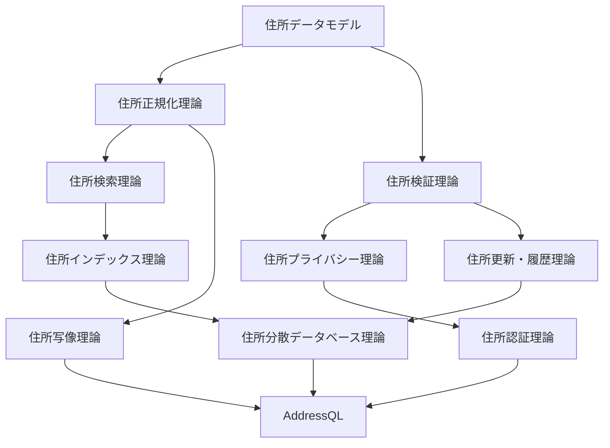
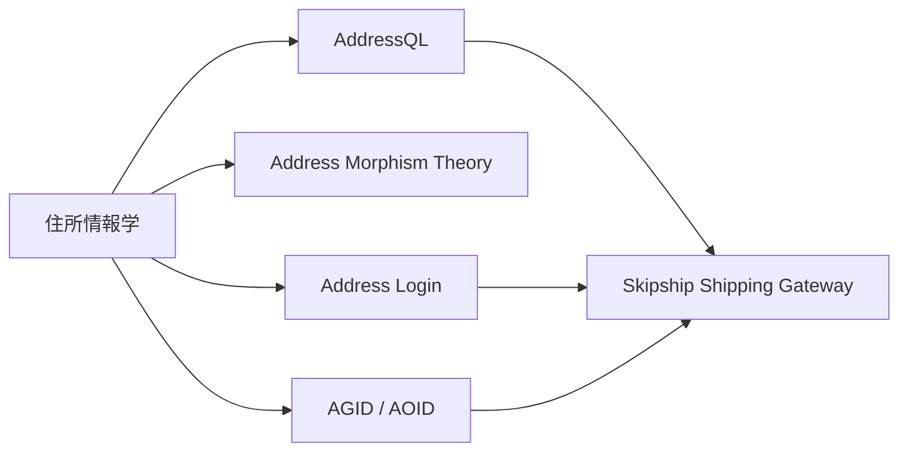

# 住所情報学 体系化準備ノート

Version: address-information-science-systematization-v0.1

対応する実行可能 registry: `src/lib/addressResearchSystematization.ts`

## 目的

住所データモデル、住所正規化理論、住所検索理論、住所インデックス理論、住所写像理論、住所検証理論、住所プライバシー理論、住所認証理論、住所更新・履歴理論、住所分散データベース理論を、個別のアイデアではなく、ひとつの学問体系として育てる。

ここで目指す名称は **住所情報学**、英語では **Address Information Science and Engineering** とする。

住所情報学は、住所を単なる文字列ではなく、表現、参照対象、識別子、証拠、時間、品質、プライバシー、認証、配送制約を持つ情報対象として研究する学問である。

## 薄い理論を厚くする

薄い理論は、名前と用途だけがある状態である。

厚い理論は、少なくとも次を持つ。

| 要素 | 内容 |
| --- | --- |
| object of study | 何を研究対象にするか |
| primitive | 分解できない基本概念 |
| axiom | 体系の前提 |
| invariant | 実装や変換後も守る条件 |
| counterexample | その理論が失敗しやすい反例 |
| metric | 評価指標 |
| fixture | 合成データ、テストベクトル |
| executable spec | JSON Schema、SQL関数、テスト、検証器 |
| non-claim | 言ってはいけない過大主張 |

この形式にすると、論文、仕様、OSS実装、テスト、標準化提案が同じ骨格でつながる。

## 学問としての中心命題

住所は、次の5種類を混同すると壊れる。

1. 住所表現
2. 住所参照対象
3. 住所識別子
4. 住所証拠
5. 住所利用権限

例えば、正規化済み文字列が同じでも、同一住所、配送可能、本人居住、法的有効性、ZK証明可能性は別問題である。

住所情報学の基礎は、この混同を避ける型体系、写像、証拠、検証、プライバシー境界を作ることである。

## 10分野の位置づけ

| 分野 | 厚くする主対象 | 最小成果物 |
| --- | --- | --- |
| 住所データモデル | 表現、参照対象、識別子、証拠、品質状態 | AddressObject schema |
| 住所正規化理論 | 表記ゆれ、文字種、略記、翻字 | normalization trace fixture |
| 住所検索理論 | 曖昧検索、多言語検索、候補集合 | candidate response schema |
| 住所インデックス理論 | 郵便番号、座標、行政区画、ランドマーク索引 | source completeness gate |
| 住所写像理論 | 表現間変換、可逆性、損失 | morphism contract tests |
| 住所検証理論 | 形式、存在、配送、本人関係の分離 | validation result enum |
| 住所プライバシー理論 | 開示最小化、同意、監査 | consent receipt schema |
| 住所認証理論 | VC、DID、ZK predicate、失効 | proof input schema |
| 住所更新・履歴理論 | 住所変更、行政再編、旧地名、履歴 | bitemporal event schema |
| 住所分散データベース理論 | 分散gazetteer、source catalog、競合 | official/OSM/GeoNames/Wikidata split matrix |

## 研究の依存関係

この依存関係は、研究の順序でもある。

まず住所データモデルを作り、次に正規化、検索、索引、写像、検証を分ける。プライバシーと認証は検証結果を使うが、検証結果を本人確認へ自動昇格しない。更新・履歴と分散DBは、国別sourceや行政変更を扱うための基盤になる。

## AddressQLとの関係

AddressQLは、住所情報学を実装へ落とす問い合わせ言語である。

AddressQLが扱う関数は、理論ごとに分類される。

| AddressQL関数領域 | 対応する理論 |
| --- | --- |
| `ADDRESS_PARSE`, `ADDRESS_OBJECT` | 住所データモデル |
| `ADDRESS_NORMALIZE` | 住所正規化理論 |
| `ADDRESS_SEARCH`, `ADDRESS_MATCH` | 住所検索理論 |
| `POSTAL_VALIDATE`, `COUNTRY_PROFILE` | 住所検証理論 |
| `ADDRESS_MORPH`, `ADDRESS_RENDER` | 住所写像理論 |
| `ADDRESS_MASK`, `DISCLOSURE_RECEIPT` | 住所プライバシー理論 |
| `ADDRESS_PROVE`, `ADDRESS_VERIFY_PROOF` | 住所認証理論 |
| `ADDRESS_HISTORY`, `ADDRESS_AT_TIME` | 住所更新・履歴理論 |
| `SOURCE_COMPLETENESS`, `GAZETTEER_CONFLICTS` | 住所分散データベース理論 |

重要なのは、AddressQLが「全部知っているDB」ではないことだ。AddressQLは、source、証拠、非主張、失敗状態を返せる住所専用の実行基盤である。

## Address Morphism Theoryとの関係

住所写像理論は、住所情報学の一分野として扱う。

ただし、Address Morphism Theoryという独立論文や数理モデルとして育てる場合は、AddressQL仕様書と混ぜない。互換性は持たせるが、責務を分ける。

| 項目 | Address Morphism Theory | AddressQL |
| --- | --- | --- |
| 主目的 | 住所表現間の写像、保存量、損失を定義 | DB上で住所関数を実行 |
| 成果物 | 定義、公理、反例、証明スケッチ | SQL関数、型、fixture、CI |
| 非主張 | 写像可能性は配送可能性ではない | 関数成功は世界完全性ではない |

## Vey / Address Login / Skipshipとの関係

Veygrit ID / Address Login は、住所情報学の認証・同意・開示レイヤーである。

Skipship は、配送版Stripeとして、住所情報学の成果を配送APIへ応用する商用・実装レイヤーである。

この構成により、研究とプロダクトを混同しない。

研究は、定義、反例、評価、非主張を作る。
AddressQLは、それを実行可能仕様へ変える。
Address Loginは、同意と認証へ変える。
Skipshipは、配送会社API、ラベル、追跡、料金、集荷へ接続する。

## 論文化の順序

1. Foundations of Address Information Science
2. Address Normalization and Morphism Theory
3. Address Search and Index Theory
4. Address Validation and Evidence Theory
5. Address Privacy and Authentication Theory
6. Distributed Gazetteers and Address Source Provenance
7. AddressQL: A Query Layer for Address Information Systems
8. Shipping Identity and Address Wallet Infrastructure

最初の論文では、過大な主張を避ける。特に「全世界の住所完全データを持つ」「ZKで住所の正しさを保証する」「正規化すれば同一住所判定できる」とは言わない。

## 研究からOSSへ落とす単位

| 研究成果 | OSS化する形 |
| --- | --- |
| 定義 | markdown spec |
| 公理 | machine-readable registry |
| 反例 | synthetic fixture |
| 評価指標 | verifier script |
| 関数仕様 | AddressQL SQL test |
| 証明入力 | JSON Schema |
| source分類 | completeness gate |
| 非主張 | release readiness test |

このノート自体は研究準備であり、実装は `src/lib/addressResearchSystematization.ts` と `src/lib/addressResearchSystematization.test.ts` が担う。

## レポジトリ分割プレビュー

ローカルの実行可能 registry では、研究repoを次の2つに分けて扱う。

| repository | 役割 | 最初の検証 |
| --- | --- | --- |
| `address-research` | 住所情報学全体の定義、10分野registry、bridge、publication track、非主張を管理する | `npm run verify:address-research-systematization` |
| `address-morphism-theory` | 住所写像理論の形式定義、loss certificate、合成安全性、AddressQL互換性を専門に管理する | `npm run verify:address-morphism-v2-compatibility` |

どちらも現時点では local scaffold only とする。remote GitHub repository の作成、削除、push、PR作成は、このregistryからは許可しない。現在のCodexタスク内で明示的に依頼された場合だけ、別のGit操作として扱う。

また、どちらのrepoにも raw address、recipient、witness、private key、proof secret、production credential を入れない。`address-morphism-theory` は、写像互換性を配送可能性、本人性、KYC保証として主張しない。

最小 repository template は、次のファイルを持つ local scaffold として扱う。

| file | 目的 |
| --- | --- |
| `README.md` | repoの目的、canonical domains、verification、non-claims、remote action boundaryを説明する |
| `package.json` | local verification scriptsのみを持つ最小manifest |
| `docs/repository-boundary.md` | 研究claim、product claim、identity claim、delivery claimを分ける |
| `docs/non-claims.md` | publication safetyとgrant/OSS review用の非主張ledger |
| `src/repositoryRegistry.ts` | domain、artifact、verification command、creation boundaryを機械可読にする |
| `tests/repository-boundary.test.ts` | remote action禁止、blocked material禁止、非主張、verify script名を検証する |

この repository template は `src/lib/addressResearchSystematization.ts` の `buildAddressResearchRepositoryTemplates()` が生成前仕様として返し、`validateAddressResearchRepositoryTemplates()` が検証する。ここでもremote GitHub操作は発生しない。

## 次に厚くするべき箇所

P0は、住所データモデル、住所検証理論、住所分散データベース理論である。

理由は、この3つが薄いままだと、正規化、検索、ZK、配送APIが全部「それっぽい関数」になってしまうためである。

次の最小改善は、`AddressObject` の JSON Schema と、形式検証・存在検証・配送検証・本人関係検証を分けた `ValidationResult` schema を作ることである。
