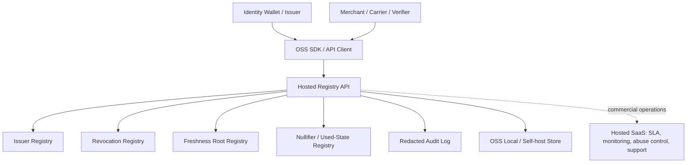
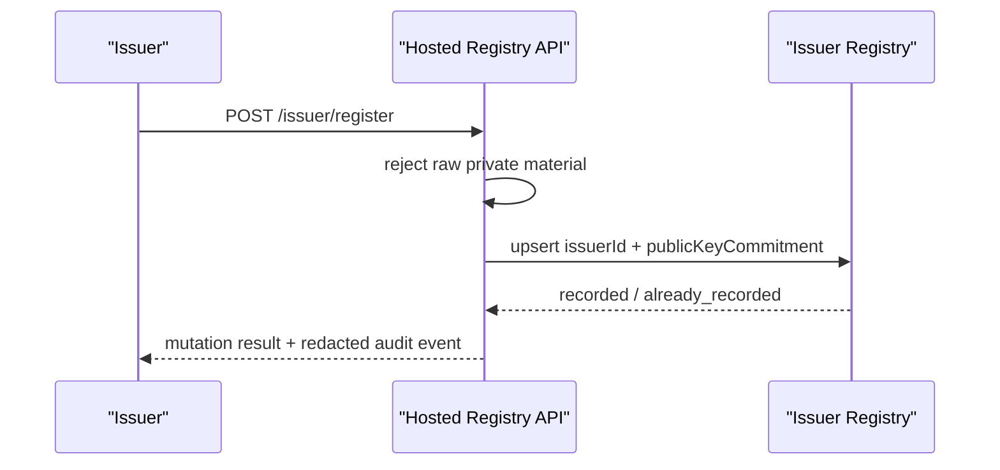
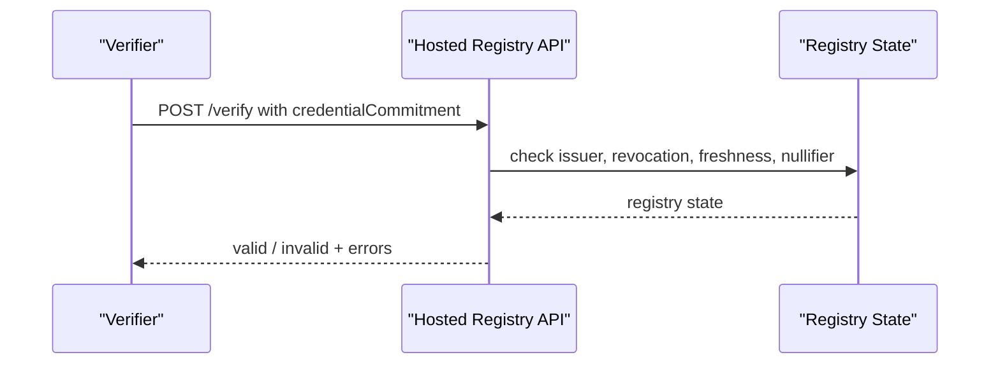
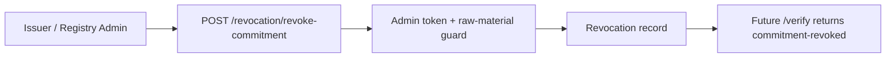
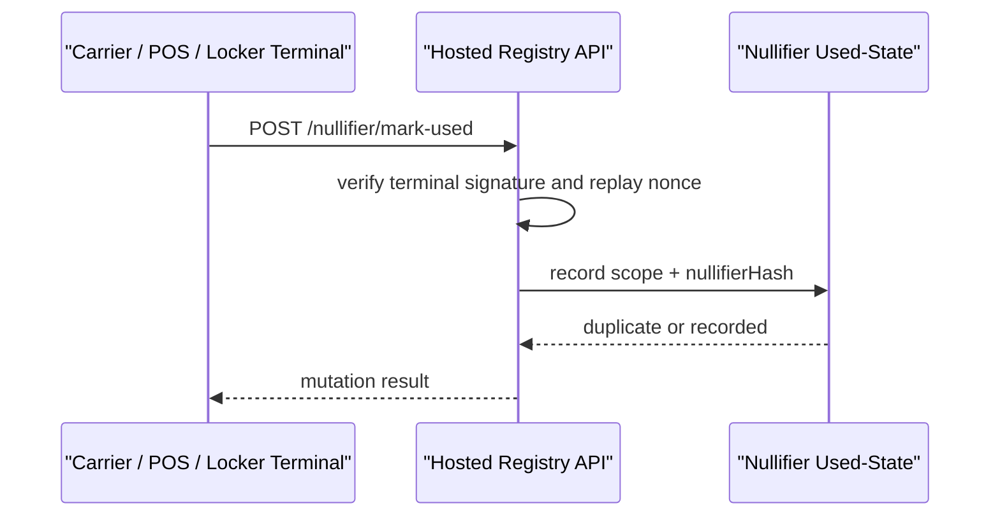

# Hosted Registry API v0.1

Hosted Registry API は、AGID / AOID / PID / Credential / revocation /
freshness / nullifier をクラウドまたはセルフホスト環境で管理するための
登録 API 仕様である。

この API の目的は、住所そのものをクラウドに集めることではない。住所を
直接保存せず、住所を利用するために必要な公開可能な状態、失効状態、鮮度
状態、発行者状態、使用済み状態だけを登録・検証する。

本仕様では、OSS 版は仕様、OpenAPI、ローカル実装、セルフホスト実装、
テスト、SDK の範囲までを対象とする。公開ホスト運用、SLA、監視、濫用対策、
高可用性、顧客別運用、サポートは商用サービスとして分離する。

## 1. 位置付け

Hosted Registry API は AGID の Mode 1 registry surface である。

```text
Mode 0: Local-only resolver
Mode 1: Hosted Registry API
Mode 2: ZK proof-only integration
Mode 3: Ethereum anchored registry
Mode 4: ZK + Ethereum anchored registry
```

Mode 1 は、ZK 回路や Ethereum を必須にせず、サーバー側で高速に状態を
照会したい導入先のための層である。より強いマルチパーティ監査や公開検証が
必要な場合は、Mode 3 または Mode 4 に拡張する。

## 2. システム図



この図で重要なのは、Hosted Registry API が住所 DB ではなく状態レジストリで
ある点である。Wallet、Issuer、Verifier は raw address を渡さず、commitment、
hash、root、nullifier、issuer id、scope だけを扱う。

## 3. OSS / 商用境界

| 領域 | OSS | 商用 |
| --- | --- | --- |
| API 仕様 | OpenAPI、JSON schema、状態遷移、非主張 | なし |
| ローカル実装 | in-memory / file-backed store、テスト fixture | なし |
| セルフホスト | Docker/Node 実行例、管理トークン、ローカル監査ログ | 導入支援、監視、バックアップ |
| SDK | TypeScript client、検証 helper、test vectors | 管理画面、SLA 対応 SDK 設定 |
| レジストリ運用 | 自前運用可能な参照実装 | 公開 hosted registry、SLA、濫用対策、WAF、RBAC |
| セキュリティ | raw material rejection、nonce、署名 hook、audit redaction | インシデント対応、鍵運用、顧客別隔離 |
| データ保持 | 最小保存モデルと retention policy template | 顧客契約に基づく retention / export / legal hold |

この分離により、研究者・開発者は API とローカル実装を検証でき、商用利用者は
運用負荷を外部化できる。

## 4. エンティティモデル

### 4.1 AGID

AGID は住所・地物・領域・配送可能性などを参照する識別子である。ただし
Hosted Registry API v0.1 では raw AGID を保存しない。登録・検証には
`agidCommitment` または `commitments[]` を使う。

### 4.2 AOID

AOID は応用・組織・用途に依存する address object identifier である。
AOID は private identifier として扱い、Hosted Registry API には
`aoidCommitment` のみを渡す。

### 4.3 PID

PID は public identifier または persistent identifier として使われるが、
v0.1 の実装では専用 `pidCommitment` フィールドを必須化しない。PID は
`addressReferenceCommitment` または `commitments[]` によって表す。
専用 `pidCommitment` は v0.2 以降の互換 alias として予約する。

### 4.4 Credential

Credential 本文は保存しない。Credential の issuer 状態、revocation 状態、
freshness root、credential commitment を検証対象にする。

### 4.5 Revocation

Revocation は commitment に対して記録する。失効対象は
`credential`、`address-reference`、`aoid`、`agid`、`issuer-scoped`、
または `unknown` である。

### 4.6 Freshness Root

Freshness root は、資格情報や出典集合がいつまで新鮮と見なせるかを表す。
Hosted Registry API は root と `freshUntil` を記録するが、root の中身や
raw witness は保存しない。

### 4.7 Nullifier

Nullifier は同じ証明・同じ配送・同じ受取権限の二重利用を防ぐための
domain-separated hash である。Hosted Registry API は
`scope + nullifierHash` の組を used-state として記録する。

### 4.8 Audit Event

Audit event は操作結果を追跡するための最小ログである。住所全文、AGID-S
ciphertext、緯度経度、受取人名、電話番号、メール、部屋番号は保存しない。

## 5. 保存してよいもの / 保存してはいけないもの

保存してよいもの:

- `issuerId`
- `publicKeyCommitment`
- `metadataHash`
- `credentialCommitment`
- `addressReferenceCommitment`
- `aoidCommitment`
- `agidCommitment`
- `commitments[]`
- `revocationCommitment`
- `freshnessRoot`
- `nullifierHash`
- `scope`
- `registryId`
- `sourceIds`
- `trustScore`
- `freshUntil`
- `expiresAt`
- redacted audit event

保存してはいけないもの:

- raw address text
- raw AGID
- raw AOID
- AGID-S ciphertext
- recipient name
- phone number
- email
- room, unit, apartment number
- postal code as private address material
- latitude / longitude
- precise coordinates
- ZK witness
- private key
- proof secret

非公開情報を直接入れた request は拒否されるべきである。

## 6. API Surface

Base path:

```text
/api/registry/hosted
```

| Method | Path | Auth | 役割 |
| --- | --- | --- | --- |
| GET | `/capabilities` | public | API 能力と privacy posture を返す |
| GET | `/status` | public or deployment-limited | issuer / revocation / freshness / nullifier snapshot |
| GET | `/audit` | public or deployment-limited | redacted audit events |
| POST | `/issuer/register` | admin token | issuer metadata commitment を登録 |
| POST | `/revocation/revoke-commitment` | admin token | commitment を失効 |
| POST | `/freshness/anchor` | admin token | freshness root を登録 |
| POST | `/verify` | public | issuer、revocation、freshness、nullifier 状態を検証 |
| POST | `/nullifier/mark-used` | terminal signature | nullifier を使用済みにする |

Admin writes require:

```text
X-AGID-Registry-Admin-Token: <server configured token>
```

Nullifier writes require a terminal body signature. The signature binds:

```text
operation = "mode1:nullifier:mark-used"
basePath
nullifierHash
scope
nonce
signedAt
```

## 7. 主要フロー

### 7.1 Issuer Registration



Issuer 登録では公開鍵そのものではなく、公開鍵 commitment または metadata hash
を使う。Issuer の trust score は参考値であり、住所の真実性を単独で保証しない。

### 7.2 Credential Verification

Credential 本文は Issuer または Wallet が保持する。Verifier は commitment と
公開状態だけを照会する。



### 7.3 Revocation



### 7.4 Freshness Anchoring

Freshness root は、credential set、issuer source set、AGID source state、
または external proof set の鮮度を束ねる。`freshUntil` を過ぎた root は
stale と判定される。

### 7.5 Nullifier Mark-Used

Nullifier mark-used は二重利用防止のための write である。admin token ではなく、
配送端末・POS・ロッカーなどの terminal signature で保護する。



### 7.6 Verification Decision

`/verify` の結果は、住所が正しいことそのものを証明しない。検証できるのは、
登録済み issuer、失効していない commitment、鮮度 window、未使用 nullifier
などの registry state である。

```text
valid =
  issuer is active
  AND requested commitments are not revoked
  AND freshnessRoot is anchored when required
  AND freshUntil >= now
  AND nullifierHash is not already used
  AND request contains no private material
```

## 8. ZK との接続

Hosted Registry API は ZK prover でも完全な verifier でもない。ZK 連携時は、
以下の public inputs または verifier policy hook を提供する。

| ZK要素 | Hosted Registry API の役割 |
| --- | --- |
| issuer root | issuer status / metadataHash を返す |
| revocation root | commitment revocation 状態を返す |
| freshness root | anchored / fresh を返す |
| nullifier | used-state を照会・記録する |
| verifier policy | scope、freshness requirement、issuer requirement を検証補助 |

ZK 回路の witness、秘密住所、秘密鍵、証明生成材料は Hosted Registry API に
送信してはならない。

## 9. セキュリティモデル

| 脅威 | Control |
| --- | --- |
| raw address leakage | forbidden key scan、raw-like value rejection、audit redaction |
| unauthorized registry write | admin token、deployment secret、least-privilege route separation |
| nullifier replay | terminal signature、nonce replay cache、scope binding |
| stale credential | freshness root + `freshUntil` |
| revoked credential reuse | revocation commitment lookup |
| issuer compromise | issuer status suspension / revocation |
| over-broad audit exposure | redacted audit events、no private material in logs |
| hosted operator trust | self-host option、Mode 3/4 anchoring option、exportable state |

## 10. Deployment Modes

### Local OSS

- in-memory store
- file-backed store
- local tests
- no hosted SLA
- suitable for development and self-hosted deployments

### Hosted Commercial

- public hosted endpoint
- monitoring and rate limits
- abuse controls
- data export and backup
- RBAC and tenant isolation
- incident response
- support and private deployment

### Hybrid

- OSS self-hosted registry
- optional commercial monitoring or support
- optional Ethereum anchoring
- optional ZK verifier service

## 11. Non-Claims

Hosted Registry API v0.1 does not claim:

- to prove that a raw address exists
- to store or normalize raw address data
- to replace a national address authority
- to replace a carrier deliverability engine
- to be a ZK proof system
- to be a blockchain
- to guarantee that candidate generation was complete
- to guarantee that an issuer made no mistake

It only provides a privacy-preserving registry state layer for commitments,
roots, issuer status, revocation, freshness, and nullifier used-state.

## 12. Publication Readiness Checklist

- [x] Public privacy boundary
- [x] OSS/commercial split
- [x] Commitment-only examples
- [x] Raw material non-claim
- [x] Local/self-host path
- [x] Hosted commercial boundary
- [x] OpenAPI surface
- [ ] Multi-tenant hosted RBAC spec
- [ ] Retention and export API
- [ ] Ethereum anchoring profile
- [ ] ZK verifier policy profile
