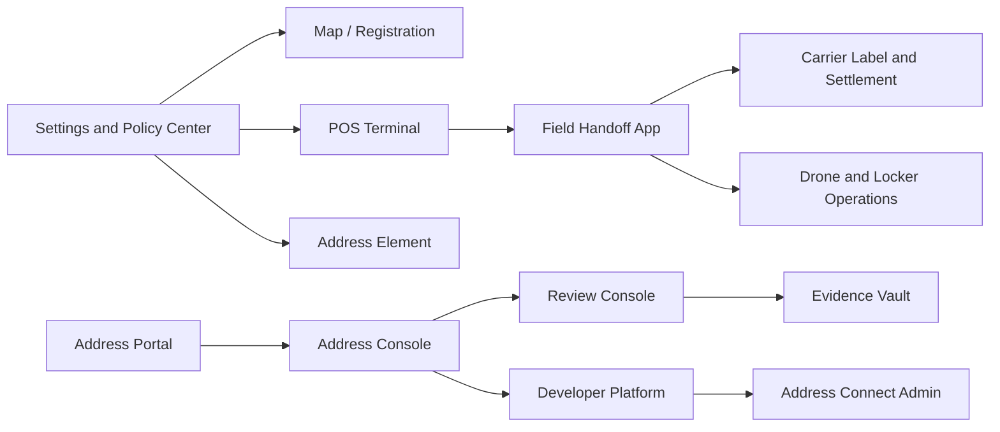

# できていないアプリの構想

Last updated: 2026-06-18

この資料は、AGID/AOIDプロジェクトで「まだ完成していないアプリ」または「既存アプリ内に入口はあるが、独立した業務画面として未成熟なもの」を整理するための構想書である。

目的は、思いついた機能を同じ画面へ足し続けることではない。目的は、次の4点を明確にすることである。

1. どのアプリとして分離すべきか。
2. 既存のMap/POS/Portal/Dashboard内で成熟させるべきか。
3. 無料・OSSで提供すべき範囲と、どうしても有料になり得る運用範囲はどこか。
4. 実住所、AGID、AOID、AGID-S、証拠、proof、端末ログをどこで秘匿するか。

実装側の型付きカタログは `src/lib/unbuiltAppConcepts.ts` に置く。検証テストは `src/lib/unbuiltAppConcepts.test.ts` で管理する。

## 現状判断

現時点では、完全な空想段階のアプリばかりではない。すでに入口があるものと、まだモデル中心のものが混ざっている。

| 区分 | 状態 | 判断 |
| --- | --- | --- |
| AGID Map / Registration | 実装済みだが密度が高い | 別アプリ化より、登録・証拠・フィードバック導線の整理が先 |
| AGID POS Terminal | 実装済み | 画面を「受付・判定・引渡し・端末・キュー・レポート・設定」に再編する |
| Address Portal | 実装済み | 接続詳細、scope履歴、取消、削除、export、異議申し立てを成熟させる |
| Address Dashboard | 実装済み | サマリーから、各業務タブへ掘れるConsoleへ育てる |
| Address Review Console | 部分設計 | Dashboard内モジュールとして先に作る |
| Address Evidence Vault | 部分設計 | RegistrationとReviewに組み込み、その後単独管理画面にする |
| Developer Platform | 未実装 | Dashboard内のDeveloperタブとして作る |
| Address Connect Admin | 未実装 | issuer/carrier/NGO/自治体向けの組織管理として作る |
| Field Handoff App | 未実装 | POSから分離したモバイル/現場アプリとして優先度高 |
| Carrier Label and Settlement | 未実装 | 送り状、着払い/先払い、carrier受理、越境補助をまとめる |
| Drone / Locker Operations | 将来候補 | POSの端末管理から共通契約を抽出してから作る |

## アプリ分割の基本方針

AGIDは「巨大な1アプリ」ではなく、次の5本を中心に分けるのがよい。

| アプリ | 役割 | ルート候補 | OSS/商用 |
| --- | --- | --- | --- |
| Map / Registration | 地図、住所表示、住所登録、修正、フィードバック | `/` | OSS reference |
| POS Terminal | 店舗・受付・配送handoff | `/pos` | 基本はOSS、端末fleet運用は商用可 |
| Address Portal | ユーザーの同意、scope、取消、削除、export | `/portal` | 取消・削除・exportは無料固定 |
| Address Console | 管理者、issuer、carrier、Webhook、監査、Review | `/dashboard` | 最小はOSS、運用高度版は商用可 |
| Address Element | EC/CMS/買い物Agent向け埋め込みUI | component / SDK | OSS core |

追加で、業務が成熟したら分離する候補は次の3つである。

| 将来分離候補 | 分離理由 |
| --- | --- |
| Field Handoff App | 現場・配送員・NGOはPOSよりモバイル/オフライン寄り |
| Carrier Label and Settlement | 送り状、支払い、carrier API、越境補助はPOS本体と肥大化しやすい |
| Drone / Locker Operations | ドローン・ロッカーは端末制御、保守、route safetyが別領域 |

## 優先順位

### P0: 今すぐ成熟させる

#### 1. Settings and Policy Center

未完成アプリではないが、全アプリの土台として先に必要である。

必要な画面:

- 言語と地域設定
- Mode 0 Local Only / Mode 1 Server Registry / Mode 2 ZK Only / Mode 3 Ethereum Registry / Mode 4 Full の選択
- 高リスクモード
- Provider adapterの有効化
- QR/NFC/プリンタ/計測器/端末接続
- 鍵参照
- 「この設定で何が外部に出るか」の表示

最初のマイルストーン:

Map、POS、Portal、Element、Dashboardが同じ設定モデルを読むようにする。

#### 2. Address Portal maturity

Portalはユーザーの信頼の入口である。ここが弱いと、AGID/AOIDは「ユーザーが何を許可したか分からない住所基盤」に見える。

必要な画面:

- 接続一覧
- 接続詳細
- scope履歴
- 取消確認
- 削除要求
- safe export
- 異議申し立て
- 高リスク接続の確認

無料固定:

- revoke
- delete
- export
- scope view
- connection view

表示してはいけないもの:

- 実住所
- AGID本体
- AOID本体
- 電話番号
- 受取人名
- proof secret

#### 3. Address Console / Dashboard maturity

Dashboardは今のサマリーから、実際に運用できるConsoleへ育てる。

必要なタブ:

- Overview
- API Logs
- Webhooks
- Issuers
- Terminals
- Review Queue
- Disputes
- QR Usage
- Launch Center
- Privacy Guardrails

最初のマイルストーン:

Dashboard内で、サマリーの数値から該当タブへ遷移できるようにする。

#### 4. Address Review Console

住所表示や配送判定では、必ず `partial`、`needs-review`、`rejected`、`conflict` が発生する。この処理をPOSやMap内に埋め続けると、業務と監査が破綻する。

必要な画面:

- case queue
- case detail
- evidence timeline
- redaction view
- decision receipt
- dispute / appeal

必要な操作:

- approve
- reject
- request correction
- request recipient proof
- merge / split
- escalate
- export audit report

重要な制約:

レビューはredacted evidenceから開始する。生データを見る場合は、scope、role、reason、signed audit receiptを必須にする。

#### 5. Field Handoff App

これはPOSと分ける価値が高い。POSは店舗・受付端末向け、Field Handoffは配送員・支援現場・避難所・現地確認向けである。

必要な画面:

- scan task
- route stop detail
- recipient proof
- reachability report
- offline queue
- high-risk mode
- sync conflict review

状態:

- assigned
- arrived
- recipient_pending
- handoff_complete
- cannot_reach
- offline_pending_sync
- sync_conflict

高リスク運用:

- AGID-Sを使う
- 有効期限を短くする
- 受取後即使用済み化
- 正確なAGIDを共有ログに残さない
- 到達不能報告は粗いカテゴリにする

## P1: 次に作る

### Address Evidence Vault

写真、PDF、公共料金明細、送り状、身分証などから住所候補を読み取る。ただし「AIで勝手に登録」ではなく、候補抽出、編集、redaction、証拠化の順番にする。

最初はRegistrationとReviewの中に組み込む。単独アプリ化は後でよい。

無料:

- local file import
- editable OCR candidates
- local redaction
- encrypted local evidence envelope

有料になり得るもの:

- managed OCR compute
- encrypted hosted storage
- legal hold
- retention policy operations

### Address Developer Platform

SDK、CLI、OpenAPI、Webhook、test vectors、Address Element設定、Launch Centerをまとめる。

最初はDashboard内のDeveloperタブでよい。

必要な画面:

- API keys
- OpenAPI explorer
- Webhook debugger
- Address Element snippets
- Test vectors
- Launch Center
- Redaction simulator

### Address Connect Admin

配送業者、issuer、自治体、NGO、倉庫、EC、POS事業者を接続する組織管理レイヤー。

個人住所は扱わない。扱うのは組織、公開鍵、endpoint、scope、issuer status、revocation statusである。

### Carrier Label and Settlement

送り状、QR、配送業者受理、着払い/先払い、Ethereum支払い、越境補助、通関補助をまとめる。

POSに全部入れると重くなるため、POSの「送り状受付」からこのアプリまたはモジュールへ遷移する形がよい。

## P2: 今すぐ作り込まない

### Drone / Locker Operations App

ドローンOS、スマートロッカー、PUDO、端末保守、access grant、incident queueは重要だが、今すぐ本体に入れると散らかる。

先に作るべきもの:

- device status schema
- access receipt model
- incident reason codes
- local MQTT/HTTP adapter contract

それから、別アプリとして作る。

## 相関図

## 作らない方がいい分け方

次は、まだ別アプリにしない方がよい。

| 候補 | 理由 |
| --- | --- |
| Address Radar単独アプリ | まずReview ConsoleとDashboardの機能でよい |
| ZK Proof App | ユーザーや運用者には証明方式を直接見せすぎない方がよい |
| Evidence Vault単独ユーザーアプリ | 先に登録・審査の一部として使えるようにする |
| Tax / Customs単独アプリ | Carrier Label and Settlementの中の補助レイヤーでよい |
| Drone OS本体統合 | 端末・安全・ルートが重いため、POSとは分離する |

## 最初の実装順

1. Settings and Policy Centerの共有モデルを作る。
2. Address Portalに接続詳細、取消、削除、export、異議申し立てを足す。
3. Dashboardをタブ型Consoleにする。
4. Review ConsoleをDashboard内に作る。
5. Field Handoff AppをPOSから分離して作る。
6. Evidence VaultをRegistrationとReviewに組み込む。
7. Developer PlatformをDashboard内に作る。
8. Address Connect AdminをDeveloper Platformの先に作る。
9. Carrier Label and Settlementを送り状/POSから切り出す。
10. Drone / Locker Operationsはdevice schemaを抽出してから別アプリ化する。

## テスト方針

最低限、次をテストする。

- 未完成アプリカタログに重複IDがない。
- 各アプリに最初のマイルストーンがある。
- 各アプリに状態モデルがある。
- 各アプリに画面一覧がある。
- 各アプリにOSS baselineと有料になり得る運用範囲がある。
- Portalのrevoke/delete/exportは無料固定。
- Review Consoleは監査理由なしに生データへ進めない。
- Evidence Vaultは外部OCR送信をデフォルトにしない。
- Field Handoffは高リスクモードで正確なAGIDを共有ログに残さない。
- Dashboard/Developer Consoleはraw request bodyを保存しない。

## 結論

次に作るべき未完成アプリは、完全新規の巨大アプリではない。

最も重要なのは、既存の `/portal` と `/dashboard` を成熟させ、POSから現場向けの `/field` を切り出すことである。

この順番にすると、AGID/AOIDは「地図アプリ」ではなく、住所・配送・証明・監査・同意を扱う住所インフラのアプリ群として整理できる。
